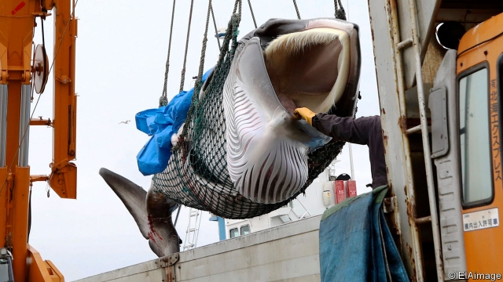

###### Conservation

# Japan resumes commercial whaling 

 

> print-edition iconPrint edition | Science and technology | Jul 6th 2019 

ON JULY 1st, to the fury of conservationists around the world, Japanese whalers landed their first commercial kill for more than 30 years, a minke whale (pictured above). In 1986 the countries of the International Whaling Commission, of which Japan was one, had agreed to a moratorium on whaling. This allowed the animals to recover to sustainable numbers after several species had been driven to the brink of extinction by untrammelled hunting. Exceptions were permitted, though, for indigenous groups of hunters, such as aboriginal Alaskans, who had an established culture of whaling, and for scientists studying whale biology—a loophole Japan has exploited ever since. 

Japanese whalers have killed between 200 and 1,200 of the animals every year since the moratorium, under the banner of research. Few outsiders, though, have believed that banner to be anything other than cover for trading in whale meat—a belief fostered by the fact that most of the catch has subsequently been sold for human consumption. 

In December 2018 Japan’s government lost patience with the moratorium altogether and announced that it was pulling out at the end of the following June. It has set this year’s quota at 227, with minke, Bryde’s and sei whales as the permitted targets. It is worth noting that of these, only sei whales are listed as endangered on the International Union for Conservation of Nature’s Red List—and their numbers are increasing. 

