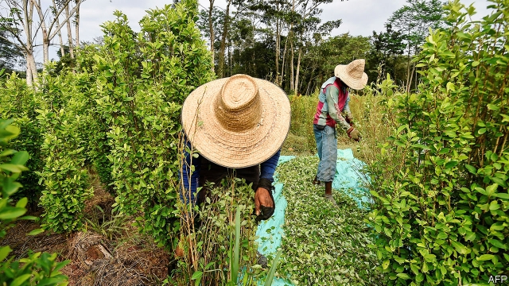
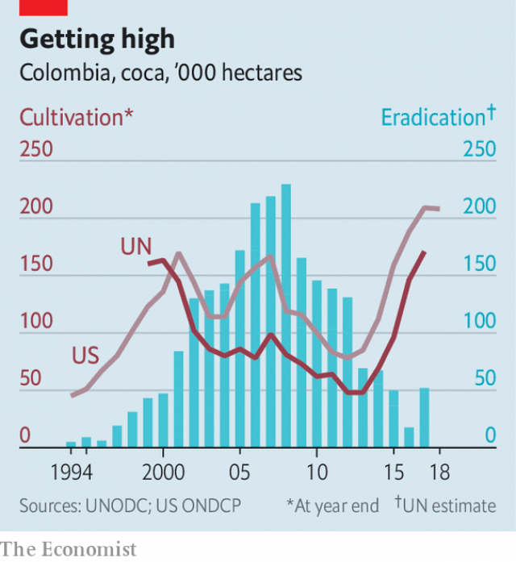

###### Blow up

# Cocaine production in Colombia is at historic highs 

 

> print-edition iconPrint edition | The Americas | Jul 6th 2019 

ON HIS FARM in Uribe, a district in central Colombia, Efraín Silva, a 50-year-old farmer, points at a solitary coca bush still on his land. “This one must have been left by a lazy soldier,” he laughs. The rest of the six hectares (15 acres) on which Mr Silva used to grow the cocaine-producing plant was torn up by the army in 2017, as part of a voluntary agreement he struck with the government in the wake of Colombia’s peace deal. He proudly shows off the crops that have replaced it: cocoa, some avocados, plantains as well. 

Until the end of 2016 Uribe was mostly controlled by the Revolutionary Armed Forces of Colombia, or FARC, a Marxist guerrilla movement with a sideline in drug trafficking. Its fields, chopped from the forest over the past few decades, produced plentiful coca. Now most of the local farmers are like Mr Silva, trying to move on from drug production. When Colombia’s government signed a peace deal with the group, the local militants disarmed. The government, working with the UN Office on Drugs and Crime, stepped in to pay farmers as much as 1m Colombian pesos ($312) a month to grow something else. 

But though coca production has collapsed in Uribe, elsewhere in Colombia it has soared. The crop of 2017 was the largest ever. On June 26th the White House published American estimates which showed that coca production in Colombia last year fell only slightly from that peak. Colombia provides 70% of the world’s nose powder. “Alternative development”, as the projects like the one benefiting Mr Silva are known, are hardly working better than the more militarised war on drugs did. By February, of 99,000 families involved, 41,000 had not received a payment. The coca boom creates huge problems for Colombia’s conservative president, Iván Duque. Cocaine use is rising in rich countries once again. Donald Trump is desperate to reduce the supply. 

At Mr Silva’s farm, the first profitable legal crop seems a long way off. His land is at the end of a long dirt track that few vehicles can travel on, about six hours’ drive from the nearest tarmac road. When growing coca, that was not a problem. “The narcos taught us how to industrialise it,” he says. By processing it with petrol and then sulphuric acid, he could turn a hectare-worth of coca leaves into a kilogram of cocaine paste, which could be carried into town in a backpack. Avocados sadly are not so easy to transport. Of all of his legal activities, only the cattle make any money, says Mr Silva, because they have legs. 

Farmers in Uribe all say that they do not want to go back to growing coca. But soon the government subsidies will run out, and the new businesses that are meant to replace drugs are scarcely viable. Mr Silva, who grew coca for 30 years, says that he would rather that the government fulfils its promises to give him a better livelihood. But if it does not, he points out, a kilo of coca paste is selling for 3m pesos. “This is a test. If the government fails, we may have to go back,” he says. Perversely, the peace deal may even have boosted the crop in recent years, as farmers grew coca in the hope of later being paid to stop. 

 

The trouble in places like Uribe, says Adam Isacson, of the Washington Office on Latin America, an advocacy organisation, is that although the FARC have disarmed, the conditions that allowed them to survive so long have not changed. “The coca and the armed groups are symptoms of the same problem,” he says. State services—not just roads but also electricity, water and the like—are all but absent. Almost nobody has a title to their land. Much coca production now happens deep in national parks or other remote places. In some new villages cut out of the rainforest, people use coca paste as currency instead of pesos. When the FARC disarmed, new armed groups quickly took over the trade. 

For Mr Duque’s government, there are few options for reducing production. Aerial spraying of crops with glyphosate, a herbicide, is what America would like. In early June Mike Pompeo, America’s secretary of state, told the Senate that spraying “is an important tool they need”. And Mr Duque does not want to upset America more (see article). Speaking to The Economist last month, he used the same phrase as Mr Pompeo. He argues that cutting coca production is the only way to stop the drug from financing armed groups and so wrecking Colombia’s fragile peace. 

However, aerial spraying was banned after a ruling by the constitutional court in 2015, because of concerns that it causes cancer. The government may be able to persuade the court that it can spray safely, complying with its ruling. But, says Isabel Pereira of Dejusticia, a think-tank, that is a dangerous strategy. Even if the court allows some spraying, the government could still find itself liable for damages. To reduce production by the equivalent of one hectare, 32 must be sprayed, at a cost of as much as $25,000. Ms Pereira thinks the best thing is to focus on reducing violence, not the coca crop. Countries like the Netherlands produce lots of illegal drugs without suffering from insurgencies. But, she says, it is easier for politicians to get public opinion on side by targeting coca farmers. 

Since a change of heart in the prohibition of narcotics seems unlikely, the government will instead resort to more manual eradication—sending soldiers in helicopters to tear out crops while others hold farmers back. The number of teams doing that has already increased from 23 when he came to office last year to over 100 now, says Mr Duque. According to Lilian Olarte Aranda, another former coca farmer in Uribe, when manual eradication was used there, it was “like a war between farmers and the army”. It seems that war may soon return.◼ 

