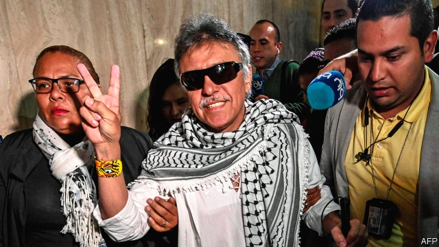

###### Jesus on the run

# The disappearance of Jesús Santrich threatens Colombia’s peace deal 

 

> print-edition iconPrint edition | The Americas | Jul 6th 2019 

ON THE MORNING of June 30th bodyguards from Colombia’s national protection unit arrived to escort Jesús Santrich, a former FARC commander, from an ex-combatant reintegration camp to an event organised by his supporters in Barranquilla, a city in northern Colombia. But when they arrived, they found his room empty. The window was open. Outside, tyres were stacked up into a staircase. Mr Santrich (an alias, his real name is Seuxis Hernández Solarte) had left without anyone noticing, despite supposedly being almost blind. Nobody has seen him since. 

Mr Santrich’s mysterious disappearance is the latest twist in his fraught transition from FARC militant to politician. Last year he was to take up one of the ten congressional seats promised to the guerrilla group in the peace deal that ended Colombia’s 50-year conflict. But he could not be sworn in because he was arrested at the request of the United States. They want to extradite and prosecute him on drug-trafficking charges; he is accused of smuggling ten tonnes of cocaine to America. 

In May, Colombia’s peace tribunal, known as the JEP, blocked his extradition and ordered his immediate release, saying they did not have enough proof to determine if he had broken the terms of the peace deal. The attorney-general resigned in protest; his office rearrested Mr Santrich again seconds after his release, saying it had new evidence to prosecute him that the JEP had not considered. He was eventually released again, this time by the judges of the supreme court, who say that only they can prosecute a congress member—even one who has not yet been sworn in. 

Mr Santrich’s supporters say he fled because he discovered a plot to kill him in Barranquilla. It is more likely that he is evading justice. He was due to defend himself against the American government’s charges before the supreme court on July 9th. Colombian military intelligence claims he has crossed the border into Venezuela, which is just 11 miles away from the camp where he was staying, and has become a haven for many Colombian armed groups. The army believes he is in the company of Iván Márquez, another demobilised FARC leader gone underground. 

Both guerrilla leaders claim the government of Iván Duque, who campaigned to modify the peace deal as a presidential candidate, wants to destroy any chance of peace in Colombia. Sadly, Mr Santrich’s disappearance has probably done more damage. Thousands of victims are waiting for him to appear before the JEP to account for his role in the FARC’s kidnapping business. Without his testimony they might never know why they or their family members were taken hostage. 

The JEP is the backbone of the peace deal, but it has been plunged into a reputational crisis. The most radical members of the Democratic Centre, the president’s party, say Mr Santrich’s behaviour proves that it is a sham court which wants to let the FARC off the hook. They want a referendum to eliminate the JEP and even modify the entire justice system through a constitutional assembly. 

Worse yet, Mr Santrich has discredited his old comrades who vehemently defended his innocence. The FARC’s political party is more divided than ever, between those defending the peace deal and those who regret it. By abandoning his seat he has left his party without a crucial vote in congress. Former militants are scared they will be punished for their boss’s crimes: funding for reintegration projects could be slashed or public anger could hinder their return to normal life. The peace deal’s supporters are begging him to show up. But the authorities reckon Mr Santrich is gone for good. He has dealt a blow to Colombia’s peace deal on the way out. ◼ 

