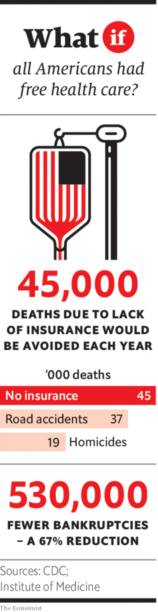

###### If robots don’t take all the jobs

# A different dystopia: July 2030 

 

> Jul 6th 2019 

IT IS HARD to believe now, but a little more than a decade ago people were seriously worried about robots taking all the jobs. Back in 2018 the chief economist of the Bank of England, Andy Haldane, gave a warning that “large swathes” of the population would become “technologically unemployed”. He argued that the “fourth industrial revolution” of automation and artificial intelligence (AI) would create even more disruption to people’s working lives than the previous three. Robots would do everything. There would be universal leisure but mass unemployment. Similar warnings were a fixture at the World Economic Forum’s annual meeting in Davos. Bestselling books predicted dystopian outcomes in which society split into a wealthy, robot-owning plutocracy and an unemployed underclass, and repressive governments would be needed to rein in social discontent. But robots did not take all the jobs—and today, in 2030, much of the world faces the opposite problem as populations age and workforces shrink. What happened to the supposedly inexorable march of the machines? 

At the height of the concern about the coming jobs apocalypse, in the late 2010s, the most vulnerable people were thought to be older, unskilled workers. In 2017 the McKinsey Global Institute, part of a business consultancy, predicted that 800m people in 46 countries, or roughly a third of the workforce, could lose their jobs to machines by 2030. Older workers were thought to be especially vulnerable because they were engaged in repetitive, unskilled manufacturing, the kind that was easiest to automate. In 2018 Mercer, another consultancy, used an index of risk developed by Carl Frey and Michael Osborne of the Oxford Martin School to calculate that three-quarters of Chinese workers aged over 50 were at risk of being replaced by robots. In America just over half of older workers ran the same risk, while in Germany and Italy about 60% did. 

But these dire forecasts did not come to pass, for two reasons. First, AI failed to advance as quickly as some people thought it would. In 2018 Rodney Brooks, a professor at the Massachusetts Institute of Technology (MIT), forecast that driverless-car services comparable to conventional taxis were unlikely before 2032 and that a robot which could navigate its way around the steps and clutter of an ordinary home would not become widespread until 2035. With just a few years to go, he seems likely to be proved right on both counts. During the 2020s robots powered by AI became more widespread, changing many industries and taking over repetitive jobs. But they were not cheap and still cannot handle many tasks requiring human discretion or empathy. In nursing and social care, in particular, robots are not up to the job. 

Second, the 2020s showed that the level of employment depends on more than just automation: it also depends on ageing and immigration. As their populations aged, rich countries saw their workforces shrink. Many invested more in robots as they aged, and some let in more migrants, plugging some of the skills gaps and boosting productivity. Countries with relatively slow ageing and lots of robots did best. But those that underinvested in automation, or shut themselves off from the world, were hard hit. 

Britain was an extreme example of the second group. In the 2020s its economy was still suffering a trade shock from Brexit and its political system was in turmoil. But the longer-term problems were demographic, made worse by the increased difficulty of hiring workers from abroad. Between 2000 and 2015 the British population had expanded by 11% and the workforce had grown by 14%, thanks to an influx of foreign-born workers. Over the next 15 years these trends went into reverse. As ageing began to have a larger effect, the population increased by just 6.5% between 2016 and 2030, while net migration dropped to a few thousand a year. The workforce grew by barely 1% in total during that period. 

 

That itself might not have been an insuperable problem. After all, the workforce was at least still growing, unlike Japan’s or China’s. But Britain was already suffering from a skills shortage, which suddenly got much worse. In 2015, 35% of the workers in health and social care, one of Britain’s biggest employers, were over 50; 18% were foreign born. A poll in 2015 found that a third of doctors in the National Health Service were planning to retire by 2020. So as doctors retired and Spanish-born nurses went home, the country found it increasingly difficult to replace them, giving rise to a series of stomach-churning medical scandals which undermined the health service’s already-tattered reputation. Similarly, successive governments’ promises to build more houses foundered on a lack of suitable workers. In 2018 two-thirds of small and medium-sized building firms said they could not find enough bricklayers, carpenters and joiners, in part because they had become overly reliant on importing plumbers from Poland and carpenters from Hungary. Brexit meant those options vanished altogether in the 2020s. 

Had Britain invested more heavily in automation, it might have been better able to cope. As Daron Acemoglu of MIT and Pascual Restrepo of Boston University showed in 2018, countries which age fastest tend to invest the most in robotics—causing their GDP growth to hold up better than you might expect. Britain, though, was a technological laggard. According to the International Federation of Robotics its “robot density” (the number of industrial robots per 10,000 manufacturing workers) was only 85 in 2017, compared with an average of 106 across Europe, and 710 in South Korea. Risk-averse businesspeople and technophobic unions ensured that Britain failed to catch up in the 2020s. 

The results were painful. As the workforce stopped growing, labour markets tightened and wages rose. But overall output stagnated and tax revenues fell, reducing the funding available for public and social services, just as they were also being hit by skills shortages and the increasing demands of an older population. Class sizes increased as schools struggled to find enough teachers. Standards of service declined in health care, transport, hospitality and other labour-intensive sectors. A series of strikes successfully blocked an unpopular effort to raise retirement ages more quickly. In 2026, caught between the militancy of its supposed allies and the hostility of markets, Jeremy Corbyn’s Labour government prevaricated, backtracked, appealed to voters and then finally collapsed. 

Britain was an extreme case. Other countries faced different problems, or managed them better. Japan and South Korea have seen their workforces shrink in absolute terms but, by investing in robots and software to perform repetitive tasks, and by retraining workers for employment in caring professions, both countries softened the blow of the demographic transition and maintained high productivity growth. 

Germany also had to deal with an ageing, shrinking workforce but reaped the rewards of allowing a large number of migrants into the country in 2015-16. America’s population did not age as quickly as those in other rich countries so its workforce did not contract. After the isolation of the Trump years, the country has become more welcoming to immigrants; it has also maintained its traditionally high investment in automation. As for China, its workforce has contracted dramatically, damaging the Communist Party’s attempt to introduce a proper pension- and social-security system, and making it hard even to find enough soldiers for the People’s Liberation Army. Social disruption and discontent have reined in China’s global ambitions. 

The dystopia predicted in the late 2010s, of widespread technological unemployment, has not come to pass. Even at the time, the evidence for an imminent jobs apocalypse was noticeably lacking: employment across the rich world reached record levels in 2019, while productivity growth in many countries was anaemic. That suggested machines were not displacing human workers after all, and their ability to do so had been overstated. In retrospect, the doom-mongers of Davos were worried about the wrong thing. Today another dystopian scenario looms instead: that of a world in which there are too few robots, not too many. ◼ 

