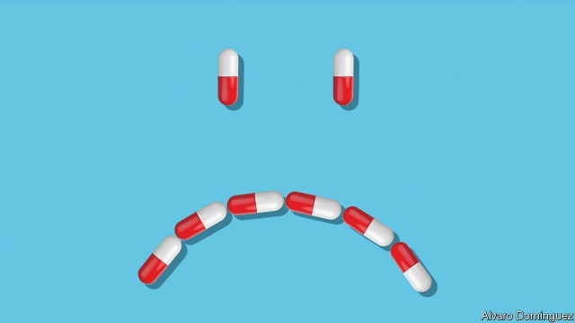
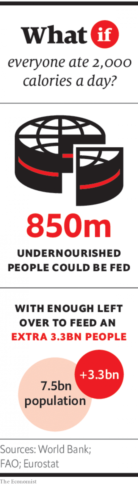

###### If antibiotics stop working

# Attack of the superbugs: July 2041 

 

> Jul 6th 2019 

AT THE CHAN ZUCKERBERG HOSPITAL in New York, Emma Jones beams a weak smile at her newborn son, cradled in her husband’s arms. Ms Jones is recovering from a severe bacterial infection that she contracted during her Caesarean section. The infection had begun to shut down her organs; doctors put her in a coma and hooked her up to a breathing machine. “We didn’t think she’d make it,” says Rosa Velasquez, an infectious-disease specialist at the hospital. Ms Jones is lucky. She is one of a handful of people to have been treated with parvomycin, the first new antibiotic to become available since 2024. The few older antibiotics that are still in use today work only rarely. In 2040 antibiotic-resistant bacteria killed nearly 400,000 people in Europe and America—more than seven times as many as in 2015. In Africa and Asia, drug-resistant tuberculosis alone now kills nearly 2m people a year, ten times more than in the 2010s. 

In Western countries the rise in deadly infections has been primarily in hospitals. Back when antibiotics still worked, they were used preventively in almost all operations. In 2015 surgical-wound infections occurred in less than 5% of cases for most types of operations in Europe; by 2040 the rate had leapt to nearly 30% for some operations. Caesarean sections, which at their peak made up one-third of births in America in 2019, are now carried out only when there is no other option. 

Some hospitals no longer perform elective surgeries, such as hip and knee replacements, because so few patients are willing to take the risk of post-operative infection. But surgeons are busier with amputations, which have nearly doubled in Europe in the past decade. The lack of effective antibiotics means that amputating a limb is sometimes the only way to treat an infected skin ulcer in a diabetic patient. At the Chan Zuckerberg Hospital, most heartbreaking are the paediatric wards. They are full of children recovering from amputations, many as a result of sepsis. “It often starts with just a scrape, a bug bite or a strep throat,” says Dr Velasquez, “things that take-home antibiotics easily cleared up 20 years ago.” 

Parvomycin’s remit is to turn this tide. It works for a wide range of Enterobacteriaceae, a family of mostly gut-dwelling bacteria that are usually harmless in healthy people. But they can destroy the heart, lungs, bones and other organs when they invade the bloodstream—often through cuts or invasive hospital equipment such as catheters and drip lines. For decades this group of bugs has been the most common cause of infections contracted in hospitals, and it has developed resistance to multiple antibiotics. 

The new antibiotic will also make a big difference for cancer treatments. They improved greatly in the early 2020s after a boom in cancer research at big pharma companies. Back then, it seemed all but certain that science would win the war on cancer. But chemotherapy, immunotherapy and stem-cell transplants—used in most courses of cancer treatment—weaken the immune system, making patients highly vulnerable to infections. As the effectiveness of antibiotics waned, so did survival rates for cancer, which are now lower than they were a decade ago. 

The loss of antibiotics has been just as bad for organ transplants, which are in greater demand as the number of people with chronic diseases increases. Like cancer patients, transplant patients are easy prey for infections because their immunity is suppressed by the drugs that prevent organ rejection. Adjusted for the risk of deadly infection, the prognosis for most patients in America who are otherwise fit for a transplant is now too poor to justify the operation. (The recent development of artificial kidneys and livers, 3D-printed from stem-cells, offers hope because such organs are not considered to be foreign tissues by recipients’ bodies, but this technology is unfortunately still in its infancy.) 

All this means demand for parvomycin will be huge. Doctors are calling it a “miracle drug”—as they did with penicillin a century ago. But there are concerns that parvomycin’s useful lifespan may be shorter than that of older antibiotics, because it is replacing many of them at once. As early as the 1950s, when the first generation of antibiotics became widely available, it became evident that the more an antibiotic was used, the faster bacteria developed mutations that conferred resistance to it. 

A decade after the use of penicillin became widespread, more than half of common Staphylococcus bacteria in big hospitals were resistant to it. Bacteria strains resistant to newer antibiotics were often found just a year or two after doctors started using them. In response, drug firms churned out new antibiotics at a steady pace to replace ineffective ones. But as the 20th century drew to a close this arms race in antibiotics became harder because of their rampant use worldwide—on humans, livestock and crops. 

The peril of overusing antibiotics became apparent in the 1990s when MRSA (short for methicillin-resistant Staphylococcus aureus), a deadly superbug, began terrorising hospitals in Europe and America. In Britain a government commission found widespread overuse of antibiotics. They were often given “just in case” or to stop outbreaks caused by lax hospital hygiene and doctors not cleaning their hands routinely. In America 30% of the 260m outpatient antibiotic prescriptions written in 2010 were unnecessary, usually for colds or other infections caused by viruses (against which antibiotics are useless). 

In poor countries, meanwhile, bacterial infections still killed millions of people each year because they could not get hold of antibiotics. At the same time, particularly in big cities, many people’s first port of call for an illness was a drug-seller with no pharmacy education, who often gave them whatever antibiotic was in stock, in whatever dose they could afford. Poor sanitation and filthy hospitals made perfect habitats for the spread of superbugs—especially bacteria with the alarming ability to pass their drug-resistant genes to other species of bacteria. 

Agriculture was also awash with antibiotics. In the 2010s it was gobbling up 130,000 tonnes of antibiotics consumed each year, more than half of the total. Ailing orange-tree groves in America and Thailand were sprayed with antibiotics that, at the time, were used to treat tuberculosis and other infections in humans. Fish and livestock on industrial farms were fed antibiotics because they turned out to have a fattening effect and were a cheap way to prevent the spread of diseases in cramped, filthy cages and pens. Some were precious last-resort antibiotics used in humans. 

By the early 2010s it was clear that a crisis was looming. In 2011 a survey of infectious-diseases specialists in America, for example, found that more than 60% had seen a pan-resistant, untreatable bacterial infection in the past year. Around that time researchers found more than 1,500 drug-resistant genes in the microbial soup of the sewage of 74 cities around the world. 

“Antibiotics stewardship”, the concept of judicious, sparing use of antibiotics, gained currency. National action plans were written, a G20 proclamation issued and a UN resolution approved. In Western countries use of antibiotics began to fall, both in humans and livestock. Developing countries slowly followed during the 2020s, though in many enforcement of the new rules was patchy at best. Bans on the use of antibiotics in healthy animals began to spread in the 2010s. Many big meat producers abandoned antibiotics because their customers became squeamish about eating animals stuffed with drugs. 

 

But all this came too late. In the late 2020s bacterial resistance to older drugs suddenly exploded in rich countries. Most antibiotics were no longer effective. And there were no replacements in sight. Big pharma companies had lost interest in antibiotics decades earlier because margins on them were low and doctors preferred to keep new ones on the shelf, for use when all else failed—which made the quest for antibiotics a poor business proposition. In 1980 there had been 25 large pharma companies working on new antibiotics; by 2020 there were just three. The handful of small biotech firms that stepped up to the task had gone out of business. The world faced a return to the pre-antibiotic era, when anyone could die from a tiny scratch or a simple infection, and even minor surgery could entail life-threatening risks. 

The crisis prompted the creation of the Global Antibiotic Science Partnership (GASP), a public-private outfit launched in 2032. It was given the task of developing new antibiotics as a matter of urgency. Chinese and American tech philanthropists, rallied by Bill Gates, put up money, as did the G20, creating an unprecedented kitty of $40bn for its first five years. The problem was finding scientists. When big pharma companies shut their antibiotics divisions, the scientists who specialised in the field had scattered, retired or switched to other specialities. In 2015 there were only about 500 of them left (few enough that they would be declared endangered species if they were wild animals, noted an article in Nature). “It’s highly specialised knowledge,” says Narita Baseravan, the head of GASP. “We couldn’t put a cancer researcher to work on antibiotics.” 

GASP ended up hiring a team of investigative journalists to track down the antibiotics specialists, now mostly in their 50s and 60s. After almost two years, a small team began work on what would become parvomycin at the GASP campus in Geneva built by Seth Resoz, an American augtech billionaire (whose third wife had died of a drug-resistant infection). Experts who were too frail to travel helped remotely using Mr Resoz’s augmented-reality technology, passing on their experience to younger scientists and giving them a crash course in antibiotic research. 

Normally, developing a new antibiotic would take 10-15 years. The GASP scientists managed to do it in just six, by taking advantage of artificial-intelligence techniques to scan drug companies’ archives for candidate drugs that had been abandoned decades earlier. One of these candidates formed the basis for parvomycin. The new drug is now being distributed globally by GSKMerckPfizer under an innovative licence that sets differential pricing for countries depending on their ability to pay. 

GASP plans to use the same model for the other antibiotics in its pipeline. They include a novel drug for tuberculosis—for which the last new drug was approved in 2012, the first new drug for the disease in more than 40 years. Research has also started on paediatric antibiotics, which were neglected even in the heyday of antibiotic development. “As far as antibiotics are concerned, children have always been treated as if they are small adults,” says Dr Baseravan. 

It will probably be years before another new antibiotic reaches patients. But there are two reasons for optimism about the future of parvomycin and any new antibiotics that follow. The first is that the practices that promoted drug resistance in the past have finally been phased out, after decades of dithering. The second reason is that, thanks to the work of GASP, the pipeline of new antibiotics is starting to fill up again. It took a crisis in which millions lost their lives to prompt decisive action, and the fight is still far from over. But at least there is now cause for hope that an end to the post-antibiotic nightmare is in sight. ◼ 

