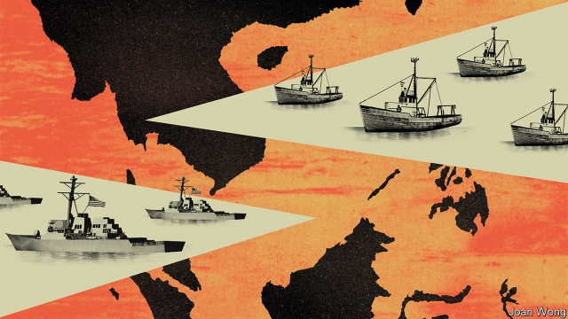

###### If America and China clash at sea

# China crisis: October 2020 

 

> Jul 4th 2019 

MANY AMERICAN presidential elections have been jolted by an October surprise. Few were as alarming as the one that just hit the 2020 contest—a crisis of deadly brinkmanship in the South China Sea, now abruptly resolved after two tense and confusing weeks. The stand-off was dismaying too, showing that even near-conflict with a foreign power is not enough to unite an America gripped by partisan furies. In purely electoral terms, the crisis may explain a slight dip in approval ratings for President Donald Trump, who was seen as more blustering than in command. But with voters now so entrenched in rival camps, poll numbers for his Democratic rival, Senator Kamala Harris, barely moved. 

China, by contrast, has scored a clear victory. The world saw the USS McCampbell, a guided-missile destroyer of the American navy, apparently being humbled by a swarm of Chinese fishing boats and militia ships. Surrounded by smaller craft, and with one of its sailors detained by the Chinese, the ship was immobilised for 13 days. Gold-braided admirals insisted the McCampbell had not been defeated, but merely exercised laudable restraint in the face of Chinese aggression. But as the world breathes a sigh of relief, one thing is crystal clear: the cost of future American operations in the disputed waters of the South China Sea has just risen dramatically. 

Already, China is pressing home its advantage. It is filling the scene of the stand-off—the waters around the Paracel Islands, a clutch of sunbleached rocks and reefs which are also claimed by Vietnam and Taiwan—with a hybrid armada comprising scores of navy ships, coastguard cutters, maritime militia craft and trawlers. After Chinese state television broadcast images of the departing McCampbell being “expelled from the sacred waters of the Motherland” by fishing boats, China hawks in Congress called for American warships to return in force to the area. A bipartisan group of senators urged the navy to conduct “freedom of navigation” operations through waters off the Paracels and the Spratly Islands, another disputed archipelago, as soon as possible. But polls show American voters overwhelmingly oppose such a move. 

 

A week after the end of the stand-off, Washington, DC, continues to witness a briefing war about what happened. The official account of the crisis begins with a terse Pentagon statement, issued on October 9th, that the McCampbell, an Arleigh Burke class destroyer, had been forced to stop in international waters by vessels “answering to China’s military chain of command” while conducting a “routine, lawful transit in the vicinity of the Paracel Islands”. 

The Pentagon demanded that China allow the McCampbell “and all its equipment” to continue its passage. The reference to equipment was clarified an hour later when Xinhua, China’s state news agency, released a video showing Chinese fishermen with boathooks grabbing at a half-submerged underwater drone fouled in a net, described as an American spy submarine. A second Xinhua video showed an inflatable speedboat, manned by armed American sailors, apparently adjacent to the drone but trapped by two dozen Chinese fishing boats organised into a ring formation. 

Both countries agree on some of what happened next. After about 30 minutes the American inflatable broke through the circle of fishing boats as sailors fired shots with their small arms, and returned to the destroyer, where Ji-Hoon Kim, one of the speedboat’s crew, was reported missing. Soon afterwards a growing fleet of Chinese fishing trawlers, many of them flying large red flags, surrounded the McCampbell. 

October 2020: The cost of American operations in the South China Sea has soared 

After that, American and Chinese accounts sharply diverge. China’s defence ministry accused the destroyer of illegally conducting military operations in Chinese territorial waters. It further accused American sailors of firing recklessly at unarmed Chinese fishermen, leaving one of them dead, which it called “a shameless, warlike act”. At almost the same moment Xinhua reported that Mr Kim was on board a Chinese fishing boat. Quoting “relevant authorities”, the news agency said the American sailor was being investigated in connection with the fisherman’s death. The report added that Mr Kim was being treated for minor injuries, “in accordance with China’s solemn responsibilities to provide search-and-rescue assistance in its territorial waters”. 

At a hastily organised Pentagon press briefing, an hour before the planned start of a televised presidential debate on October 9th, a senior naval officer said that the McCampbell had never strayed from international waters. A chart on an easel showed the box-shaped boundary that China drew around the entire Paracels archipelago in 1996, claiming all waters within. That box has no basis in law, the Pentagon insisted. Instead, each individual islet is surrounded by a 12-mile-wide strip of territorial waters, but the seas in between—where the McCampbell sailed—belong to nobody. 

As for the ship holding Mr Kim, the Pentagon identified it as the Qiongsanshayu 00111, a 750-tonne vessel with a reinforced hull and a mast-mounted water cannon, belonging to the Sansha City Maritime Militia, a force based on Woody Island, the largest of the Paracels. An officer told reporters that hundreds of Chinese trawlers appeared to have been mobilised by the People’s Armed Forces Maritime Militia, and summoned to the Paracels in a pre-planned operation. “They weren’t out there catching fish,” he said. 

That evening, American allies in the Asia-Pacific region watched aghast as Mr Trump and Ms Harris argued on live television about how to respond, turning the penultimate presidential debate of the 2020 campaign into a reality-TV version of the White House Situation Room. “The American people do not want to start World War Three over a bunch of rocks,” said Ms Harris. Mr Trump countered that “China respects me like they have never respected an American president” and then alleged—without further explanation or evidence—that “the Democrats are bought and paid for by China. It’s disgusting if you knew what I know.” 

In the days that followed, Mr Trump staged shows of unity with the armed forces, inviting generals and admirals to join him in the White House Rose Garden as he called upon China’s president, Xi Jinping, to release “my ship” or face “extremely horrible consequences”. Such scenes were offset by press reports of Mr Trump berating military chiefs in the Oval Office, claiming they were trying to sabotage his re-election. Little had changed by the time of the final presidential debate on October 19th, when Mr Trump made finger-jabbing demands that China hand back Mr Kim. Yet the president also appeared to blame Mr Kim, who is Korean-American, for “letting himself be captured”, and questioned the sailor’s loyalties in terms that Democrats called racially charged. 

There were mixed signals from the Chinese Communist Party leaders and military commanders, too. Plans were announced for a formal military funeral for Zhou Haibo, the Chinese fisherman killed during the chaotic initial skirmish. They were then abruptly cancelled, and his family, who live in the southern island province of Hainan, are now said to be resting at an unknown location. And universities in several Chinese cities were put on lockdown after a small group of students in Sanya, the provincial capital of Hainan, protested against Mr Kim’s sudden release on October 22nd, saying that he ought instead to have been charged with murder in connection with the fisherman’s death. 

Exactly why Mr Kim’s release came when it did remains unclear. Mr Trump denies that he resolved the crisis by apologising to Mr Xi in a telephone call—a claim made by China’s foreign ministry, and since repeated by Ms Harris. He has tweeted “NO APOLOGY” three times, and says the release of Mr Kim and the McCampbell prove that China’s president is “smart”. Asked by reporters if he will authorise new freedom-of-navigation operations in the South China Sea, Mr Trump replied: “Vietnam says these are their islands. So Vietnam can spend its money on them.” 

Pentagon officials defended the decision of the McCampbell’s commander to stay put for two weeks, besieged by Chinese vessels, to keep the ship holding Mr Kim within sight. They noted that the McCampbell had endured constant harassment, including mock attacks by small boats every night, which forced the crew to stand guard with machineguns, small arms and high-pressure water hoses at all times. The ship’s helicopters were prevented from flying after their pilots were dazzled with laser beams. “It was a mess, but the commander only had bad choices,” said one officer. 

But Pentagon spokesmen have not addressed the details of the equipment at the heart of that first, deadly skirmish. An unnamed military official told CNN, however, that the alleged spy submarine was an “unmanned mobility capability” attached to the far end of a “multi-function towed array”. Such arrays are long, thin tubes packed with sophisticated electronics that can detect underwater threats from submarines, torpedoes and mines, and are designed to be towed behind warships. “The towed array was the prize,” the official said, comparing the unmanned vehicle to “the guy you see at the back of a long firetruck, steering it round corners.” 

Mr Xi has yet to speak in public about the crisis, prompting speculation that he had been surprised by it, or even opposed it. That theory became less plausible after the People’s Daily carried a front-page photograph of the Sansha City Maritime Militia, depicting its leaders studying a letter from Mr Xi which urged them to build “a great maritime power.” Meanwhile the New York Times reported that China had recovered sections of the McCampbell’s towed array and shipped them to the mainland for analysis. Both presidential campaigns declined to comment. ◼ 

Listen to a bonus scenario, on parenting in 2029, on “The world ahead”, our future-gazing podcast 

