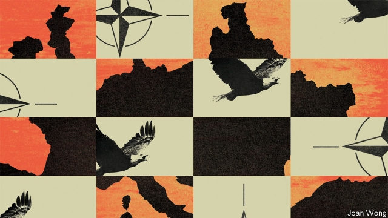
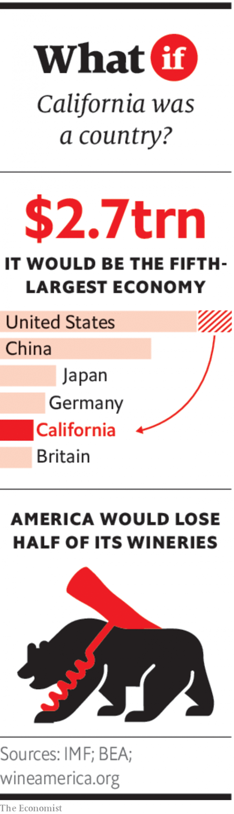

###### If America leaves NATO

# Europe alone: July 2024 

 

> Jul 6th 2019 

“IF EUROPEANS WON’T take American soybeans, they don’t get American soldiers. AMERICA FIRST!” The tweet was dispatched by President Donald Trump in the early hours of April 5th 2023, as he watched “Fox & Friends”, his favourite breakfast-television show. It landed as officials in the foreign ministries of Paris, Berlin and Warsaw were settling down for lunch. Most rolled their eyes. 

The president had, after all, issued similar threats at each of the NATO summits after his narrow re-election in November 2020. At the alliance’s gathering in Potsdam in 2021 Mr Trump had unnerved fellow leaders by proposing that Russia join the alliance. The following year in Skopje, as the US-EU trade war spiralled out of control, he had insisted that his chief trade negotiator accompany him to every meeting with allies, in place of the secretary of defence. Despite that, 60,000 American troops remained scattered across the continent. 

Yet it quickly became apparent that Mr Trump’s latest tweet was not just another shot across the bow. Within hours of his broadside, couriers from the State Department began delivering letters to the embassies of all 29 NATO members across Washington, DC. Each one, signed by Jared Kushner, Mr Trump’s son-in-law and secretary of state, was a “notice of denunciation”, giving the requisite year’s notice of America’s intention to quit the alliance. 

Both chambers of Congress roundly condemned the decision the next day. But Mr Trump made it clear that he would ignore this “unconstitutional” effort to overturn his decision. “I’m the commander-in-chief,” he said, flanked by queasy-looking generals on each side of his desk. “And we’re not going to be ripped off by the world any more.” Though the Pentagon calculated it would take five years to extract every soldier, sailor and pilot—the accretion of eight decades of Pax Americana—Mr Trump demanded that 10,000 be brought home by Thanksgiving in November. 

Europeans had imagined this possibility, but the shock came at a delicate moment. Three months earlier, in January 2023, as fighting escalated in eastern Ukraine, President Vladimir Putin had announced the creation of the Federal Union of Russia and Belarus. Mr Putin declared that, though he had anticipated a retirement of judo and fishing, he would reluctantly, and by popular demand, assume the presidency of the new country—and so serve another five years beyond his term limit of March 2024. Hundreds of Russia’s Armata tanks had already trundled to the union’s new western border—just 200km (125 miles) from Warsaw. 

When European leaders gathered at an emergency summit in Brussels, days after Mr Trump’s bombshell, the solution seemed simple enough: NATO’s 29 remaining members would regroup and marshal their defences without America. The EU had, after all, been steeling itself for this era. It had launched a European Defence Fund in 2016, which had grown from €13bn ($14.5bn) to more than €30bn. Permanent Structured Co-operation (PESCO), a scheme of joint arms production and defence integration, had followed in 2017. PESCO had already yielded a world-beating “Eurodrone”, battle-tested in the Sahel. 

To be sure, this was not an EU Army. But it certainly laid the groundwork for one. At a press conference after the leaders’ emergency summit, Angela Merkel, president of the European Council, urged calm and pointed out that Europe’s collective defence spending was more than four times that of Russia. “Europe is a sleeping giant”, agreed President Emmanuel Macron of France. “We must realise our own strength.” 

In practice, things were not so simple. The EU had hoped to slip effortlessly into the ready-made NATO institutions left vacant by America. That plan was, however, unexpectedly vetoed by Turkey—a member of NATO, but not the EU. Turkey’s relations with Europe had taken a sharp downward turn in 2022 after President Recep Tayyip Erdogan’s cancellation of elections and declaration of emergency rule. He relished thwarting the club that had denied him entry. 

 

By the summer of 2023, after months of wrangling, EU leaders agreed to establish a new European Treaty Organisation (ETO), building on the EU’s embryonic military bodies. The learning curve was steep. Without the cocoon of NATO’s bureaucracy and procedures, everyday military tasks became harder. States were reluctant to share intelligence, because Russian hackers had long ago penetrated the EU’s communication networks, which had been designed to carry information on fishing quotas rather than delicate war plans. A common joke in Brussels was that the EU’s intelligence school in Nicosia, run by Greece and Cyprus, had trained more Russian spies than European ones. 

Then came the power struggle. NATO’s Supreme Allied Commander Europe (SACEUR), the alliance’s military chief, had always been an American; his deputy always a Briton. Now America was gone, and Britain had crashed out of the EU in acrimonious circumstances. Germany, now the continent’s largest military spender, won the contest to lead. France agreed, on the condition that ETO’s military command centre be moved to Versailles, the site of NATO’s original 1950s headquarters. Italian, Spanish, Polish and Dutch generals were handed senior posts. 

Yet it was “a struggle to claim leadership of a hologram”, as General Sir Richard Barrons, former commander of Britain’s joint forces, noted wryly at the time. The first post-American assessment of Europe’s military position by ETO’s general staff was bleak. “Last year I could count on getting an armoured division, at least two aircraft-carriers and over a dozen nuclear submarines from across the Atlantic,” ETO’s first commander, General Wolfgang Schmitt, told European leaders at the alliance’s first meeting. But there was a bigger problem. America, General Schmitt observed, had provided the bulk of NATO’s air and missile defences; the lion’s share of intelligence and surveillance assets needed to see across the modern battlefield; most of the tankers needed to refuel warplanes; and the logistics to move everything across the continent quickly. It would, he said, take at least $300bn to fill these holes. 

The EU’s estrangement from Britain deepened the problem. Britain had made up a quarter of the bloc’s total military spending before its disorderly departure. Britain’s prime minister, Jeremy Corbyn, had refused to sign up to the new alliance. The time for such power politics was over, he declared. 

July 2024: France and Germany tried, and failed, to hold their new alliance together 

ETO also faced a thorny nuclear gap. The Intermediate-Range Nuclear Forces treaty, which banned mid-range American and Russian missiles, had collapsed in 2019. The New START treaty, which covered longer-range missiles, crumbled in 2021, when both America and Russia refused to renew it. Russia’s nuclear arsenal ballooned, including hundreds of new SSC-8 cruise missiles that could reach European capitals in minutes. America countered by placing new conventional missiles in Poland. 

Yet by the middle of May 2023, America had whisked away not only these, but also the 180 tactical nuclear bombs it had kept in Europe for decades. Their departure was announced only after the last one had left Büchel Air Base in Germany. “No longer will we put New York or Los Angeles at risk of annihilation for the sake of European countries that drain our economy,” declared Stephen Miller, Mr Trump’s national-security adviser. The bombs, he said, would be shifted to South Korea and Japan—an implicit reward for the trade deals they had signed with America the previous year. 

Europe was torn. A growing anti-nuclear movement cheered the departure of American weapons of mass destruction. But leaders were nervous. What if Mr Putin—now ensconced deep in Belarus—grabbed a chunk of Poland and then threatened to use nuclear weapons if ETO counter-attacked? North Korea’s missiles could now comfortably reach all of Europe, and Iran had also revived its nuclear programme. Europe was dangerously vulnerable to nuclear blackmail. 

One proposal was a “Euronuke”: the European Commission would fund half of France’s nuclear-weapons programme, in exchange for shared ownership and control. Annegret Kramp-Karrenbauer, Mrs Merkel’s successor as German chancellor, was said to have praised the plan in private. But it was quickly rebuffed by Mr Macron. “The republic’s strategic deterrent”, he pronounced, “is neither for sale nor rent.” Yet after a feisty summit in the summer, Mr Macron agreed that France would use “all means at its disposal” to protect Europe. His aides quietly briefed that this would include nuclear weapons. Few, however, believed that even the ardently Europhile French president would really exchange Paris for Podgorica. Rumours swirled that Sweden, Poland and others had started clandestine work toward nuclear weapons of their own. 

As the year turned, things came off the rails. In January 2024, Italy’s parliament dramatically refused to ratify the alliance, with populist parties on left and right clubbing together. Greece and Spain followed weeks later. In Montenegro and Macedonia, coups brought to power pro-Russian governments—which promptly pulled out, too. France and Germany desperately tried to hold the ETO together. Ms Kramp-Karrenbauer even pledged that Germany would spend 2.5% of its GDP on defence, a plan that would make it the world’s third-largest military power, after America and China, by 2030. Even so, others began hedging their bets. 

The Nordic countries agreed a tight-knit defence pact—the Kalmar Arrangement—and invited Britain to join on equal terms. Poland, Hungary, Romania and Bulgaria signed their own deal, the Metternich Pact, in February 2024. They pointed to the trouble brewing in Ukraine and Belarus; left unsaid was their anxiety over the breakneck pace of German armament to the west. Weeks later, Italy formed its own Adriatic Alliance, focused on beating back migration from north Africa. 

Mr Trump’s own assessment, tweeted from the third hole of the Trump International Golf Club in Florida, was curt: “Europe wanted to build its own army instead of paying its dues to NATO. How did that work out for them?” ◼ 

