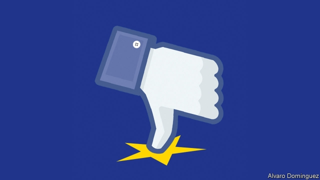

###### If Facebook shuts down in Europe

# Network effects: July 2020 

 

> Jul 6th 2019 

THE FIRST tweet came from Aarhus at two seconds after midnight, European summer time, on July 1st 2020. “Hottest night of the year and Instagram is down. Now what do I do with this?” It carried a striking picture, taken a couple of hours earlier, of the fiery Scandinavian sun setting over the Jutland peninsula. Then came another, a thousand, a million complaints: “Is Facebook down?” “Messenger’s not loading.” “What’s up with WhatsApp?” 

At first people thought it was simply an outage, like the one that had disabled Facebook services for several hours in March 2019. But then users in Europe began to post screenshots on Twitter of the Instagram app displaying a single, clinical sentence in dark grey lettering: “This service is not available in your jurisdiction. Please contact your MEP.” The Facebook app displayed a similar message. WhatsApp said “Connecting…”, but refused to do so for European users. 

Over the previous year Facebook had faced growing scrutiny from Europe’s regulators. It stood accused of sins from violating privacy and oversharing data to squeezing competition and undermining democracy. The rumour in Brussels was that the new competition commissioner wanted to make a splash by hitting Facebook with a huge fine. The firm also faced investigations and civil suits in every EU country. 

For more than a year “people familiar with Mark Zuckerberg’s thinking” had been briefing journalists about potential EU overreach. In May 2019 the New York Times had asked if “the region is going too far”, and suggested that EU proposals on the removal of hate speech and misinformation risked “accusations of censorship and potentially providing cover to some governments to stifle dissent”. 

Fifteen minutes after midnight Facebook issued a press release. As of that morning, it explained, its services would no longer be available within the European Union. Negotiations around Europe’s data-protection rules, content restrictions and competition concerns had broken down. Europeans had been cut off. The message was clear: blame your governments, not us. 

Within minutes, every major news channel in the world was leading with the news. President Donald Trump tweeted in approval. “Show Europe whose BOSS. Very good decision! WELL DONE MARK FACEBOOK.” Sputnik, a Russian online news outlet, noted wryly that Facebook was still available in Russia. 

More than 380m people—16% of the company’s users—had just lost access to their friends, families and loved ones. The EU’s economy was sure to take a hit. Businesses built on selling through Instagram would disappear overnight. Small firms that relied on WhatsApp to stay in touch with customers would be cast adrift. 

Within hours of Facebook’s move, Europe’s politicians found themselves under enormous pressure to find a compromise, and fast. Acting with unusual speed, the EU arranged a summit for noon that day. For all the grumbling about Facebook’s power and influence over commerce, politics and social activity, having to do without it was, millions of Europeans suddenly realised, unthinkable. Facebook had succeeded in demonstrating its indispensability. Ironically, it had also highlighted its extraordinary power—and the need to constrain it through regulation. 

