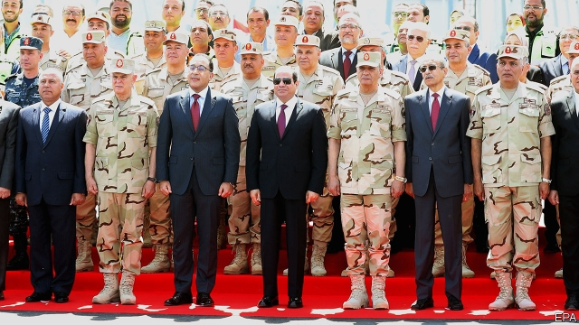

###### If Egypt collapses

# Pyramid scheme 

 

> Jul 6th 2019 

“IF EGYPT COLLAPSED, millions of Islamic State members would storm the world.” This prediction came from Egypt’s strongman president, Abdel-Fatah al-Sisi, in 2015. He has cynical reasons to sound apocalyptic. His formula for staying in power has two main parts: repression at home, and constantly warning foreign leaders that unless they support him, Egypt will fall into chaos. 

It works surprisingly well. Gulf states bankroll him for fear that the alternative is a regime led by the Muslim Brotherhood. This is not an unreasonable fear. The Brothers won elections in 2011 and 2012 and ruled Egypt incompetently until Mr Sisi overthrew them in a coup in 2013. America backs Mr Sisi for the same reason: some in President Donald Trump’s administration consider the Brotherhood a terrorist organisation (and Mr Sisi is adept at flattering Mr Trump himself). Europe turns a blind eye to the awful things that go on in Mr Sisi’s police cells because it fears the millions of refugees who might surge across the Mediterranean, were Egypt to fail. So Mr Sisi’s warning is self-serving. But is it wrong? 

Egypt’s collapse is far from impossible. Granted, the country is not Lebanon or Iraq, riven by sectarian feuds. Nor is it like Libya or Yemen, where regional and tribal divides fuel civil wars. Egyptians have a strong sense of nationhood. But they are under great stress, bossed around by a military regime that is both brutal and brittle. Discontent is everywhere. The Islamists who won the only moderately fair elections Egypt has ever held still justifiably seethe at having been ousted from office at gunpoint. Despite an uptick in economic growth, youth unemployment remains worryingly high. In April 2019 Mr Sisi won a grossly unfair referendum to allow himself to remain in power until 2030. A despot with a messianic streak who aims to rule for ever is not a recipe for long-term stability. 

The most likely cause of social breakdown is water, or rather the lack of it. Egypt is mostly desert. Its people are nearly all crammed into a narrow fertile strip on either side of the Nile. Successive governments have encouraged them to waste water by charging almost nothing for it. Meanwhile, the countries upstream of Egypt plan to draw more water from the Nile. Ethiopia is building a huge dam to generate electricity and help its people lift themselves out of poverty. Sudan wants to divert water into irrigation projects, hoping to become the regional breadbasket. Many Egyptians, accustomed to taking the pharoah’s share of the Nile’s waters, view all this as an existential threat. 

The potential for conflict may increase as climate change parches the region and Egypt’s population increases: from 100m today to an estimated 130m by 2030. Some Egyptian military officers have suggested that Egypt will go to war to protect its rights to the Nile’s waters. At the same time, Egypt also has a sizeable jihadist threat in the Sinai region, where an offshoot of Islamic State massacres Christians and Sufis (a minority Muslim sect). It has unstable neighbours, too: war-torn Libya to the west, revolutionary Sudan to the south. With so many potential sources of instability, it would be rash not to think through the possible consequences if Egypt collapsed into the kind of chaos seen in Syria or Libya. 

For one thing, the refugee flows would dwarf those from Syria (which, pre-war, was only a fifth as populous as Egypt). A few of the displaced might head for the open, unguarded spaces of Libya. But most would cram into boats and cross the Mediterranean, or try their luck in the Gulf. Italian and Greek ships would try to turn them back. Many would drown. Turkey and Jordan would be slightly more welcoming. Though only a small proportion of the refugees would make it to Europe, anti-migrant parties would wax hysterical about the “Egyptian invasion”. Populists would win elections, starting in France. President Marion Maréchal-Le Pen would close the border with Italy—and then ban halal butchers. 

If the Egyptian government lost control, foreign powers would intervene to keep the Suez canal open to global shipping. The United States, which uses the canal to move naval forces from the Mediterranean to the Gulf and farther east, would swiftly take charge, with a token coalition of Saudis and Emiratis at its side. But given the humiliation they suffered in the Suez crisis of 1956, Britain and France would be understandably reluctant to participate. 

Some of Egypt’s vast ungoverned territory would provide a safe haven for killers. Rebels from Libya would use the borderlands as a rear base. Jihadists would set up a new caliphate on Egyptian turf. Israel would find this intolerable—Egypt would have transformed from a partner in peace to a mortal threat. Israeli jets would bomb Islamic State targets in Egypt as ferociously as they bombed Iranian missile units in Syria. Even then, having lost its main mediator with Hamas in Gaza, Israel would be desperately vulnerable. 

As the chaos in Syria and Libya shows, putting Egypt back together would be excruciatingly hard, and might take decades. Far better to stop it collapsing in the first place—but it is far from obvious that Mr Sisi is the right man for that job. ◼ 

