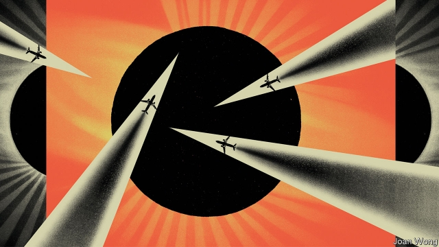

###### If geoengineering goes rogue

# Reaching for the sunshade: July 2030 

 

> Jul 6th 2019 

THE PARIS climate deal commits its signatories to cuts in climate-changing greenhouse-gas emissions over the coming decades. But even if countries stick to their promises (and some may not), that may not be enough to avert catastrophe. Imagine that by 2030 global temperatures are still creeping up, and sea levels are tens of centimetres higher—significantly worsening the impact of storm surges that push seawater over low-lying areas and corrode coastal infrastructures. In Europe and America, summer heatwaves and winter flooding have become more severe. In America’s southern states, the Caribbean and South-East Asia, coastlines are battered by stronger tropical cyclones. The global South suffers worse droughts and more irregular monsoons, undermining fragile agricultural systems and causing famines and civil unrest. The reality of global climate change becomes apparent to rich and poor countries alike. 

Under these conditions, it seems likely that some countries will propose the use of a technique called “solar geoengineering” to cool the planet or slow its warming. One way to do this involves injecting tiny reflective particles into the stratosphere, where they would act as a sunshade by bouncing part of the sun’s energy back out into space. Something similar also happens naturally: big volcanic eruptions have, in the past, thrown large amounts of material into the atmosphere, cooling the planet for months or years. The eruption of Mount Pinatubo in the Philippines in 1991, for example, reduced temperatures in the northern hemisphere by as much as 0.5ºC for four years. Solar geoengineering would, its advocates say, do the same thing in a more controlled manner. 

Imagine that the idea starts to gain political support. The first detailed international discussions of the options, starting in the mid-2020s, are fraught. Developing countries, more exposed but less well equipped to cope with the impacts of climate change, call for discussions at the United Nations. A motion is proposed by a group of “least developed countries”, led by Bangladesh, a medium-sized economy with a strong voice in international climate talks. Eventually, the issue makes it onto the agenda in the General Assembly. But, as with negotiations to cut global emissions, years of discussions and resolutions lead to little concrete action. Few see a planetary sunshade as a desirable solution. Supporters observe that a sunshade would buy more time to reduce greenhouse-gas emissions, given that cuts are not happening fast enough. But opponents say it will reduce the urgency of cutting emissions. 

A further objection is the risk of unintended consequences, given that the technique has never been tried before, and academic studies and small-scale field trials have been underfunded, for fear of giving countries an easy way to avoid the difficult choices emissions cuts require. There is also the danger of “termination shock”: if a geoengineering project is launched, and it successfully cools the planet, then any failure of the sunshade (due to technical problems, say, or sabotage) could cause a sudden increase in temperatures in just a few years. For all these reasons, there are calls for international rules to govern the use of the technology—because without them, there is nothing to stop one or more countries launching a “rogue geoengineering” scheme on their own. 

But that is exactly what some countries might start to consider, perhaps in 2030, after the UN debate fails to reach any agreement. Fed up with yet more inaction, a small group of developing countries might choose to engage in “minilateral” discussions over whether to “go it alone” with a sunshade scheme that would, if it worked, both cool the planet and provide a proof of principle that might persuade other countries to back the idea. 

The fastest way to do this would be to build a fleet of specialised planes. An analysis published in 2018 by Wake Smith, at Yale University, and Gernot Wagner, at New York University, maps out how to do it. The planes need to fly at altitudes of 20km (66,000ft) or higher, ruling out the possibility of using existing commercial aircraft for the purpose. Instead, a custom fleet of several dozen aircraft would be needed, with four jet engines mounted on two huge, glider-like wings, which would allow them to stay aloft in the thin air of the stratosphere. In the first year, eight aircraft could carry out 4,000 five-hour flights (four spent in ascent and descent and one in the stratosphere). By year five, this would be ramped up to 34 aircraft making 20,000 flights a year; by year ten, 71 aircraft would be making 44,000 flights year. After 15 years the fleet would be 100 strong. 

This first-generation sunshade would probably be made from dispersed sulphur dioxide (SO2), which is one of the chemicals produced during volcanic eruptions. Dr Wagner suggests that the most efficient way to deliver it would be for geoengineering aircraft to be loaded with solid sulphur, which they would burn at altitude in their engines to produce SO2. All this would cost around $3.5bn a year (at today’s prices) to deploy. A parallel research programme would also be needed to monitor the dispersal of the particles, determine their interaction with other molecules in the atmosphere and model the climate impacts. This would cost about the same again. According to Janos Pasztor, executive director of the Carnegie Climate Governance Initiative, the only existing monitoring network capable of carrying this out at the required level of detail is the World Meteorological Organisation’s satellite and ground-based global atmosphere monitoring system. 

Bangladesh on its own seems unlikely to foot that bill. As well as financial help, it would almost certainly want safety in numbers, which is why a coalition of developing countries seems more likely. Such a coalition might also want the security provided by the support of a larger power, such as India or China, both of which have large populations at risk from considerable climate impacts. Handily, China is also a big producer and exporter of sulphur. 

It would be both smart and efficient to start such a programme slowly. Drs Smith and Wagner calculate that the fleet could scatter 200,000 tonnes of SO2 in the stratosphere in the first year, causing an unremarkable 0.02°C of cooling. By the fifth year, those figures would rise to 1 megatonne of SO2 and 0.1°C. The cooling would reach 0.2°C in year ten and 0.3°C in year 15. At these levels, there should be a real impact on the rate of warming. 

July 2030: a few developing countries start to discuss building a sunshade 

But there is a catch. Regional geoengineering is impractical (stratospheric winds disperse particles across whatever hemisphere they are deposited in) so a solar sunshade would have to be either hemispheric or global. The former could be catastrophic, because models suggest it could shift the balance of energy in the upper atmosphere in a way that causes large-scale disruptions to tropical monsoons. 

To avoid the disastrous geopolitical fallout of such a scenario, the coalition would therefore seek to deploy a global sunshade that would offer equal or comparable cooling to all regions. Some studies suggest that this may be possible, though research is still very much in its early days. Simone Tilmes at the US National Centre for Atmospheric Research calculates that injections of SO2 at 15° and 30° north and south of the equator would produce a reasonably uniform global cooling. 

Even so, a coalition of states acting unilaterally to cool the whole planet would still risk military reprisals. To avoid conflict, flights would have to remain within participating countries’ own airspace, so a coalition would need to span those latitudes. China, India and Bangladesh could take care of the northern latitudes, but the southern hemisphere would require collaborators with the right capabilities in Africa, South America or Australasia. 

There is another possibility. America has the money to build a fleet, the research capacity to track its impact and military bases around the world from which to launch planes. As for motives, look no further than hurricanes. Modelling published earlier this year suggested that sunshades might reduce the intensity of hurricanes compared with a warmer world. And it is possible, if hard, to support solar geoengineering without taking a position on the causes of global warming. A sceptical American administration could still insist that climate change was not man-made; it need only concede that temperatures are rising. 

It is difficult to predict what the international response to a unilateral American sunshade programme would be. It would, of course, depend on how the sunshade was deployed and how the climate responded. America, the Soviet Union, Britain, France and China were all rebuked for carrying out atmospheric nuclear testing in the 20th century, but suffered little actual diplomatic cost. Unilateral geoengineering might provoke condemnation, but not war. 

Countries opposed to the idea might respond by developing counter-geoengineering programmes. They could either shoot down geoengineering planes or, more tactfully, build a second fleet to deliver a separate stratospheric payload to neutralise the sunshade (either by reacting with the SO2 to break it down, or by making the sulphate particles clump together and rain out faster). The development of counter-geoengineering tools might provide a deterrent against the unilateral deployment of a sunshade. 

With or without counter-geoengineering, the global climate blame-game would undoubtedly become even more heated if a sunshade were deployed. One problem would be distinguishing its cooling effect amid natural variability. The cooling would take effect gradually, and global average temperatures would continue to rise in the early years of its deployment. Eventually, a slowdown in the rate of warming would become apparent in global data sets. But because temperatures vary naturally from one year to the next, reliably identifying a sunshade signal within the data would be tricky. And even before its effect became apparent, the sunshade would start to influence the weather, and the frequency of droughts, floods and tropical cyclones. Teasing apart the relative influences of global warming and natural variability on an extreme weather event is devilishly complicated today. Add a sunshade into the mix and fingers will be pointing in all directions, which will make international climate talks even more difficult. 

But if a sulphate-based sunshade was successfully deployed and was shown to work, it might then be time for phase two. David Keith, who runs Harvard University’s solar-geoengineering research programme, has suggested that it might be possible, perhaps even preferable, to design synthetic particles that are more efficient at reflecting the sun’s radiation, or can stay suspended in the stratosphere for longer than sulphate particles can. And perhaps, having failed to reach international agreement on geoengineering in the 2020s, the United Nations might try again, with a new treaty being signed in Kyoto in 2047, 50 years after the original Kyoto Protocol. Kyoto 2 would concede that efforts to tackle climate change had fallen short, and would endorse the use of a sunshade as a way to give countries more time to reduce their emissions. In the worst case, the unilateral deployment of a sunshade could lead to conflict. But in the best case, it might provide a pathway to a lasting solution to the climate problem. ◼ 

