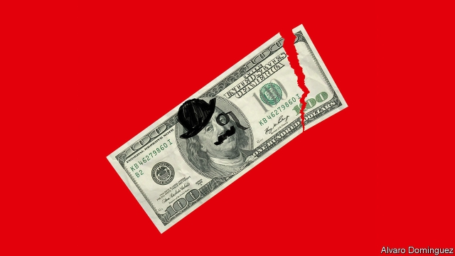

###### If America introduces a wealth tax

# Rich people’s problems 

 

> Jul 6th 2019 

THOMAS PIKETTY proposed a tax on wealth in 2014 as a solution to what he saw as capitalism’s innate tendency towards growing inequality. Many reviewers of his book, “Capital in the Twenty-First Century”, thought his idea outlandish. Now it has been adopted by an American presidential candidate, Senator Elizabeth Warren, who could conceivably win the White House in 2020. True, Mr Piketty wanted a global tax. But there is at least an outside chance that the most important rich country—and one of the most unequal—will answer his call. 

Mrs Warren’s idea is the most novel of many whack-the-rich proposals to have emerged on America’s left. Senator Bernie Sanders, another candidate for the White House, wants a higher estate (inheritance) tax on billionaires. Others want much higher income taxes. If Mrs Warren becomes president, she promises a 2% annual levy on net worth over $50m, rising to 3% on fortunes above $1bn. Backers of her policy have, broadly, three aims: to reduce inequality, raise revenue and prevent the accumulation of fortunes so vast that they influence the political process. They think a wealth tax would bring American capitalism to heel. Opponents respond that a wealth tax, like any plan to soak the rich, would crush the country’s entrepreneurial spirit. 

Were President Warren to sign a wealth tax into law, one thing is certain: it would be subject to an immediate legal challenge. America’s constitution forbids almost all “direct” taxes unless each state contributes an amount in proportion to its population. The dispute would centre on whether or not Mrs Warren’s tax is “direct”. Though her administration would line up legal scholars to argue that it is not, there is not much legal precedent on which to come to a firm view. An adverse court ruling would stop the wealth tax in its tracks, or leave it to states to implement. But suppose Mrs Warren wins in court. What would be the policy’s effect? 

Mrs Warren relies on analysis by Emmanuel Saez and Gabriel Zucman, longtime collaborators with Mr Piketty and wealth-tax proponents, and both of the University of California, Berkeley. They calculate that the tax would hit only 75,000 households (less than one in every 1,700) and raise approximately $210bn, or 1% of GDP, in new annual revenue. Mrs Warren wants to spend that cash to forgive most student debt, abolish tuition fees at most public colleges and provide universal child care for children under five—policies that could be significant vote-winners. Yet plenty of experts suspect that Messrs Saez and Zucman are too optimistic. For example, Janet Holtzblatt, a former senior budget official now at the Tax Policy Centre, a think-tank, predicts wealth-tax revenue would “fall far short” of Mrs Warren’s hopes. 

Experience would seem to be on the sceptics’ side. Net-wealth taxes do not have an encouraging record. In 1990, 12 rich countries levied them. By 2017 only four did: France, Switzerland, Spain and Norway. France has since mostly scrapped its levy, fearing that it made the country unfriendly to investors. Of the remainder, only Switzerland raises significant revenue (about 1% of GDP, comparable to what Mrs Warren hopes for). The Mirrlees review, a study of the British tax system in 2011, found that “wealth taxes have failed to live up to expectations and are generally in decline”. But the fact that many countries have abandoned net-wealth taxes is hardly a killer argument against them. What really matters is why they did so, and whether the problems they found with them would apply in America. There are three primary issues to consider: valuation, avoidance and economic impact. 

Start with valuation. A net-wealth tax requires a reliable estimate of net wealth. Financial investments, which account for about four-fifths of the wealth of the rich, can typically be marked to market. American houses are already valued for the purposes of local property tax. The trickier parts of investment portfolios to value include oddities like art and antiques, and, much more significantly, privately held businesses, which account for about a tenth of the rich’s wealth. Perhaps the most prominent example is Koch Industries, an American conglomerate. Another is Bloomberg, a financial-data publisher which is 88% owned by Michael Bloomberg, one of America’s richest men. Putting a value on some assets can be “very challenging”, says Ms Holtzblatt, and costly disputes are inevitable. But not, perhaps, insurmountable: art is often valued for insurance purposes, and businesses can be valued using their profits, although doing so turns the wealth tax into a de facto income tax. Even so, countries with wealth taxes often exempt many types of assets from the levy to make things simpler. 

That adds to the second problem: avoidance. When Spain exempted small-business shares from its wealth tax in 1994, for example, business owners reorganised their affairs to exploit the exemption, according to work by Mr Saez and Facundo Alvaredo of the Paris School of Economics. The most lucrative avoidance involves borrowing money and using it to buy non-taxable assets, thereby reducing taxable net worth. Many countries with wealth taxes added rules to exclude debts incurred buying exempt assets. 

Wealth can also be hidden overseas, or in complex legal structures designed to avoid tax. Larry Summers of Harvard University and Natasha Sarin of the University of Pennsylvania recently calculated in the Washington Post that the estate tax raises far less from estates valued at over $50m than would be expected from Messrs Saez and Zucman’s wealth data, so adept are the rich at avoiding the tax. Their data on billionaires came from the Forbes 400, an annual list of the mega-rich compiled by Forbes magazine. But the Internal Revenue Service (IRS), America’s tax authority, has found that the taxable value of large estates is only around half what is reported in that list. Many of the countries that have given up on wealth taxes concluded that struggling with avoidance, and the high administrative costs of stopping it, for a relatively small amount of incremental tax revenue did not seem worth it. 

Mrs Warren’s backers argue, with some justification, that if America was sufficiently committed to stopping avoidance it surely could. America’s size and importance give it leverage over overseas tax havens, for example. It has extended its reach in recent years, after the passage of a law in 2010 requiring foreign banks to report the assets of their American customers to the Treasury. Mrs Warren would levy a 40% “exit wealth tax” on those who renounce their citizenship to try to escape the clutches of the IRS. Committing to stopping avoidance with such measures would be at least as important as writing the tax into law. But it would be a political challenge. Today America does not fund the IRS enough to enforce even existing tax law properly, having cut its budget by over a fifth in real terms in the current decade. 

Then there is the question of economic impact. Although tax theory says much less about taxing wealth than it does about taxing income, there are reasons to expect a wealth tax to cause some economic damage. Levies of 2-3% may sound small, but are high enough to gobble up a big chunk of the annual returns investors make. Assuming a return on capital of 5%, for example, a 3% wealth tax has the same effect on an investors’ bottom line as a 60% tax on income from capital, all else being equal. 

That high rate is by design. Mr Piketty feared that substantial returns to wealth cause it to grow inexorably relative to the economy. He wanted to prevent that expansion. But taxes are typically designed to have the minimum possible effect on economic behaviour, like entrepreneurship and saving, that is seen as broadly beneficial. That is why governments tend to tax only property wealth: the supply of land is fixed and cannot shrink in response to the tax. Mrs Warren, by contrast, wants to tax huge fortunes out of existence. That might deter wealth creation—though backers of the tax retort that Switzerland, despite its wealth tax, has one of the highest saving rates in the OECD, a club of rich countries. 

There is a limit to how much Mrs Warren’s wealth tax could distort the economy, however, because only about 10% of total American household wealth would actually be subject to it. As for incentives for entrepreneurs to get rich, Messrs Saez and Zucman argue that most innovation comes from people with vastly fewer resources than the $50m threshold for Mrs Warren’s proposal. 

The limited scope of the tax is double edged: it would also limit its upsides. Take inequality. Certainly, the levy would put a brake on the ability of the super-rich to enlarge their portfolios. But most Americans probably would not notice a decline in plutocrats’ fortunes. Go just a little down the income spectrum and wealth ceases to look very relevant to inequality. Most of the rise in the share of the income of the top 1% of households since the 1970s has resulted from growing disparities between winners and losers in the labour market, not growing income from wealth. True, labour’s overall share of national income has fallen and capital’s has risen, but that is primarily attributable to a surge in the returns to owning housing, which is relatively less important to the mega-rich. 

A wealth tax will not solve the inequalities that are most plainly visible: those caused by the growing dearth of opportunity for people without college degrees and without expensive houses near successful cities. Yet reducing economic inequality is not the only goal of the policy. Mrs Warren and Mr Sanders both argue that billionaires have captured the political process. Curbing their wealth is in part about curbing their political power. 

Regardless, the reluctance of Congress to fund the IRS and its history of creating porous tax laws both suggest that making a wealth tax watertight, even if it is possible, would be a huge political lift. Perhaps it would be achievable for a freshly inaugurated president with control of both branches of Congress. It is more likely, however, that a wealth tax would leak, limiting the impact of an already narrowly targeted policy. That, in turn, would limit its effects, both good and bad. A wealth tax would neither revolutionise capitalism nor mark its end—not least because it would probably prove too leaky to do either. ◼ 

