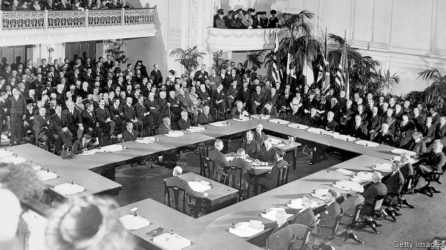

###### If the Allies had been more generous in 1919

# Versailles revisited 

 

> Jul 6th 2019 

THE TREATY signed in the Palace of Versailles exactly a century ago, on June 28th 1919, was a catastrophic failure. It set out to create peace, but within just 14 years Adolf Hitler had become German chancellor and was dragging the world back towards war. The blame, it is often said, lay with the leaders of America, Britain and France, who imposed a vengeful “Carthaginian” peace on Germany, visiting a punishment that crushed the fragile Weimar Republic. If only Versailles had been more generous, the second world war might never have taken place. 

The peacemakers included 70 delegates from 27 countries, who met for six months in Paris, starting on January 18th 1919. Although they certainly made mistakes, they deserve a sympathetic hearing. At the end of the first world war the Allies were not too harsh on Germany. If anything, they were not harsh enough. 

Critics of Versailles got their attack in early. Just six months after the treaty was signed John Maynard Keynes published “The Economic Consequences of the Peace”, the book that made his name. Keynes combines intricate tabulations of German coal consumption with vicious portraits of Woodrow Wilson, Georges Clemenceau and David Lloyd George, the American president and prime ministers of France and Britain, who ran the negotiations. The tabulations purport to show that Germany could not afford large reparations; the portraits that weakness, vanity and vindictiveness blinded the Allies to German suffering and to how reparations would poison European relations. Hadn’t Sir Eric Campbell Geddes, First Lord of the Admiralty, vowed that Germany should “be squeezed until the pips squeak”? 

Yet Keynes was protesting too much—and too soon. He was writing in 1919, two years before the size of the reparations was actually determined. The sums being talked of at Versailles were as much as 16 times bigger than the final bill. The reparations imposed in 1921, in what Germans called the “London ultimatum”, were large, but not impossibly so. Germany was asked to pay 132bn German marks, but this included 82bn marks in bonds that were never likely to become payable. The remaining 50bn marks—worth about $12.5bn then, or $185bn today—was less than what Germany itself had earlier offered to pay. It was about 160% of the country’s GDP, similar to British national debt at the time and only slightly larger than the $10bn that the recipients of the reparations owed the United States. Moreover, Versailles also gave Germany a “peace dividend” by limiting its military spending, which was by some calculations worth about as much as the reparations cost. 

Neither did reparations cripple Germany’s economy. Despite the hyperinflation in 1921-23 and allowing for changes in the map of Europe, Germany produced 30% more iron and 38% more steel in 1927 than it had in 1913, the previous record. By 1930 the tonnage of German merchant navy was about 4m tonnes, only a little less than the 5m of 1913. And yet Germany appeared to struggle. It repeatedly failed to pay its reparations bills on time—its failure to make coal shipments in January 1923, for instance, was its 34th in 36 months. So badly did it fall behind that the payments schedule from 1921 was relaxed twice, in 1924 and again in 1930. Overall, Weimar Germany ended up paying a total of just 20bn marks. 

Do the defaults and rescheduled debts prove that Germany had been asked to pay too much in 1921? In fact, Germany’s behaviour had less to do with its capacity to pay than its incentives. Article 234 of the Versailles treaty said that the reparations should be adjusted if Germany could show that it could not afford them. 

The German government tried to do this in two ways. First, rather than strive for sound public finances, it sought to demonstrate that it was broke. For instance, Karl Joseph Wirth, chancellor in 1921-22, argued against raising revenues through a property tax, which would have helped slow the collapse of the mark. “The goal of our entire policy must be the dismantling of the London ultimatum,” he declared, and thought it would be a mistake to suggest, by stabilising the currency, that payments were “80% possible”. 

Second, the Weimar government spread the idea that Versailles was fundamentally unjust. Its diplomats insisted the war had been defensive, a response to the threat from imperial Russia and its ally, France. Troops returning from the front in 1918 had been told by their president, Friedrich Ebert, that “no enemy has defeated you”. Many believed that they had lost the war only because, in 1918, a cabal of Jews and Socialists had “stabbed them in the back”. The Allies inadvertently played into this punishment narrative. Lloyd George and Clemenceau needed the reparations bill to appear large because public opinion demanded that Germany suffer. 

Versailles failed chiefly because it was being asked to finish the job that the exhausted Allied armies had left unfinished. Unlike France and Belgium, Germany ended the war with its factories and mines intact. Germans felt undefeated. Upended by the Depression and goaded by Hitler, they were ready to take up arms again. 

In her memoirs Elizabeth Wiskemann, a correspondent for The Economist, describes how she met Keynes in London in 1936: 

A full list of sources for this article is available here. 

