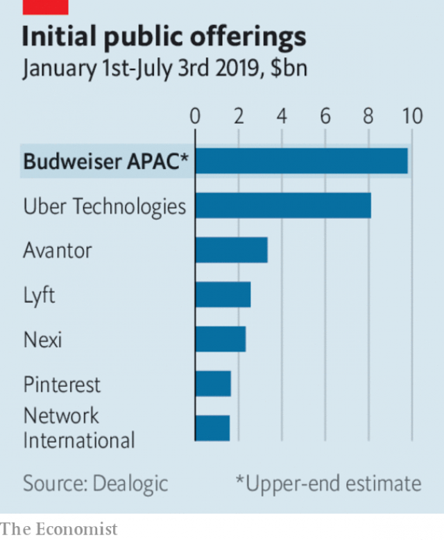

###### Politics

# Business this week 

> Jul 6th 2019 

America and China agreed to resume trade talks. At a summit of G20 leaders in Japan, President Donald Trump agreed not to slap new tariffs on $300bn-worth of Chinese goods. He also said he would allow American companies to sell products to Huawei, a Chinese telecoms firm which was blacklisted in May. In exchange, Xi Jinping, China’s president, agreed to make new purchases of American agricultural products. The truce lacked specifics and did not include a timeline for completing negotiations. Mr Trump declared victory anyway, telling reporters, “We’re right back on track.” See article. 

Days after the China ceasefire, America threatened to impose tariffs on $4bn-worth of goods from the European Union as part of a 14-year dispute at the World Trade Organisation over aircraft subsidies to Boeing and Airbus. In April America identified $21bn-worth of European goods that could be hit with tariffs over the WTO spat. The 89 products targeted under the new levies include cheese, pasta and whisky. 

The European Union and Mercosur, a South American trade group, agreed to a free-trade deal. The agreement, which was reached 20 years to the day after negotiations began in 1999, would eliminate tariffs on more than 90% of goods traded between the two blocs. Jean-Claude Juncker, president of the European Commission, hailed the deal as a victory for “open, sustainable and rules-based trade”. See article. 

The European Commission decided not to take disciplinary action against Italy for violating EU budget rules, which might have resulted in fines. Italy’s cabinet pledged to cut its deficit for 2019 from 2.4% of gross domestic product to 2%, in line with a previously agreed target. Italy’s debt, at 132% of gross domestic product, remains more than twice the EU’s 60% limit.  

 

Anheuser-Busch InBev, the world’s biggest brewer, is seeking to raise up to $9.8bn by listing its Asia-Pacific business in Hong Kong. The share offering of the unit, Budweiser APAC, is expected to be the world’s biggest so far this year. The initial public offering would help the firm reduce its $100bn-plus debt pile and give it a platform for making acquisitions in the region. 

European leaders tapped Christine Lagarde, head of the International Monetary Fund, to become the next president of the European Central Bank. Ms Lagarde, a former French finance minister, would succeed Mario Draghi whose term ends on October 31st. If approved by the European Parliament, she will become the bank’s first female boss. See article. 

Saudi Arabia revived plans for an initial public offering of Saudi Aramco, the world’s biggest oil company. Khalid al-Falih, the oil minister and Aramco’s chairman, said the IPO was back on track after being put on hold last year. The listing, first announced in 2016, is the cornerstone of Muhammad bin Salman’s “Vision 2030” plan to diversify the kingdom’s economy beyond oil. In April Aramco raised $12bn in its first international bond sale. See article. 

At a meeting this week in Vienna,  opec agreed to extend oil production cuts by nine months. The cuts, first negotiated in December, will reduce output by the oil cartel and its allies by 1.2m barrels a day from October production levels. The price of oil has been under pressure from expanding American shale output and a slowdown in global demand. See article. 

Warren Buffett, the 88-year-old chairman of Berkshire Hathaway, said he will donate $3.6bn-worth of shares in the conglomerate to five charities. It is one of his largest charitable gifts ever. Mr Buffett, the world’s fourth-richest person, has pledged to give away his entire fortune. Since 2006 he has donated more than $34bn. 

Donald Trump announced via Twitter that he would be nominating Christopher Waller, director of research at the Federal Reserve Bank of St Louis, and Judy Shelton, America’s representative on the board of the European Bank for Reconstruction and Development, to fill two vacancies on the Federal Reserve Board. Ms Shelton, a former adviser to Mr Trump’s presidential campaign, will no doubt be the more controversial pick. She is an outspoken critic of the Fed and has called for a return to the gold standard. See article. 

Ithaca Holdings, a music-investment company run by Scooter Braun, a music manager, announced it was acquiring Big Machine, a Nashville-based independent record label. The deal, reportedly valued at more than $300m, includes the entire six-album catalogue of Taylor Swift, a pop star. Ms Swift, who signed with Big Machine at 15 and left the label in November, criticised the acquisition and Mr Braun, saying she had spent years trying to buy back her master recordings. Justin Bieber, another pop star, came to Mr Braun’s defence and suggested the three talk it out. 

