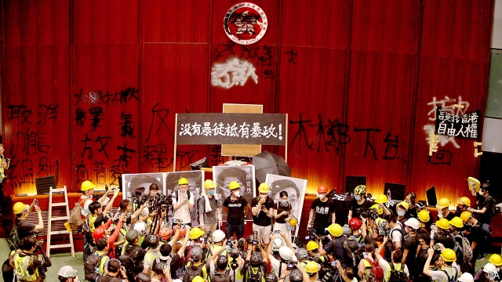

###### Politics

# Politics this week 

 

> Jul 6th 2019 

Protesters ransacked Hong Kong’s legislature, spraying graffiti and waving British-era flags in the chamber after commemorations for the 22nd anniversary of the handover of Hong Kong to China. Hong Kong’s chief executive, Carrie Lam, condemned the “extreme violence”. China’s government accused the demonstrators of trampling on “the rule of law”. See article. 

Rahul Gandhi resigned as leader of Congress, India’s oldest political party and the only national force opposing the ruling Bharatiya Janata Party (BJP). Mr Gandhi’s father, grandmother and great-grandfather all served as prime minister. Congress has been thrashed by the BJP at the past two elections. 

Taliban insurgents killed some 40 people in an attack in Kabul, the capital of Afghanistan. The attack came as American and Taliban negotiators were meeting in Qatar to discuss a possible peace deal. 

Prayuth Chan-ocha, the general who has served as Thailand’s prime minister since leading a coup in 2014, appeared to threaten another putsch, this time against his own government. Mr Prayuth was upset at his squabbling supporters in parliament, who have been fighting over cabinet posts. They seem to have taken the supposed restoration of democracy too seriously. 

Japanese commercial fishermen caught their first whale since Japan withdrew from the International Whaling Commission, an intergovernmental body which has maintained a moratorium on whaling for 30 years. The Japanese government has scrapped supposedly scientific whaling expeditions in Antarctic waters that involved killing a much larger number of whales. See article. 

Iran has breached a limit imposed in 2015 on how much enriched uranium it can stockpile. The limit was part of a deal that eased economic sanctions on Iran in exchange for restrictions on its nuclear programme. President Donald Trump withdrew America from the deal last year and reimposed sanctions, including a ban on Iranian oil sales. But the other signatories, including Britain, France and Germany, had urged Iran to continue to comply with the agreement. Iran’s president, Hassan Rouhani, said the country also plans to enrich uranium to higher levels than those allowed under the deal, raising concerns that it is stepping closer to developing a nuclear bomb. 

An attack on a migrant centre near Tripoli, the capital of Libya, killed at least 44 people held there. The Libyan government blamed an air strike by forces under the command of Khalifa Haftar, a warlord who controls much of eastern Libya. Mr Haftar’s forces claimed that the government had shelled the centre. See article.  

Nigeria, Africa’s most populous country and one of its two biggest economies, said it will sign a free-trade deal known as the African Continental Free Trade Agreement. The deal aims to increase trade between African states. 

Tens of thousands of people marched through Sudan in protest against military rule almost a month after government forces killed more than 100 people. See article. 

After a marathon three-day session, the leaders of the European Union decided on an allocation of the bloc’s top jobs. In a surprise move, one of the most important jobs, president of the European Commission, went to Ursula von der Leyen, Germany’s defence minister. The appointment is subject to ratification by the European Parliament, which may not approve it. See article. 

In another surprise, the European Central Bank is to be run by Christine Lagarde, currently boss of the IMF. The leaders also picked Spain’s foreign minister, Josep Borrell, to run  eu foreign policy and Charles Michel, prime minister of Belgium, to be the new president of the European Council. See article. 

Protests erupted in Madrid, the capital of Spain, against a decision to suspend a ban on polluting vehicles in the city centre. The ban, similar to those in other European cities, was introduced in November. The city’s new conservative mayor suspended it from July 1st. Without the policy, the city could face sanctions under the EU’s clean-air rules. 

America and European countries condemned Venezuela, after Rafael Acosta Arévalo, a captain in the country’s navy, died in custody just days after appearing in court, having apparently been tortured. Mr Acosta was accused of plotting to murder the country’s disputed leader, Nicolás Maduro. 

Jesús Santrich, a former commander in the FARC, a Colombian guerrilla group, who had become a politician, disappeared. He has reportedly fled to Venezuela, throwing Colombia’s peace deal into disarray. See article. 

Donald Trump met Kim Jong Un, North Korea’s dictator, for the third time. The two agreed to restart talks about ending the North’s nuclear-weapons programme; the talks had stalled since the failure of their previous summit in February. The latest meeting took place in the demilitarised zone that divides the two Koreas. Mr Trump briefly crossed the demarcation line and entered the North, becoming the first serving American president to set foot in the country. See article. 

America’s Department of Homeland Security said that it will investigate revelations that Border Patrol agents traded offensive content in a private Facebook group. ProPublica, an investigative service, revealed that border agents had mocked dead migrants, made jokes about throwing burritos at visiting Latino members of Congress, and faked sexual images of Alexandria Ocasio-Cortez, a Hispanic Democrat who has criticised the Trump administration’s border policies. See article. 

