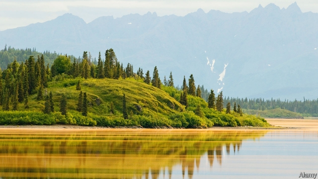

###### Yellow tide

# Alaska’s changing climate 

 

> print-edition iconPrint edition | United States | Jul 6th 2019 

AROUND A RECENT backyard bonfire on the outskirts of this small fishing and tourism town in the south-central part of Alaska, local residents debated whether a massive release of spruce pollen, which accumulated on every surface—including car bonnets, picnic tables and the nearby Kachemak Bay—amounted to a “golden sheen” or a “yellow scum”. The fine dust turned the surface of the sea the colour of butter and left a bright, lemony line on shore that marked the extent of high tide and gave off a sickly sweet smell. 

Eric Clarke manages trails at the nearby Kachemak Bay State Park, a rugged coastal area of dense spruce forests. He has been with the park for 24 years. “I haven’t seen a pollen dump like this in years,” he said. This huge release of pollen might be yet another symptom of a rapidly changing environment. Spruce pollen is made up of microscopic, double-lobed orbs that look a bit like Mickey Mouse heads. The “ears” are minute air sacks that help the pollen grains disperse over hundreds of miles, which in this region of Alaska means across mountains, glaciers and bays. 

Spruce trees release pollen annually, but every three to five years there is a natural bump in pollen production. This cyclical process is called masting, and it flushes the forests every few years with spruce seeds, overwhelming seed-eating animals like red squirrels and white-winged crossbills, and thereby ensuring many uneaten seeds go on to germinate. 

Climate change is also affecting how trees and other plants release pollen. Rising temperatures and increasing atmospheric carbon-dioxide concentrations are intensifying pollen seasons, much to the chagrin of allergy sufferers. In Alaska, where temperatures are warming at twice the national average, the change is getting up people’s noses. “Increased carbon dioxide will drive pollen levels,” says Jeffrey Demain of the Allergy, Asthma and Immunology Centre of Alaska, who began pollen counts here nearly 25 years ago. His clinic treats patients with especially pernicious pollen-related symptoms. 

More carbon dioxide in the atmosphere spurs plant growth. The pollen season is extending as well. Trees release pollen in the spring after a short stretch of frost-free days. Because the last frosts of spring are occurring earlier in the year, trees are blasting out pollen earlier as well. And because warming temperatures are keeping autumn frosts at bay later into the year, plants continue to release pollen for weeks longer than in years past. And in Alaska, where trees are moving north into formerly treeless landscapes, the geographic reach of pollen is changing. 

Already this year, Alaska has seen record temperatures, more than 20 degrees Celsius (40 degrees Fahrenheit) above normal. And each year atmospheric carbon dioxide concentrations increase. While spruce pollen is irritating to local residents, the massive pollen release could be a boon to the region’s forests, which have been decimated in recent years by beetle and aphid infestations brought on by rising temperatures. The yellow mist rising from the trees looks like an indicator of a rapidly changing environment, which is leaving its mark on human health, local forests and the tideline. ◼ 

