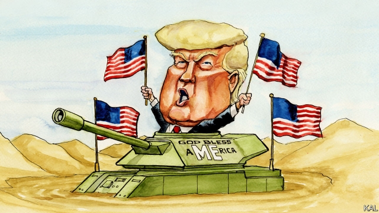

###### Lexington

# Donald Trump: foreign-policy showman 

 

> print-edition iconPrint edition | United States | Jul 4th 2019 

JULY 4TH could not come a day too soon for Donald Trump. As Lexington sat down to write, the president was finalising plans for the “Salute to America” pageant he had dreamed of presiding over ever since witnessing Emmanuel Macron’s columns of armoured cars and strapping legionnaires two years ago. Tanks, planes and other things that go were promised—plus, Mr Trump teased by tweet, “an address by your favourite President, me!” Trump devotees, including the donors and other cheerleaders for whom a section of the National Mall had been cordoned off, were in for a treat. 

Equally delightful for the president, his critics were outraged. There were reports that $2.5m in national park receipts had been siphoned off to help foot the jamboree’s bill, and that Mr Trump’s tanks could damage the underground vaults of the Lincoln Memorial. To see Independence Day being so politicised was sad. For a president who has elevated “owning the libs” from a Twitter meme to a governing strategy, this was both part of the plan and a timely distraction from more damning events. Mr Trump has issued a series of bold foreign-policy pledges for his first term: including to improve America’s trade with China, deal with the nuclear threats of North Korea and Iran, wind down the war in Afghanistan, pacify the Middle East and restore order to America’s southern border. And it has become apparent, in a recent cascade of bad news for his dealmaking ambitions, that he has a diminishing chance of honouring any of them. 

In a meeting with his Chinese counterpart at the G20 summit in Osaka he agreed to extend trade negotiations with China—but only after making concessions, including the reversal of his decision to blacklist Huawei, a Chinese telecoms firm his administration accuses of spying. President Xi Jinping also adopted a less conciliatory public tone than he had before the two leaders’ previous meeting, last year in Argentina. The prospects of a substantial China settlement appear remote. Mr Trump’s subsequently arranged trip to meet Kim Jong Un on the front-line between the two Koreas looked like an effort to divert attention from this climb-down. 

His Korea trip, in turn, provided a reminder that despite Mr Trump’s affectionate encouragement, Mr Kim has taken no step to denuclearise the peninsula, nor—even within the administration—is he expected to. Happily for Mr Trump, the much-criticised efforts of his daughter Ivanka to promote herself on the Korean front-line provided an additional diversion. Ms Trump’s parading for the cameras was the distraction from the main distraction. 

The list goes on. Iran said this week that it had stockpiled more than 300kg of enriched uranium—Mr Trump having torn up its promise to America not to do so. America’s negotiators meanwhile prepared to rejoin peace talks with the Taliban in the absence, at the militants’ insistence, of any representative of Afghanistan’s elected government. The insurgents are also stepping up attacks across the country. If Mr Trump goes ahead with the troop withdrawal he claims has already taken place, he risks triggering an explosion. As for the Middle East, better not ask. The summit in Bahrain last week at which Jared Kushner unveiled his economic blueprint for peace was a farce. The president gave it a wide berth; no plausible Palestinian attended. Which leaves the border—and this may be Mr Trump’s most damaging failure of all. Despite his effort to push Mexico into deterring border crossings, they are soaring, which is dismaying his base even as the administration’s brutal treatment of poor migrants angers everyone else. 

This is not all Mr Trump’s fault. He has taken on major problems, some of which defeated his predecessors. And on China and Afghanistan especially his approach has been novel, good in parts and may yet form a basis for progress. The problem is his relentless divisiveness, hitherto more damaging at home than abroad, is hurting his prospects. His Iran, North Korea and Middle East polices were launched largely in an effort to repudiate his Democratic predecessor. This has encouraged the Democrats to oppose all his efforts, even—as on Afghanistan and China—where they share his aims. That partisan schism is in turn encouraging Mr Trump’s foreign counterparts to play a long-game, to think they can hold out for better terms from a future Democratic administration, or that such an administration would in any event scrap whatever deals Mr Trump might have done. 

The only way the president looks able to unlock the dramatic progress he craves, on any of these fronts, would be by making further concessions: for example, by agreeing to a weak trade pact with China or a replica of Mr Obama’s Iran deal. Yet he could in that case expect a backlash from within his own party. Marco Rubio, one of several Republican senators who consider foreign policy a safe space from which to criticise the president, called the concessions on Huawei a “catastrophic mistake”. 

This reflects a broader dilemma for Mr Trump. Because he now has little prospect of expanding his support—beyond the large minority of Americans who are not offended by him—he must at all costs keep the Republican coalition together. He is therefore constrained by politics as well as the poor progress of his deal-making efforts: both are stuck. The daily controversies Mr Trump generates, including this week’s Trump show on the steps of the Lincoln Memorial, are meant to mask that reality. 

It is depressing how well the tactic is working. By rising to the daily bait, Mr Trump’s opponents are doing as he is: whipping up their supporters, without in any way impressing the other side. To be fair, it is hard not to be thus riled; the controversies Mr Trump stirs, including over his politicising of Independence Day, are often real scandals. Yet his critics risk losing sight of his actual record. It suggests an administration that is less unstable than many believe; but one with weak support and signature policies, fully 18 months out from an election, that are mostly running into the sand.◼ 

