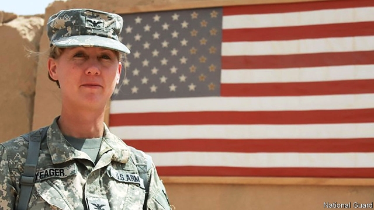

###### Top brass

# Laura Yeager, General 

 

> print-edition iconPrint edition | United States | Jul 6th 2019 

THE HEADQUARTERS of the 40th Infantry Division in Los Alamitos is awash in historical memorabilia. In a long glass case sit yellowing photographs of men in uniform and a tattered cap from when the unit was founded in 1917. Displayed in frames are a collection of bayonets and rifles carried by the unit in its past deployments to France in the first world war, Hawaii and the Philippines in the second, Korea in the 1950s and, more recently, Iraq. Past the threshold of the main office wing hang portraits of the division’s previous commanders: 31 men clad in blazers decorated with service ribbons. 

In the future, that wall will look a little different. On June 29th, in a ceremony featuring cannon fire and a helicopter flyover to honour her time as a Black Hawk pilot, 54-year-old Major-General Laura Yeager assumed command of the division. She is the first female leader of an infantry division in American history. 

Major-generals, who sport two stars on their uniform, typically command over 10,000 soldiers. General Yeager’s division is made up of four brigade combat teams, usually over 4,000-strong, spread across 13 western states and Pacific territories. Much of her time will be spent managing a sprawling network of bases and facilities. 

When she joined the armed forces in the 1980s—first applying to the Reserve Officers’ Training Corps programme for college students at the Los Alamitos training base she now leads—women were not allowed to drive tanks, join certain special operations units, or serve in any combat capacity, including infantry, which generally engages the enemy at closer range than artillery and tanks. 

In 1997 a study by the RAND Corporation, a think-tank with close ties to America’s armed forces, found that the integration of women into the armed forces did not degrade readiness, cohesion and morale, despite dire warnings that all three would suffer. Yet progress was slow. Until 2000, Canada was the only NATO country which accepted women into combat arms. In 2013 the Obama administration eventually followed suit. 

In January 2016 the Pentagon threw open all military positions to women. “Women could be generals and admirals and do all sorts of things. But until the removal of restrictions on women in combat, there was still this secluded part of the military that women couldn’t enter,” says Kara Dixon Vuic of Texas Christian University. “It’s been the last brass ceiling, so it is a big deal that a woman is now in charge of an infantry division.” 

According to the Centre for Naval Analyses (CNA), a think-tank, the share of women serving across the armed services rose from 4.2% in 1973 (when America moved from conscription to an all-volunteer force) to 18.4% in 2017 among commissioned officers, who manage enlisted personnel, and from 2.2% to 16% among enlisted members. 

Speaking at the division’s headquarters a few days before she took command, General Yeager, who is amiable but direct, added: “As far as I’m aware, there’s no other occupation where you know you’re going to make exactly the same amount of money as the male doing the work that you’re doing. And I didn’t have to negotiate that—it’s just part of the plan.” Though she is heartened by the increasing number of women joining military ranks, she says she is keen for the trend to continue until the armed forces more closely resemble the country they serve. 

That will take time. The Army and Marine Corps adopted a “leaders first” policy in 2013, prioritising recruiting female officers ahead of female enlisted personnel, with the intention of building a cadre of female leaders. That process was expected to take two decades, notes Monica Medina of Georgetown University. Although over 500 women now hold jobs previously closed to them, the army has more than a million soldiers. Tests conducted by Britain’s defence ministry suggested that only 1% of serving women there could pass physical tests for service in the infantry. 

Even so, having witnessed Ms Yeager make history on a sunny Saturday morning, Captain Gerrelaine Alcordo, a 35-year-old who works in public affairs for the 40th Infantry Division, was overflowing with optimism. As politicians and uniformed men and women milled about the base, she exclaimed: “Now little girls can say, ‘Oh my god, I can do that!’ If I had a daughter and she was here I would be like: ‘You can do that. You can be in the infantry, you can go into combat roles and be powerful.’”◼ 

