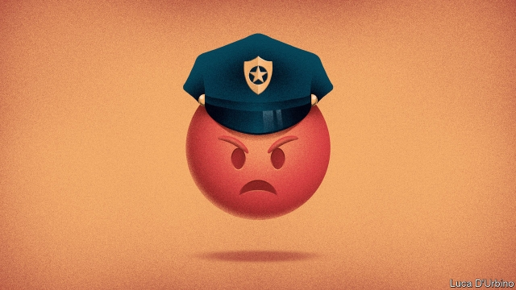

###### Slur and protect

# Police officers and Border Patrol agents say racist, sexist things 

 

> print-edition iconPrint edition | United States | Jul 6th 2019 

“WE SERVE THE American people with vigilance, integrity and professionalism” is part of the ethos of the Customs and Border Protection, the agency charged with guarding America’s borders. On July 1st ProPublica, an investigative journalism non-profit, exposed a private Facebook group of current and former border patrol agents who have been sharing comments about migrants and misogynist memes about Latina lawmakers. The group, which has some 9,500 members, is called “I’m 10-15”, code for aliens in custody. One commenter mocked a 16-year-old migrant’s death. Another made fun of a man carrying his child in a plastic bag to cross a river: “At least it’s already in a trash bag.” Alexandria Ocasio-Cortez, a New York representative who has called detention centres concentration camps, was crudely photoshopped into a sex act with a migrant and being sexually assaulted by the president. 

The Border Patrol agents are not the only law-enforcement officials who have been busy online. The Plain View Project, launched by Emily Baker-White, a Philadelphia lawyer, looked at the social-media accounts of 2,900 officers and 600 retired officers from eight police departments, including Philadelphia, Dallas, Phoenix and St Louis. It reviewed tens of thousands of posts and discovered reams of racist, misogynistic and anti-Islamic imagery and memes. Some posts referred to Muslims as “goat-humpers” and “savages”. Many posters bashed immigrants and refugees. Some applauded violence and glorified police brutality. One Phoenix officer declared it was “a good day for a chokehold”, a dangerous and largely forbidden police tactic. At least 60 of the Philadelphia police officers in the database are in command positions, such as captains, inspectors and sergeants. 

The officers may have thought they were posting private thoughts, but Chuck Wexler, head of the Police Executive Research Forum, a research and policy group, says the postings are a “21st-century version of conduct unbecoming a police officer”, a police disciplinary rule that has been upheld by state and lower federal courts. Law-enforcement officers are rightly held to a high standard. “A cop is still a cop even when not in uniform,” says David Thornburgh, of the Committee of Seventy, a Philadelphia government watchdog. 

Jerry Ratcliffe, a former Metropolitan Police officer in London and now head of the Centre for Security and Crime Science at Temple University, finds the officers’ posts abhorrent, but worries about policing policemen’s thoughts. “Are we going to fire people for having views we don’t like?” Some of the posts are political in nature and are opinions held by a lot of Americans, including the president. Social-media training is unlikely to change thinking, though policy may change superficially to satisfy critics. It is already difficult to recruit high-quality officers, says Eugene O’Donnell of John Jay College of Criminal Justice. Some departments have had to lower academic requirements. Perhaps too far: ten police cadets in Philadelphia resigned this week after they admitted cheating in an exam. 

Richard Ross, Philadelphia’s police commissioner, put 72 of the 300 Philadelphia officers identified by the database on administrative leave. He expects some to be fired. The department intends to develop social-media training and will monitor officers’ accounts in the future. He has asked an outside law firm to conduct a probe to determine whether the posts are protected under the constitution’s first amendment, which protects free speech. 

Prosecutors, meanwhile, are refusing to work with some officers. Larry Krasner, Philadelphia’s district attorney, says he is reviewing the database. Some officers may no longer be asked to testify in court because they lack credibility. He wants to avoid having to notify defence lawyers of any evidence that could help their clients (such as that the arresting officer would appear to be racist). About 120 Philadelphia officers in the database have had federal civil-rights cases filed or settled against them. St Louis’s prosecutor also refuses to work with certain officers. She has banned 22 from bringing cases to her office. That, ultimately, may be the best incentive for officers to change.◼ 

