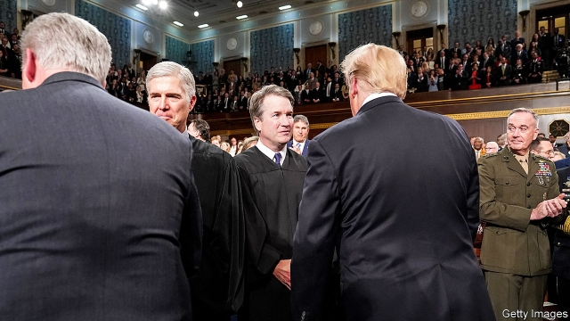

###### Holding court

# The Supreme Court wraps up its term, inching to the right 

 

> print-edition iconPrint edition | United States | Jul 6th 2019 

THE SUPREME COURT opened for business in October amid high drama over President Donald Trump’s nominee to replace Justice Anthony Kennedy, a 30-year veteran. Following testimony from a high-school classmate that he had assaulted her as a teenager, Brett Kavanaugh, Mr Kennedy’s more conservative former clerk, squeaked through the Senate by a 50-48 vote. In some ways, Justice Kavanaugh has met expectations. He voted to preserve a gigantic cross on public land in Maryland. He rebuffed several last-minute stay requests in death-penalty cases. 

The conservative justices took turns joining the liberal justices in nine 5-4 victories—and they chalked up only half as many wins in closely divided cases as they did a year ago. It seems the partisan confirmation fight may have tamed Mr Kavanaugh a bit in his first go-round. The junior justice disappointed abortion opponents when he joined the liberals and John Roberts, the chief, in refusing to hear two challenges to funding for Planned Parenthood. He broke with the conservative bloc in an antitrust lawsuit against Apple, holding that consumers could sue the company for gouging them on its app store. And in Flowers v Mississippi—provoking an irate dissent from Justices Neil Gorsuch and Clarence Thomas—he sided with a black death-row inmate whose trials were infected by racial bias in jury selection. 

Remarkably, Justice Kavanaugh broke with his fellow Trump appointee, Neil Gorsuch, in nearly a third of the term’s 72 rulings. Meanwhile, reflecting a preference for the centre-right, he and Chief Justice Roberts voted the same way over 90% of the time—among the highest buddy rates of any pair of justices. 

The most indelible mark of Justice Kavanaugh’s first year was his vote to abandon his predecessor’s ambition, announced 15 years ago, to rein in “the business of rigging elections”. The judiciary “should be prepared to order relief”, Justice Kennedy wrote in 2004, providing that a workable standard for policing partisan gerrymandering could be found. It now seems that quest is dead. Despite voicing concerns about the dangers to democracy posed by gerrymandering in two redistricting hearings, Justice Kavanaugh anchored a 5-4 majority in Rucho v Common Cause to preserve extreme gerrymandering from constitutional objections. 

Chief Justice Roberts, author of the Rucho opinion, did not applaud skewed district lines. They are, he acknowledged—pointing to the 10-3 seat advantage for North Carolina Republicans in the House of Representatives, despite the state’s fairly even Republican-Democratic split—“highly partisan”. But that does not mean the practice is unconstitutional. Federal judges cannot stop stunts like North Carolina’s, even those that may “reasonably seem unjust”, because challenges to engineered maps “present political questions beyond the reach of the federal courts.” 

In a thunderous dissent, Justice Elena Kagan wrote that what the court says “can’t be done has been done”. Lower-court judges from Wisconsin to Ohio to Maryland “have largely converged on a standard for adjudicating partisan gerrymandering claims” and struck down maps drafted by both parties that are extreme outliers. Rucho, she wrote, will embolden state legislators who have “debased and dishonoured our democracy, turning upside-down the core American idea that all governmental power derives from the people.” The conservative bloc’s decision, she concluded with “deep sadness”, risks “irreparably damag[ing] our system of government.” 

Another challenge to the integrity of America’s democracy was averted in a row over the Trump administration’s wish to add a citizenship question to the 2020 census. After the oral argument, it seemed certain the five conservative justices would hand the government a win despite evidence the question would spur a pronounced undercount of people in mostly Democratic states. The stakes were high: population data from the decennial census direct the flow of billions of federal dollars and set the number of congressional representatives allocated to each state. 

Chief Justice Roberts knocked down the challengers’ legal arguments one by one but saved a plot-twist for the end. While there is nothing in the constitution or federal law stopping the government from asking census-takers if they are citizens, he wrote, Wilbur Ross, the commerce secretary, violated administrative law when he gave a “contrived” reason for the change. Enforcing the Voting Rights Act of 1965, the official justification was a “distraction”, the chief wrote. This is as close as a chief justice gets to calling a cabinet secretary a liar. 

The ruling left open a small window for Mr Ross to come up with a “genuine” rationale, but on July 2nd he closed it, saying the census form was rolling off the presses without the citizenship question. Pandemonium ensued on July 3rd after a defiant tweet from Mr Trump; the government now says it will give the question another go. However this circus ends, Melissa Murray of New York University cautions that the Supreme Court ruling “does not foreclose such a question being included in a future census” and predicts that if Republicans hold the White House in 2030, “it will be on there.” She also notes that the lawsuit may depress response rates even with no citizenship query. ◼ 

