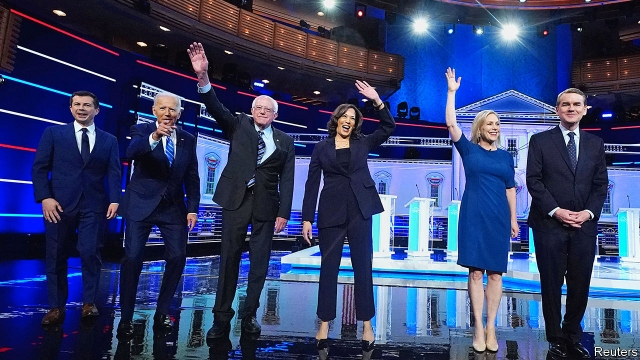

###### Debatable

# The best line in the first televised debate may hurt the Democrats 

 

> print-edition iconPrint edition | United States | Jul 6th 2019 

IN THEIR FIRST televised debates of the 2020 nominating contest, Democratic presidential candidates made one thing clear: they will not be hiding their enthusiasm for policies that delight the party’s activists. The most memorable moment came when Kamala Harris, the junior senator from California, confronted former vice-president Joe Biden for his record on school busing (Mr Biden introduced legislation in 1977 that would have curbed the practice, if passed). “You know, there was a little girl in California who was part of the second class to integrate her public schools, and she was bused to school every day,” Ms Harris told Mr Biden. “And that little girl was me.” 

Ms Harris’s barbs appear to have won favour from Democratic primary voters. According to a poll conducted on behalf of The Economist by YouGov, their support for Ms Harris increased by 6 percentage points in the week following the first debates. This is no fluke. Other pollsters have also detected a boomlet in support for the senator. The share of Democratic primary voters picking Ms Harris as their first choice doubled from 7% in polls fielded during the two weeks before the debate to 15% in those taken after. Mr Biden has taken a direct hit, slumping an average of 6 points since last week. One poll now has them neck-and-neck. Although in our poll Mr Biden is still the first choice of a plurality of Democratic voters, what might happen if he—or a similarly moderate candidate—were to lose to someone seen as more progressive? 

Some Democrats are worried that nominating a candidate with views on race that are too far to the left of the average voter could scare off the remaining conservative members of their coalition. This worry is justifiable. In an article published last year, Tyler Reny of UCLA, Loren Collingwood of UC Riverside and Ali Valenzuela of Princeton wrote that “white voters with racially conservative or anti-immigrant attitudes switched votes to Donald Trump [in 2016] at a higher rate than those with more liberal views on these issues.” According to the authors, those losses could have been enough to cost Hillary Clinton the election. 

Ms Harris might also face a backlash for holding views on economics that are too liberal for the electorate. The senator supports lefty proposals like the Green New Deal and abolishing private health insurance, for example. In another paper last year Andrew Hall and Daniel Thompson, both of Stanford, found that candidates perceived as ideologically extreme face a penalty at the ballot box because they fire up the other side. This is another possible explanation for Mrs Clinton’s loss in 2016. Although she was no Bernie Sanders, voters viewed her as more extreme than Mr Trump. According to a poll in 2016 by the Pew Research Centre, 58% of voters thought Ms Clinton was liberal on “most” or “almost all” issues, whereas just 44% thought Mr Trump was mostly or almost always conservative. A plurality believed the now-president to be a “mix of liberal and conservative”, whereas just 28% thought the same of Mrs Clinton. 

Whoever wins the Democratic nomination will need to retain the support of a small but still important band of conservative Democrats. According to YouGov’s polling, they still make up 9% of the party today. Yet nominating a candidate just to assuage this group comes with a trade-off. The Democratic nominee also needs to get non-white voters to the polls. After having the largest voter turnout of any racial group in both 2008 and 2012, 11% of black voters who cast ballots for Barack Obama stayed home in 2016, according to The Economist’s analysis of survey data from the Cooperative Congressional Election Study, a bi-annual survey administered by Harvard. They might have been the difference in vital states like Michigan and Wisconsin. 

Whomever the Democrats nominate will have to mimic the campaign style of Mr Obama, who owed his wins to a multiracial coalition. He simultaneously convinced whites of his moderation and excited African-Americans. In March 2008 Mr Obama delivered the most memorable speech of his campaign. Americans, he said, “need to come together” to solve a set of problems “that are neither black or white or Latino or Asian, but rather problems that confront us all.” Whether they like it or not, Democrats need votes from white Americans who did not attend college. If Ms Harris were the nominee in 2020, she would have to replicate Mr Obama’s formula, or else see her prospects threatened by the electoral divide over racial attitudes. ◼ 

