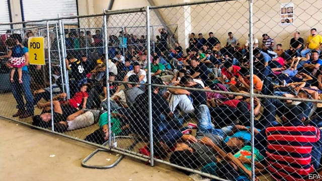

###### In the land of the free

# What caused the shameful scenes at America’s southern border? 

 

> print-edition iconPrint edition | United States | Jul 6th 2019 

IT IS ALWAYS the best of times and the worst of times in America for PresidentDonald Trump. Various things have simultaneously never been worse, owing to Democratic meddling, but also never been better, thanks to his own intervention. “Our country has a hole, nobody sees anything like it, but we’ve stopped them,” he said at a raucous rally in Orlando, Florida, to launch his re-election campaign on June 18th. “Thanks to Democrat policies, schoolchildren across the country are being threatened by the vicious gang MS-13 that ICE [Immigration and Customs Enforcement], by the way, is taking out of the country and dropping them back home by the thousands.” Another problem solved. 

Meanwhile in the real world American border police apprehended 132,887 migrants in May, the most recent month for which data has been officially released. That is the highest recorded number in 13 years, and a ninefold increase from May 2017, when border arrests were at the lowest levels in nearly 50 years. Preliminary data collected by the US Customs and Border Protection agency and released by the Mexican government suggests that arrests declined by 30% in June to 95,000. 

That decline might be owing to a deal cut with the Mexican government after Mr Trump threatened to impose tariffs unless the migration surge subsided. It might be owing to the heat, since fewer cross the desert in summer. Yet this is still more than double the number of people detained the previous June. An unusually large share of recent arrivals are children. According to the Migration Policy Institute, a think-tank, more than half of those arriving at the border are coming as families, and 9% are unaccompanied children. 

This all presents a problem for American authorities. After they are apprehended, migrants are processed in facilities run by the Customs and Border Patrol. They are not supposed to stay there for longer than three days. Adults and children who arrived with their parents or guardians are then dispatched to facilities run by ICE until a hearing can be held. Unaccompanied children are supposed to be cared for by a separate agency, the Department of Health and Human Services (HHS). 

At least that is how it is meant to work. In fact just 424 judges nationwide hear these cases. There are 892,517 cases outstanding, says TRAC, a research outfit at Syracuse University, and hundreds of thousands more are pending. This logjam creates a problem across the country. Hearing dates in New York City, an especially overburdened court system, are being set for August 2023. The backlog of cases and the unexpected migration surge has filled both ICE and HHS facilities to overflowing. 

Immigration detention centres were built to handle single adult men, not to house families and children. Partly because of this the Border Patrol is not releasing detainees to these longer-term facilities. A doctor visiting detained children reported that they had not been given toothpaste or soap and were being kept in freezing rooms where the lights were kept on for 24 hours. She visited facilities in the Texas towns of Clint and McAllen encountered babies who were sick and losing weight and described the conditions as comparable to “torture facilities”. 

The Border Patrol has insisted that reports of deplorable conditions for migrants were exaggerated. That was then contradicted by another report from the Department of Homeland Security’s inspector-general. It found detainees were being kept in overcrowded conditions for much longer than three days. Many children had been held longer than a week; most of the facilities visited by government inspectors did not give children showers and little access to fresh clothing. They were not fed hot food. Some adults were being held in standing-room-only conditions for as long as a week. Detainees had started to clog their toilets with blankets so they could at least leave their confinement while the pipes were unblocked. They pressed notes to the windows as the inspectors passed by, including one on a piece of cardboard, saying “HELP 40 DAY HERE”. 

Congress has had to scramble to respond. By June 26th both the Republican-led Senate and the Democratic-led House had agreed to the figure requested by immigration agencies—$4.6bn for emergency humanitarian spending. But they differed on how it ought to be spent. The House version of the funding bill had more restrictions aimed at preventing the administration from using the money to round up more migrants. After moderate Democrats revolted, Nancy Pelosi, the speaker of the House, had to concede defeat and pass the Senate bill over the howls of the party’s Hispanic caucus. Then a delegation from the caucus managed to tour two of the customs and border facilities. They described sordid conditions. Alexandria Ocasio-Cortez, a congresswoman from New York, says she encountered women sobbing “out of fear of being punished, out of sickness, out of desperation, lack of sleep, trauma, despair”. The Hispanic caucus described the border-funding bill as “a betrayal of our American values”. 

Embarrassing as this was for Ms Pelosi, the emergency funding is a temporary reprieve for a recurring problem. Mr Trump’s administration has tried various methods to quell the influx. First, the short-lived practice of deterring family migration by separating children from their parents; now other tactics designed to scare off potential migrants and the strong-arming of the Mexican government into detaining many more central Americans on their way to the United States. 

At the same time, prospective challengers vying to be the Democratic presidential nominee are adopting ever-leftier ideas. Several Democratic contenders have recently embraced decriminalising border crossing, a position held by Julián Castro, a former federal housing secretary and primary candidate. Cory Booker, a senator from New Jersey, says he would like to “virtually eliminate” immigrant detention and wrote that America must guarantee hormone therapy for detained transgender migrants who seek asylum. 

As Mr Trump’s election showed, sympathy for migrants at the southern border ebbs and flows, but there is always demand for draconian border enforcement. Democrats need to tread carefully. ◼ 

