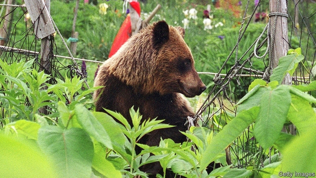

###### Grin and boar it

# In Japan, fewer people means more animals 

 

> print-edition iconPrint edition | Asia | Jul 13th 2019 

FOR A LONG time hikers in Japan have considered a bear bell essential. Its tinny ring is said to scare off the huge creatures. Nowadays, however, bear bells are increasingly useful on the way to the shops as well as in the wild. “The number of animals—whether bears, boars or monkeys—is expanding, and they are going into villages and towns,” says Hiroto Enari of Yamagata University. 

Japan is home to many species of wild animals, including both black and brown bears. Estimates of their numbers are wobbly, but since the 2000s the number of bear sightings has been rising. There were close to 13,000 in 2018 alone. The resurgence has its roots in human demography: the shrinking of Japan’s population is especially acute in rural areas, where it is exacerbated by ongoing urbanisation. The dwindling quantity of people, in turn, has emboldened animals. Bears are less inhibited about entering villages in broad daylight if there are few folk around, Mr Enari says. Indeed, the biggest jumps in sightings have been where the population is falling fastest, such as Akita, a prefecture in the north-west of Honshu, Japan’s most populous island. 

Hunting is declining in Japan, too. Government data suggest that the average hunter is now 68 years old. The country’s many forests and mountains provide an expansive habitat for wild animals. Indeed, true wilderness is growing as foresters and farmers die off. Bears become particularly bold in years when acorns are scarce, sneaking into orchards to steal persimmons. 

While some welcome the ursine renaissance, others suffer from it. Every year bears injure scores of people, and kill a handful. Deer cause damage to farmland and spur erosion by, for example, gobbling up grass. Simple solutions, such as changing the layout around villages or putting up fences, are rarely used. Instead, many bears are captured or killed. In 2013 the government resolved to halve the number of certain types of deer, boars and monkeys by 2023. Japan is struggling to adapt to the “changing power balance between animals and people”, says Mr Enari. 

