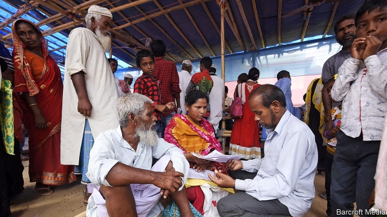
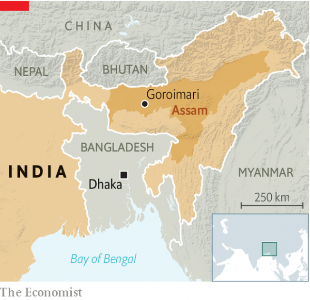

###### Madness in the hills

# India is declaring millions of its citizens to be foreigners 

 

> print-edition iconPrint edition | Asia | Jul 13th 2019 

IT IS HOTTER than Prague. It does not have the Czech capital’s cobbled squares or narrow streets but instead tin-roofed houses and paddies hemmed with palms and mango trees. Yet Franz Kafka would have felt quite at home in Assam. Since 2016 this hilly tea-growing state in India’s north-eastern corner has been compiling a National Register of Citizens (NRC). Billed as a scientific method for sorting pukka Indians from a suspected mass of unwanted Bangladeshi intruders, the seemingly banal administrative procedure has instead encoiled millions of people in a cruelly absurdist game. 

Rather than find and prosecute illegal immigrants, Assam has instead tasked its 33m people, many of them poor and illiterate, with proving to bureaucrats that they deserve citizenship. Those who fail risk being locked up. Some 1,000 people currently moulder in Assam’s six existing detention centres for “foreigners”. The Indian public has lately been shocked by stories of people, such as a decorated war hero and a 59-year-old widow, who have found themselves jailed for failing to prove their Indian-ness. But the state of Assam is clearly expecting a lot more to come. Ten purpose-built camps are planned. 

The current phase of the NRC game is set to stop on July 31st, the deadline for publishing the completed citizens’ register. After that, those left off the list will have to wait for Foreigners’ Tribunals, special parallel courts with no right of appeal, to hear their cases. There is no telling how many there may be. When a draft NRC was issued last year, it left out some 4m of Assam’s 33m people. In June 100,000 more were deemed suspected foreigners. The majority of the losers are Bengali speakers, some of them Hindu but mostly Muslim; other Assamese were automatically included in the register because they have obvious local pedigrees or belong to recognised “native” tribes. 

Not surprisingly, some 93% of those excluded have petitioned for inclusion, presenting evidence that they are Indian-born. But the bureaucratic machinery, primed by Assamese chauvinists aligned with the Bharatiya Janata Party (BJP), which rules both the state and the country, has been incentivised to reject as many as possible. Indeed, the national government is preparing to declare the exercise a great success. It wants to extend the NRC and Foreigners’ Tribunals to the rest of the country. Muslims, who are 14% of India’s 1.3bn people, fear that they may find themselves, as in Assam, disproportionately sifted into the reject bin. They are right to be worried. 

In the hamlets around Goroimari, a largely Bengali-speaking village in the lush flatness of the Brahmaputra valley, it takes little effort to coax out NRC nightmares. Take the case of Somiron Nisa, a recent high-school graduate. Everyone in her family appeared on draft NRC lists as proper citizens, and in the first draft she did, too. But beside her name on the latest draft it says “declared foreigner”. NRC officers told her family this was because she has been tagged a “D” or doubtful voter by the state’s election commission, which means she will automatically have to defend herself at a Foreigners’ Tribunal. When it was pointed out that Ms Nisa is the only “foreigner” in her family, and is also too young to have ever registered to vote, the officers shrugged. 

 

Or listen to Shamas Uddin, 93, an illiterate farmer. He was born in this village when it had just a handful of houses, he says. His name appeared on all the NRC drafts but then, in March, a certain Debajit Goswami officially objected to his inclusion. Mr Uddin does not know his accuser. No one in the village does, and indeed lawyers with a local NGO failed to track down Mr Goswami at his registered address. Nor did he show up at either of the NRC hearings to which Mr Uddin was summoned, in two different towns 150km apart. 

Perhaps this is because Mr Goswami’s name appears on hundreds of “objection” letters, demanding the removal of suspected foreigners from the NRC. Under rules set by India’s Supreme Court, no less, such individuals were given licence to denounce any number of fellow citizens, and also excused from appearing to face those they accuse. In this district alone, a suspiciously small number of objectors, all believed linked to Assamese nativist groups, somehow gained access to a local NRC database and together penned 30,000 such objection certificates. Across the state, some 220,000 such poisoned letters were filed before a deadline in May. Indigenous activists in other parts of north-eastern India, in turn, have begun to waylay migrant workers from Assam, demanding to see proof that they are on the NRC and turning away those who cannot provide it. 

“No one here is from Bangladesh,” scoffs Rahum Ali, one of Mr Uddin’s neighbours. “Where would they settle? There is no land. Brothers are fighting over land.” Mr Ali is 70 but was not included in the NRC drafts, although three brothers and two sisters were. Summoned to an NRC office, he was told his case is PFT or “pending Foreigners’ Tribunal”. He was subsequently summoned four more times, to offices in different towns, each time wondering if he would be thrown in jail, only to be told the same thing. But although he is told there is a case, no case number is cited, so he has no idea which out of some 100 Foreigners’ Tribunals he should appear before. A local lawyer says that 46 people in the village are similarly PFT and being “driven mad” by repeated summonses. 

How did this Kafkaesque situation arise? As so often in India the blame lies partly with British rule and partly with toxic Indian politics. Under the Raj millions of Bengalis, mostly Muslim, were encouraged to settle in Assam. With independence, local politicians thrived by playing up the “threat” that intruders posed to native language and culture. With the rise of Hindu nationalism, the religious component has been magnified and the threat recast as one to India’s national security. 

As a result, claims of ever bigger numbers of supposed illegal migrants have been bandied about. With Assamese chauvinists repeatedly asserting that 5m or even 8m “infiltrators” have invaded their state, right-wing politicians have scented the possibility of erasing much of the typically left-leaning Muslim “vote bank” from the rolls. They are substantiating the baseless estimates by declaring millions to be “foreigners”. “It’s like Chernobyl,” says a lawyer, “They are trying to hide a lie at the cost of disaster.” 

No one seems to know what the ultimate fate of Assam’s “foreigners” will be. They cannot be deported; Bangladesh flatly rejects the whole exercise as an internal Indian matter. Millions of people cannot be shunted to some other part of India, either. The BJP has offered a solution for some: cocking a snook at the secular constitution, it is pushing an amendment to citizenship laws that will allow refugees who are Hindu, Buddhist, Sikh or Christian to apply for citizenship, but specifically ban Muslims. Nani Gopal Mahanta, chair of political science at Assam’s Gauhati University and a BJP supporter, has some suggestions for those who still fall foul. He thinks that the Foreigners’ Tribunals may not act very quickly, taking perhaps 20 years to sort through their case load. Those declared non-citizens need not be made stateless, but could simply be stripped of civil rights, perhaps for a limited time. “Citizenship, whether you like it or not, is not a very democratic concept,” he says. Kafka would certainly have agreed.  

