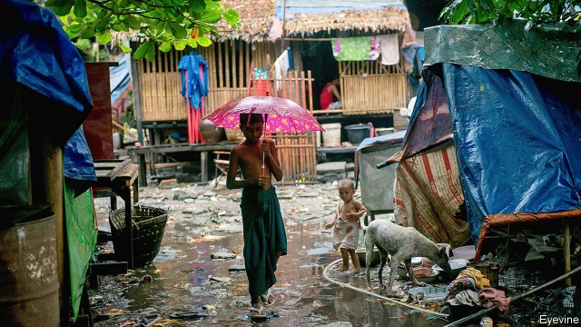

###### Movers and forsakers

# Myanmar’s countryside is emptying and its cities bursting 

 

> print-edition iconPrint edition | Asia | Jul 13th 2019 

WHEN SHE moved from her village to Yangon, Myanmar’s biggest city, Ma Thet Thet Nwe was afraid. Her husband had just died and she needed to provide for five children. She found work at a garment factory in Hlaingthaya, an industrial zone, and saved enough money to buy a one-room, bamboo house in a nearby shantytown. Now she is pleased with her lot. Two of her daughters work in garment factories, while she cares for her other children and runs a roadside café. Factory work is easy, she says with a smile—much better than toiling in the fields. 

Ms Ma Thet Thet Nwe is part of a wave of migrants from the countryside to the city in the past decade. Data are sparse but a national census in 2014 found that out of a population of 50m, 9.2m people had moved townships (the equivalent of counties) in their lifetime. Of those, over one-third had moved since 2009, mostly to Yangon. One in three lived in cities. 

Many were forced to leave their homes by Cyclone Nargis, which struck southern Myanmar in 2008, killing around 140,000 people. Hundreds of thousands were left destitute and moved to the cities to start over. But the disaster also laid bare the shortcomings of the country’s military dictatorship. In subsequent years the army relaxed its grip on power. Among other reforms, restrictions on internal migration were eased and foreign investment, previously shunned, was eagerly courted. 

That helped usher in a period of rapid growth. From 2008 to 2018 the economy expanded by an average of 6.3% a year, thanks in part to a thriving garment sector. Exports of clothes and shoes increased tenfold over the same period, reaching $5.3bn last year, about 8% of GDP. 

That created plenty of jobs in Hlaingthaya. Garment factories’ walls are adorned with lists of vacancies; it took Ms Ma Thet Thet Nwe just five days to find work. Job security, rather than higher wages, draws ever more country folk. Factory hands earn around 3,000 kyat ($2) per day, about half what they could on a farm, but the work is much more reliable. 

The rapid influx of migrants has created sprawling slums around factories. A government survey in 2017 found 475,000 people squeezed into one neighbourhood of eight square kilometres. Most houses have one room and are made from bamboo, nipa-palm fronds and tarpaulin. 

Living conditions are grim. Crime is rife and rubbish piles up between houses. Floods occur frequently during the monsoon season, spewing untreated sewage onto the streets and so spreading disease. A study by the ministry of health found that slum-heavy townships were worst affected by waterborne ailments, like tuberculosis. 

The municipal government’s plan to build more cheap homes around Yangon seems far-fetched. The allotted sites remain undeveloped; private investors are yet to be found. The Asian Development Bank estimates that, to provide housing for those in the slums and to cater to a growing population, the city needs to build 100,000 low-cost units a year for the next ten years. Between 2010 and 2016 it built around 3,000 units a year. 

Life in Hlaingthaya is precarious even for those with jobs and homes. Khin Thet spent 1.1m kyat on her house, but worries she will be evicted when a new railway line is built. Few receive benefits required by law, such as redundancy pay, because they work in the informal economy or their employers have failed to complete the relevant paperwork (and pay the associated taxes). Exploitation is a constant risk. Most migrants to the slum are single; over half are women. Pimps seek out workers dismissed from factories. 

For those who cannot find steady work, life is little better than in the village. Kyaw Zepa Tua and his family came to Hlaingthaya three years ago. He and his wife struggle to feed their children and have fallen into debt with their landlord, who charges 40,000 kyat a month for a poky room in a grimy bamboo hostel. Four other families share the hostel, all in similar states of instability. If things do not improve, says Mr Kyaw Zepa Tua glumly, they will have to go back to the village. 

Returning migrants will find that urbanisation has changed village life, too, by creating a shortage of people. In the Ayeyarwady region, to the west of Yangon, this is particularly clear. That is partly because of proximity. But Ayeyarwady also has low rates of land ownership, giving locals less reason to stay put, and was in the path of Cyclone Nargis. As a result, the villages are emptying. A survey of six by the International Organisation for Migration found that two-thirds of families have at least one member who has left. 

The working-age population are disproportionately likely to move. That is changing the culture of the villages, says Ko Win Zaw Oo, who works for a local NGO. There are fewer people to perform communal tasks that used to fall to young adults, such as repairing roads and bridges and helping to organise Buddhist festivals. The quality of village councils, which do things like settle disputes and interact with the central government, is also suffering. Previously the cleverest people in the village would have joined the council. Now bright sparks head to the city. “Only the drunks and drug addicts will be left,” says a gloomy expert. 

Remittances from relatives in the cities are also changing things. Mom-and-pop stores work as intermediaries for cash-transfer firms, allowing locals to send and receive cash swiftly. In 2016, 1% of the population used an app or a cash-transfer firm to move money. Now 80% do, says Brad Jones, boss of Wave Money, one such firm. It handled $1.3bn in Myanmar in 2018 and has already surpassed that figure this year. 

The exodus has had a big impact on agriculture, in particular. Khin Aye, a farmer in the Ayeyarwady region, has 14 acres of paddy fields, which can be seen through the back window of his farmhouse. Over the oink of pigs, he explains how hard it is to find labourers. He says he has to pay double his previous daily rate. One study found that agricultural wages in the area jumped 40% between 2011 and 2016. Some farmers, struggling to make ends meet, have sold their paddy fields or switched to less labour-intensive crops. Automation is another option. Buffaloes are becoming a rarity, but ploughs pulled by tractors are a common sight. Mr Khin Aye started renting one two years ago. The amount he pays the rental firm is about the same as he used to pay for labourers, but now the work is done much quicker. 

A recent study by Myat Thida Win and Ben Belton of Michigan State University and Xiaobo Zhang of Peking University found that the share of farms in southern Myanmar using machines to harvest increased from 10% to 54% between 2011 and 2016. They also looked at the annual sales of five local farm-vehicle dealerships. They found that between 2013 and 2016 the number of two-wheel tractors purchased doubled to 20,684. Sales of four-wheel tractors and combine harvesters soared 12-fold from 460 to 5,572. The paddy fields of Ayeyarwady region are one of the few places on Earth where a wave of automation is seen by nearly everyone as a relief.  

