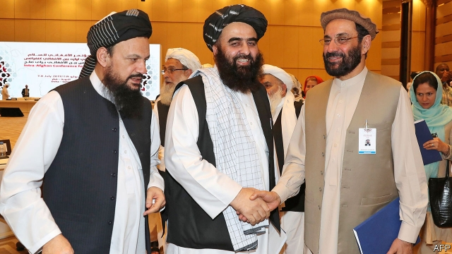

###### Happy talk

# The Taliban negotiates with Afghan officials for the first time 

 

> print-edition iconPrint edition | Asia | Jul 13th 2019 

IT WAS A breakthrough, albeit only by the forlorn standards of the 40-year conflict in Afghanistan. After two days of talks with Afghan officials at a posh hotel in Qatar, envoys of the Taliban promised that their insurgents would not attack schools, hospitals or bazaars. The Afghan government, too, said it would try to stop killing civilians. But more important than their woolly resolutions was the fact that the two sides were speaking at all. Officially, the Taliban insists that the Afghan government is an illegitimate puppet regime; it was only “in a personal capacity” that its envoys met Afghan officials, alongside politicians and representatives of NGOs. 

The meeting was partly to break the ice and partly to brainstorm over a “road map for peace”. In addition to the resolution about avoiding civilian casualties, the vague, non-binding declaration also provided an outline of sorts for future negotiations on a peace deal. Women’s rights, the Taliban agreed, would be protected, albeit within an “Islamic framework”. By the same token, “institutionalising an Islamic system”, the delegates decided, would not involve dissolving government institutions such as the army. 

The American government, which is hoping to find a face-saving formula to withdraw from Afghanistan, has long called for such a meeting. With the Afghan government sidelined, talks between America and the Taliban had naturally focused on America’s chief concern: how to withdraw its forces without allowing Afghanistan to become any more of a haven for international terrorists, such as Islamic State and al-Qaeda. Yet a deal between the Taliban and America is not enough to secure peace in Afghanistan. Even before American troops invaded in 2001, the country was aflame. To allow American troops to depart without leaving chaos and bloodshed in their wake, the Taliban must find a way to rub along with the Afghan groups they once fought and persecuted. 

Discrepancies in the translation of the declaration agreed in Qatar give an idea of the difficulties. The English version did not mention an American withdrawal. The Pushtu version reportedly had no mention of protecting women’s rights. Under the Taliban, women have been unable to leave home without a chaperone and have been denied work or education. 

Filling in the details will be contentious. Who, for example, will decide what is acceptably Islamic? “People will accept concessions, but they are not going to accept an emirate,” says one Western official. Under the Taliban’s interpretation of democracy, only people with sufficient Islamic knowledge should be allowed to vote. “As you can imagine, all those people are men with white beards.” 

The Taliban’s delegation to the talks was indeed a collection of men with white beards—some of them former detainees at the American military prison in Guantánamo Bay in Cuba. The Afghan officials included several women, most notably the country’s first female governor. 

Taliban fighters in the field often say they cannot negotiate for anything less than a strictly Islamic system. “Without that Islamic regime, a deal for me personally would offend and dishonour those thousands of Taliban and leaders we sacrificed,” says a commander in Ghazni, a town 150km south of Kabul, the capital. 

The Taliban also refuse the main demand of the Afghan government: a ceasefire. While vowing to protect civilians, the Taliban nonetheless say the war must continue. It is the pressure of war, they say, that has led to negotiations, so they must keep it up. In the past week the Taliban have attacked government buildings in Ghazni and Kabul, wounding scores of children in schools nearby. By the same token, an Afghan commando raid on a hospital in the province of Wardak, just west of Kabul, reportedly killed at least two of its staff. 

The Taliban and America are in the middle of their seventh round of talks. There have been hints of progress on a timetable for an American withdrawal and on assurances that the Taliban will not harbour terrorists. Talks among Afghans will be longer and messier. But they are the only way to end the country’s decades of agony.  

