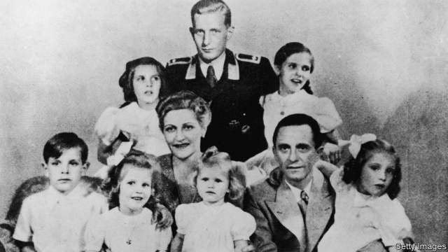

###### The only way out

# A grimly compelling study of the psychology of fanaticism 

 

> print-edition iconPrint edition | Books and arts | Jul 13th 2019 

Promise Me You’ll Shoot Yourself. By Florian Huber.Allen Lane; 304 pages; £20. To be published in America by Little, Brown Spark in March; $14.99. 

IN AUGUST 1991 Marshal Sergei Akhromeyev, a former head of the Soviet armed forces, hanged himself in his office, lamenting a superpower’s end. During the war in Cyprus in 1974, mothers told daughters how to electrocute themselves if Turkish soldiers approached, to avert the pain and shame of rape. For Japanese warriors, self-disembowelment was not a forlorn act but a way to regain their honour. 

Among those facing defeat or humiliation, suicide can arise from hopelessness, defiance or calculation. In the many that occurred in Germany during and immediately after the Nazi regime’s collapse in 1945, there was a broad range of motives and methods—as Florian Huber, a German writer and film-maker, shows in “Promise Me You’ll Shoot Yourself”. A bestseller in his homeland, it offers a grimly compelling insight into the psychology of fanaticism. 

The best-known acts are those of the Nazi leaders. Adolf Hitler put an end to his life in a bunker below Berlin on April 30th 1945, together with Eva Braun. A day later, his propaganda chief Joseph Goebbels killed himself with his wife Magda, who procured cyanide pills for their six children. But Mr Huber is more concerned with the ordinary people who succumbed to terror or despair, in particular as the Red Army approached Germany’s eastern lands. 

He focuses on the town of Demmin, where more than 1,000 people are thought to have perished—the numbers are still vague—out of a population of around 15,000. Dozens of bodies were extracted from rivers and lakes in the vicinity, but East German propaganda generally covered up the story, just as it concealed the Soviet cruelties which pushed many to self-annihilation. Whatever the technique (poisoning, shooting, drowning), one striking feature of this suicide wave was that it was often based on a family decision. People who did not want to survive generally did not want their loved ones to live either. The book’s title comes from an incident in Berlin, when a middle-aged man gave a pistol to his 21-year-old daughter and implored: “Promise me you’ll shoot yourself when the Russians come, otherwise I won’t have a moment’s peace.” In the event, she threw the gun away. 

Mr Huber uses many such vignettes to portray the atmosphere of a nationwide epidemic that seems to have claimed at least 20,000 lives (and perhaps many more). An officer on leave from serving in a concentration camp burbled drunkenly about inmates who were electrocuting themselves: “I’ll end up running into those wires myself.” In smouldering Demmin, a doctor presented his maid with a parcel she assumed was poison; in fact it was a parting gift of two wedding rings, offered hours before he and his wife and daughter ended their lives. The maid was left to write to the couple’s son, a prisoner of the British, recounting his family’s extinction. 

In the second half of his book, Mr Huber switches tack to give a broad sweep of the Nazi era, tracing the dark exhilaration that overtook previously sane individuals as they came to feel that Hitler could solve all their problems. He describes the denial or glib justifications with which people reacted to the persecution of Jews; some readers may feel he should have dwelled more on that subject. Closer to his main theme, he pinpoints reactions to the assault on the Soviet Union in June 1941. Some had a bleak sense the invasion might fail, others still believed devoutly in the military and moral superiority of the Reich. As news emerged of the atrocities the invaders were committing, and the titanic reverses they began to suffer, some Germans experienced cognitive dissonance. Their faith in Nazism’s ultimate triumph grew all the more fervent. 

Thus the book hints at a deep truth about war at its dirtiest. When people sense crimes are being committed in their name, they can become even more fanatical in their devotion to the cause, so that an all-out drive for victory, or else martyrdom, seem the only ways these sins can be redeemed. Although he does not make the links explicit, the background Mr Huber sketches provides some important context for the suicides. They were not simply driven by fear of the Red Army’s depredations. They reflected the implosion of a Nazi fantasy which had grown even more zealous as its evil became more obvious. Self-destruction did not signify a search for honour or redemption, but rather the collapse of a twisted idea of what honour meant. 

