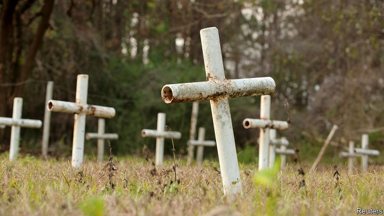

###### School of scandal

# Colson Whitehead’s searing new novel 

 

> print-edition iconPrint edition | Books and arts | Jul 13th 2019 

The Nickel Boys. By Colson Whitehead.Doubleday; 224 pages; $24.95. Fleet; £16.99. 

“EVEN IN DEATH the boys were trouble.” The first line of Colson Whitehead’s new novel introduces both its fierce vision and the mordant subtlety with which he ambushes his readers. Why are the boys dead—and what sort of trouble can dead boys have caused? 

The boys in the “The Nickel Boys”, it turns out, are blamed and punished for all sorts of things. Elwood, the protagonist, is a teenage acolyte of Martin Luther King in the Jim Crow Florida of the early 1960s. Convinced he is “as good as anyone”, he pores over his “new secondhand textbooks” and awaits the desegregation of Tallahassee. After hitching an ill-starred ride to an extra-curricular class, he winds up in a reform school. There he falls in with the worldlier Turner, who during his short life has “tumbled down the street like an old newspaper”. 

The horrors they experience unspool as casually as they are inflicted, so that, like other bystanders, readers might almost miss them. The black inmates’ food is swiped and hawked around town (the white boys get to eat theirs); their labour is sold to local officials. A strap known as “black beauty” is administered in a building called the White House—though some unfortunates are instead manacled to a tree “out back”, after which “they put you down as escaped, and that’s that.” Lovers’ Lane, the venue for sexual abuse, is a grisly basement. Nobly, naively or both, Elwood thinks it is his duty to resist the rackets and cruelties. 

The dead become trouble when their graves are discovered. Survival, though, is hard. A character makes it to New York—exactly how is integral to the plot—where, years later, he remembers nights on which “the only sounds were tears and insects”. Yet it is the incidental, half-told tales that lend this book its slow-burn power. Jaimie the Mexican, for example, “had an uncle with a quick hand”; he bounces between the white and black campuses, too dark for one, too light for the other. There is a grotesque boxing match that recalls Ralph Ellison’s “Invisible Man”. “Pain rolled off him like rain from a slate roof,” Mr Whitehead writes of a fabled champ. 

In his previous novel, “The Underground Railroad”, which won a Pulitzer and a National Book Award, the escape route of the title magically becomes an actual railway; what begins as an unblinking depiction of slavery morphs into a phantasmagoric allegory of African-American history as a whole. “The Nickel Boys” is a simpler story (albeit with a late twist), inspired by a real episode in Marianna, Florida (see picture). Still, in the dialogue between Elwood and Turner it frames some perennial arguments over how to respond to injustice. “You can change the law,” Turner reckons fatalistically, rejecting his friend’s idealism, “but you can’t change people and how they treat each other.” 

Quietly, meanwhile, Mr Whitehead insists that this tragic past is far from dead and buried. “The iron is still there,” he says of that punishment tree. “Testifying to anyone who cares to listen.” 

