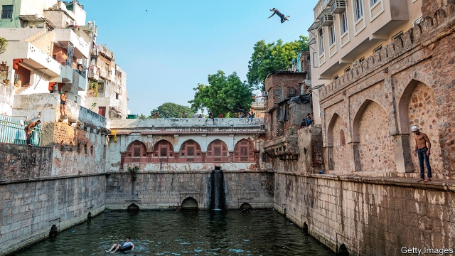
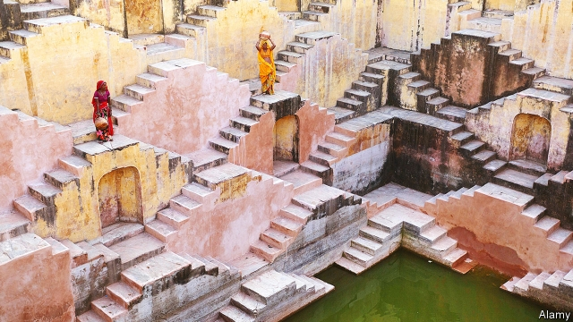

###### Liquid assets

# India’s magnificent stepwells are relics of a nuanced history 

 

> print-edition iconPrint edition | Books and arts | Jul 13th 2019 

THE STORY goes that devout followers of Nizamuddin Auliya, a Sufi saint who lived from 1238 to 1325, had already begun work on his baoli or stepwell when Ghazi Malik, the new sultan of Delhi, ordered all projects to stop until the construction of an impregnable citadel for him was finished. Out of adoration for Nizamuddin, the labourers worked on the fortress by day and the baoli by night. Enraged, Ghazi Malik banned the sale of oil for lamps—whereupon Nizamuddin blessed the well’s water and told his followers to use that instead. Miraculously, it burned. 

Today, Nizamuddin remains one of South Asia’s most admired Sufi saints. His message of tolerance and humanity appeals in an age when political leaders preach communal division. Not just Muslims but Hindus, Sikhs and Christians flock to his dargah, or shrine, in New Delhi, where qawwali songs of devotion are performed. Thousands crowd every day down the narrow, beggar-lined passageway that runs alongside the baoli on their way to strewing rose petals on the holy man’s tomb. Many pilgrims believe in the healing power of the baoli water (pictured above). 

Until recently that water was filthy. The tank was full of rubbish; the neighbourhood’s raw sewage flowed into it. Worse, the structure, which is more than 160 feet (49 metres) deep, was in an advanced state of dilapidation. One section of its walls of grey Delhi quartzite had collapsed. Other parts were bulging alarmingly—and, for the dozens of families who had built homes atop them, perilously. 

India has thousands of surviving stepwells, but the great majority are similarly run-down. Many others have vanished, often filled in and built upon. This neglectful attitude is extraordinary, for they are one of India’s unsung wonders. At last, through restoration efforts by the Aga Khan Trust for Culture (AKTC), among others, they are starting to get the recognition they deserve. 

The earliest of the wells date back almost 2,000 years. They were first and foremost a response to a climate in which a year’s rains fall chiefly in the four brief months of the summer monsoon, when they fall at all. The point of the staircases and side ledges is to provide permanent access to ever-fluctuating water levels—and cool shelter in the hottest months. In the north-western regions that are India’s most arid, such as Rajasthan and Gujarat, the baolis underwrote life, as sources of both irrigation and drinking water. They were often located on ancient trade routes. In Delhi, every community once had its own tank. 

Many stepwells were used for ablution; the tanks associated with mosques, Hindu temples and other shrines offered the most purificatory form. Summoning water from the depths was also a symbol of temporal power. Around Hyderabad in south-central India, many of the baolis were built by kings and zamindars. A surprising number were built at the behest of women, including princesses, courtesans and merchants’ wives, who wished to attain immortality through the gift of water. Indeed, stepwells have always been considered women’s spaces—places to gather without inhibitions, away from men’s domineering eyes (in India, after all, it is traditionally a woman’s job to fetch and carry water). Rani-ki-Vav, or the queen’s stepwell, in Patan in Gujarat, graces the new 100-rupee note. 

 

And, as you descend into them, what mind-boggling structures these wells are. Their early builders were capable of astonishing feats of engineering. The Chand Baori in Abhaneri, east of Jaipur (the capital of Rajasthan), resembles an inverted ziggurat. Its 13 storeys and 3,500 narrow steps prefigure M.C. Escher’s “impossible objects” by centuries. The Panna Meena Ka Kund stepwell (pictured above), also near Jaipur, is another elaborate masterpiece. Hindu embellishments to baolis included covered arcades and pavilions that served as refuges from the heat and even as lodgings. Sculptures and friezes were crammed with gods, animals and humans. Spreading Muslim rule introduced a more austere, though no less impressive, architecture of arches and jaalis (stone lattice windows). 

But all this was abandoned. The decline of the stepwell began with the British raj, which insisted baolis were unhygienic havens of vermin and disease. They called for them to be filled in or barricaded. The raj’s administrators were blind to their role in socialising and as subterranean caravanserais. Independent India’s encouragement of diesel-powered borewells proved to be the baoli’s death-knell. 

Yet these borewells’ impact on the water table, plus untrammelled urban development, have led to a drastic depletion of natural aquifers and a countrywide water crisis. That is one reason why the restoration efforts of the AKTC and like-minded groups have struck a chord: more Indians are wondering whether old-fashioned water-conservation methods have lessons for today. 

At Nizamuddin dargah, the trust has saved the baoli. Its workers cleared the tank of tonnes of sludge, and relaid the neighbourhood’s sewage pipes. Marrying traditional workmanship with laser scans and ground-penetrating radar, the trust rebuilt the baoli in a form as close to the original as possible. In the process, a subterranean passage from the saint’s tomb to the tank was uncovered, along with water springs and the well’s wooden foundations. 

Meanwhile, the trust also turned to the adjacent, huge gardens belonging to Humayun’s tomb, a Mughal building of even more breathtaking beauty than the Taj Mahal. The lush grounds are covered in tanks and wells that the trust is restoring. With Ratish Nanda, the AKTC’s enthusiastic head in India, this correspondent recently descended to the bottom of a baoli that was being cleared of centuries of rubble and sludge, bucket by laborious bucket. Two weeks later, water was starting to gush in. One find, covered over by the British, is a 16th-century well built not to capture water, but to ensure it flows back into the underlying aquifer. Mr Nanda says the restoration work has helped raise the area’s water table by several metres. 

Next door, in Sunder Nursery, the trust has converted 90 acres (36 hectares) of abandoned land into the sooty capital’s first new park in years, laid out as a classical Persian garden. Again, tanks and wells are an essential component. “Delhi needed a refuge,” says Mr Nanda. The gardens have become one of the most popular spots for the city’s families and lovers. The AKTC is now taking on the most ambitious project yet: a 106-acre site in Hyderabad, where seven stepwells were built by the Qutb Shabi dynasty in ornate, white-plastered granite. As became clear during the restoration, they were linked by underground channels that also connect to aquifers. 

Some of the obstacles to this effort are not physical but political. To help pay for its conservation work, the trust seeks donations from Indian companies. Yet supporters of the Hindu-nationalist government of Narendra Modi, the prime minister, dislike the idea of a body headed by the Aga Khan, an Islamic leader, being involved in Indian cultural work; besides, the Hindutva agenda is to expunge Mughal influence from Indian life, as if it were an alien, Muslim carbuncle rather than an intrinsic part of the country’s inheritance. They are said to have been leaning on companies not to donate. That arid worldview is refuted by the joyful families picnicking in Sunder Nursery, and the devotion of pilgrims at Nizamuddin baoli. 

