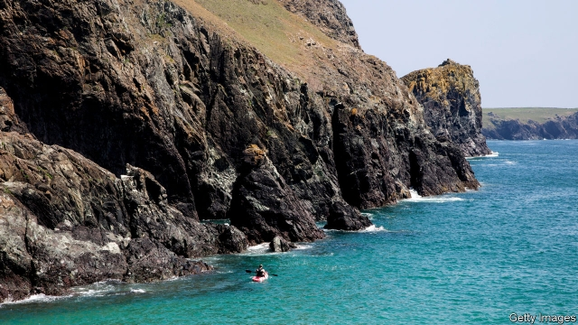

###### A sea change

# Telling Britain’s story from its “ocean-gouged fringe” 

 

> print-edition iconPrint edition | Books and arts | Jul 13th 2019 

The Frayed Atlantic Edge. By David Gange.William Collins; 400 pages; £18.99. 

FOR A KAYAKER caught in heavy swells, the world is all sea. Waves tower. Land is lost. The coastline vanishes to a thin strip, glimpsed for a moment before it veers drunkenly behind the next wave. 

If this seems an unusual environment for a historian, David Gange’s book suggests otherwise. “The Frayed Atlantic Edge” is an account of a year-long kayak voyage that he made down the western seaboard of the British Isles, from the northernmost tip of Shetland to the most southerly point of Cornwall. It is also an argument for a different, more personal sort of history. Mr Gange’s subject is the “archipelagic world” of Britain: an interlinked constellation of Atlantic-facing settlements, which are scattered geographically but bound by shared cultures and language. He turns conventional records of the British Isles inside out. Instead of rooting his story in metropolises such as London, he tells it from the “tattered ocean-gouged fringe”. 

This is an apposite moment for his project. Over the past few decades, there has been a revival of Gaelic culture and language—led largely by the kind of coastal communities that were previously overlooked. Institutions such as the University of the Highlands and Islands, which has a campus in the Outer Hebrides, have overseen a surge of vigour and confidence. The depopulations that in the 18th and 19th centuries afflicted the outer islands of the archipelago—such as Fair Isle and Foula in Shetland—are being reversed. Young people are staying, Mr Gange observes, and newcomers arriving. There and elsewhere, localism has become a point of pride. 

The strength of Mr Gange’s account is his generosity. His own wry persona never overshadows the voices of past and present inhabitants. Artists and writers are his principal guides: Rob Donn, an 18th-century crofter-chronicler, sits companionably alongside the modern Scottish poet Robin Robertson, their writing harmonising across time. The references are democratic, familiar names such as Virginia Woolf and Walter Scott keeping company with lesser-known figures, who are nonetheless noteworthy in their own ways. Mr Gange considers a meditation on Bardsey Island, off the coast of Wales, by the poet Christine Evans, and the eerie seascapes of Peter Lanyon, a Cornish painter. 

In this way he presents the landscapes that he traverses anew—not just as beautiful wildernesses, but as the by-product of human history, an occasionally troubled braiding of people and place. The craft of the historian, he thinks, lies in “interpreting the intertwining”. 

It helps that Mr Gange’s prose is itself poetic and precise. The hills and lochs of Assynt, for instance, tessellate in shapes “like Euclidian art”. He conveys the experience of kayaking through mountainous “scarps of sea”; his enthusiasm for snoozing in soggy sleeping bags is infectious. By the end, his book makes a persuasive case for chronicling the history of regions through the experiences and voices of the people who call them home. A dunking in the freezing sea, off the coast of County Mayo, leaves the author shivering but “ignited, elated”. Surfacing from his book, the reader is invigorated, too.  

