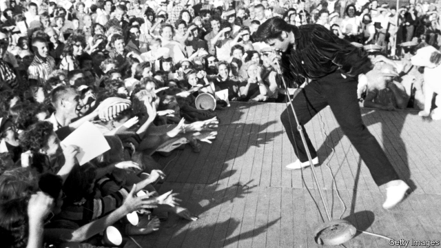

###### Love me sweet

# When the King saved Vegas 

 

> print-edition iconPrint edition | Books and arts | Jul 13th 2019 

Elvis in Vegas. By Richard Zoglin.Simon & Schuster; 304 pages; $28 and £18.99. 

MUCH WAS riding on Elvis Presley’s return to Las Vegas in 1969. It had been nearly a decade since he had played to a live audience, and Vegas offered a chance to revive a career mired in middling movies and synthetic songs. The timing was right for the city, too, which had lost some of the glamour of its early-1960s heyday, when the crooning of cool cats such as Frank Sinatra and Dean Martin packed the lounges. The rise of the counterculture had made it look square; most young performers had little interest in supplying the kind of schmaltz it had become known for. 

“In a town that got blindsided by the rock revolution, it was only fitting that Vegas would turn to the original rock ’n’ roller, Elvis Presley, as the agent of its reinvention,” writes Richard Zoglin, a longtime culture correspondent for Time. In “Elvis in Vegas” he argues that the singer and the city saved each other, at least for a while. 

Las Vegas had always been derided for its kitsch, but in the late 1950s and early 1960s it was a necessary stop for Hollywood starlets, Broadway actors and nearly every nightclub turn in America. The resort began to lure high-rolling holidaymakers and the artists who helped empty their wallets in the 1930s, when Nevada became the first state to legalise gambling and liberalise divorce laws. Hotels multiplied along the strip in the 1950s; the advent of non-stop air travel from Chicago in 1960 helped draw visitors from across the country. 

The mob bosses who ran the town (casinos were handy for laundering money) attracted talent by lavishing huge salaries and luxurious perks on the stars. For their part, the entertainers kept people in the casinos. Judy Garland was paid $55,000 a week for her heart-on-sleeve performances, though she preferred to sing at 2.30am owing to insomnia. Sinatra, a rather touchy and somewhat bigoted codger in these pages, earned as much as $100,000 a week for his residency at Caesars Palace. 

But by the late 1960s the economics were changing. Howard Hughes, an eccentric billionaire, bought up Vegas properties, pushed out the free-spending mobsters (a national crackdown on organised crime helped) and instituted a new era of bean-counting. Hotels stopped coddling entertainers, many of whom seemed dated. Over the same period Elvis’s manager, Colonel Tom Parker, had steered him towards films, in the mistaken belief that they offered a surer payday than rock ’n’ roll. Fifty years ago this month, with Vegas in desperate need of a bankable star, Elvis arrived with his hat in his hand. 

He delivered the goods. Trim, energetic and still impossibly handsome, he performed like a man hungry for redemption. His voice was richer and deeper for his 34 years and he prowled the stage like a panther, kicking up a sweat in his stretchy, karate-style outfits (Bill Belew, the designer of the increasingly ornate costumes, switched to jumpsuits after Elvis split his trousers). Backed by a dream-team of musicians, two vocal groups and a 40-piece orchestra, Elvis relished the reunion with his fans, many of them housewives who had screamed for him as teenagers. He played twice a night, seven days a week for four straight weeks and sold out every show. Rolling Stone hailed him as “supernatural, his own resurrection”. 

The King returned to Vegas twice a year for seven years, always playing to sell-out crowds. In a city where entertainers had been loss-leaders, Elvis turned a profit. Hotels learned that the right star could attract ordinary types from all over, who would bring their families for a holiday splurge. He paved the way for the lavish shows of Celine Dion, Elton John and Lady Gaga. 

But the demands of these twice-a-night gigs proved less kind to Elvis. By 1971 he looked tired and heavy; by 1975 he often needed a chair on stage. Isolated in his penthouse suite, hooked on pills and bloated with bacon, he was “a prisoner of the town as well as its saviour”. He died at Graceland in 1977 with 14 drugs in his system. But his spirit lives on in Las Vegas and in the pages of this enjoyable book. 

