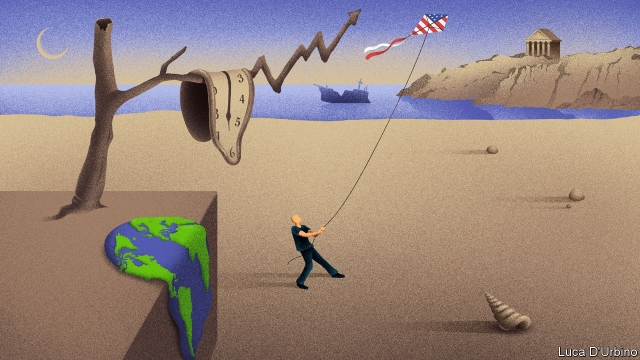
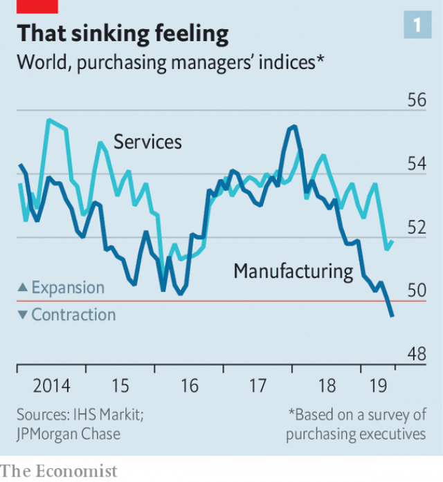
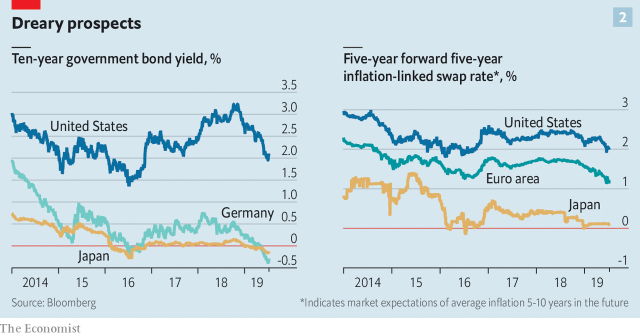
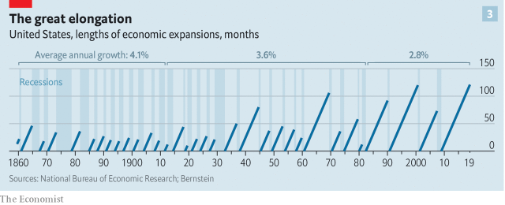
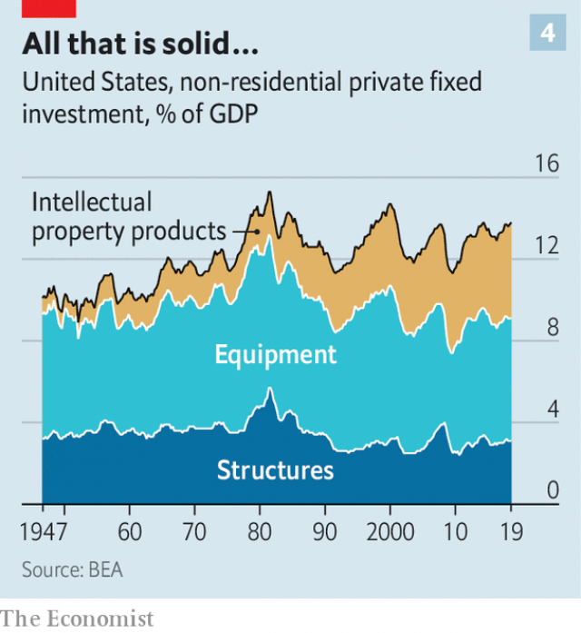
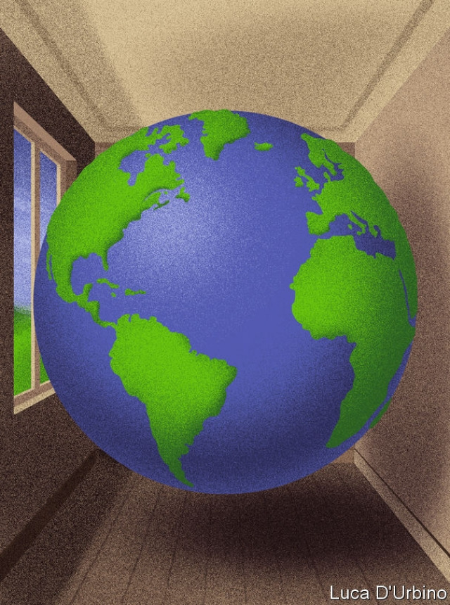
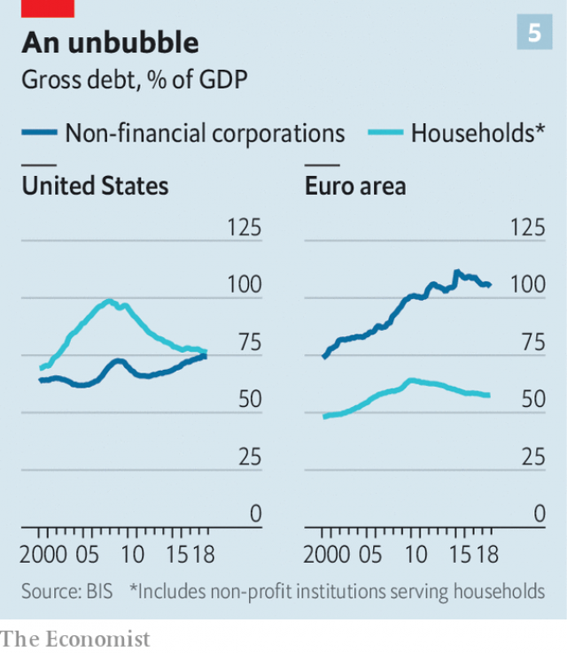

###### An awfully long expansion

# For how long can today’s global economic expansion last? 

 

> print-edition iconPrint edition | Briefing | Jul 13th 2019 

IT IS HARD to summon significant optimism when looking at the world economy. As the trade war between America and China grinds on unresolved, indices of business confidence in America and elsewhere have been falling fast (see chart 1). Surveys suggest that, as trade growth slows, global manufacturing is shrinking for the first time in more than three years. Services have begun to follow manufacturing’s downward trend as domestic demand falters, even in economies with strong labour markets, such as Germany. 

Long-term bond yields have been tumbling. Having started the year around 2.7%, on July 2nd America’s ten-year Treasury yield fell below 2% for the first time in Donald Trump’s presidency. Yields on ten-year German debt fell below -0.4% earlier this month. Low long-term rates signal that investors expect central banks to keep short-term rates low for a long time. Yet differences in yield between regular bonds and inflation-indexed ones suggest that they will undershoot the inflation targets they are meant to hit—presumably because their various economies will grow too weakly to generate much upward pressure on wages and prices (see chart 2). 

On top of all that, there is the simple fact that the current economic expansion is unprecedentedly long in the tooth. If, as is almost certain, America’s economy proves to have grown throughout the second quarter of 2019, it will have matched the record for the longest unbroken period of rising GDP set in the 1990s. Europe has enjoyed 24 consecutive quarters of rising GDP. As these years of growth have dragged on, it has become increasingly easy to find people sure they will soon come to an end. And yet they have not. 

 

If economists took one firm lesson from the financial crisis of 2007-09, it was to refrain from celebrating long periods of growth. In the good years before that crash the dismal science turned chirpy, talking of a “Great Moderation” that had tamed the boom and bust of the business cycle. The high point of hubris, for many, came in 2003 when Robert Lucas, making his presidential address to the American Economic Association, boasted that the “central problem of depression-prevention has been solved.” When the second half of the decade saw the most severe downturn in the world economy since the 1930s, pointing out that it had been merely a great recession, and that an actual depression had indeed been prevented, looked pettifogging. 

 

But the length of the current expansion suggests that Mr Lucas and the colleagues he spoke to and for had a point. Modern economics says business cycles are caused by changes in total spending which outpace the ability of prices and wages to respond. Recessions happen when, faced with lower spending, firms sell less and shed workers, leading spending to fall yet further, rather than adjust prices and wages so as to balance supply and demand. The Great Moderation was marked by changes in the economy that made spending less volatile, and by a greater willingness on the part of central banks to promptly increase demand when things looked dicey. A financial crash could still end an expansion, and the crisis that scuppered that of the 2000s was a doozy. But over the long term, stretches of economic growth in America have got longer and longer (see chart 3). 

 

Thus this expansion’s remarkable longevity does not mean it will die of old age. It just means that none of the things which usually bring expansions to an end—busts in industry and investment, mistakes by central banks and financial crises—has yet shown up with scythe in hand. Why not? And is their arrival merely delayed, or becoming genuinely unlikely? 

First, take downturns in manufacturing. In the second half of the 20th century, people serious about predicting recessions learned to pay a lot of attention to manufacturing inventories; Alan Greenspan, before he became chairman of the Federal Reserve, specialised in forecasting their ups and downs. They mattered because, in the days when companies planned production months in advance, a modest drop in demand often led manufacturers to cut production abruptly and run down their stocks, deepening the downturn. 

This factor now seems genuinely less important. Better supply-chain management has reduced the size and significance of inventories. And manufacturing has been shrinking both as a share of rich-world economies and of the world economy as a whole. As the current situation demonstrates, this makes it easier for the rest of an economy to keep going when factories slow down. Manufacturing has swooned in the face of the trade war; but service industries have held up, at least so far, and with them the economy as a whole. The same pattern was seen in 2015, when a slowdown in the Chinese economy led to a manufacturing slump. 

Some of the shift from manufacturing to services may be an illusion. Services have replaced goods in parts of the supply chain where equipment is provided on demand rather than purchased. At the same time, some firms that appear to produce goods increasingly concentrate on design, software engineering and marketing, with their actual production outsourced. Such firms may not play the same role in the business cycle that metal bashers did. 

This blurring of manufacturing and services has been accompanied by changes in the nature of investment. America’s private non-residential investment is, at about 14% of GDP, in line with its long-term average. But less money is being put into structures and equipment, more into intellectual property. In America IP now accounts for about one-third of non-residential investment, up from a fifth in the 1980s (see chart 4); this year private-sector IP investment may well surpass $1trn. In Japan IP accounts for nearly a quarter of investment, up from an eighth in the mid-1990s. In the EU it has gone from a seventh to a fifth. 

 

Recently, this trend has been reinforced by another: investment as a whole is increasingly dominated by big technology firms, which are spending lavishly both on research and on physical infrastructure. In the past year American technology firms in the S&P 500 made investments of $318bn, including research and development spending. That was roughly one-third of investment by firms in the index. Just ten of them were responsible for investments of almost $220bn; five years ago the figure was half that. A lot of this is investment in cloud-computing infrastructure, which has displaced in-house computing investment by other firms. 

In general, the rate of investment in IP tends to be more stable than that of investment in plant and property. When low oil prices led American shale-oil producers to pull in their horns in 2015-16, business investment fell by 10%, which in the past would have set off imminent-recession claxons. But investment in IP mostly sailed on regardless, and although GDP growth slowed, it did not stop. Philipp Carlsson-Szlezak of Bernstein, a research firm, cites this episode as evidence that physical investment simply no longer carries the economic significance that it used to. 

Whether or not that is the case, it would be wrong to think that IP investment can be relied on come what may. When the dotcom boom of the late-1990s went bust IP investment was one of the first things to fall, and it ended up dropping almost as much as investment in buildings and kit. With tech companies increasingly dominating investment of all sorts, it is worth worrying about what could now lead to a similar drop. One possibility might be a crunch in the online advertising market, on which some of the biggest tech firms are highly reliant. Advertising has, in the past, been closely coupled to the business cycle. 

It would also be wrong to think that the world weathered the incipient bust of 2015-16 purely because of changes in the investment landscape. The effects of a flood of stimulus to credit in China and a change of tack by the Fed were important, too. 

The swift action by the Fed was particularly telling. Central banks’ tendency during expansions has long been to continue raising rates even after bad news strikes, cutting them only when it is too late to avoid recession. Before each of the last three American downturns the Fed continued to raise rates even as bond markets priced in cuts. In 2008, with the world economy collapsing, the ECB raised rates on ill-founded fears about inflation. It repeated the mistake in the recovery in 2011, contributing to Europe’s “double-dip”. 

But since then there has been no such major monetary policy error in the rich world. Faced with the economy’s current weakness, the ECB has postponed interest-rate rises until mid-2020 and is providing more cheap funding for banks. It will probably loosen monetary policy again by the end of the year. In March the Fed postponed planned rate rises because of weakness in the economy. Markets are certain it will cut rates at its next meeting on July 31st; it may do so by double the usual quarter-of-a-percentage-point. 

America’s monetary loosening allows central banks in emerging markets, many of which are also reeling from the trade slowdown, to follow suit. With America cutting rates they need not worry about lower rates pushing down the value of their currencies and threatening their capacity to service dollar-denominated debts. The Philippines, Malaysia and India have already cut rates in 2019. 

Normally, as an expansion wears on, central banks face the fundamental trade-off between keeping rates low to aid growth and raising them to contain prices. But over the past decade that trade-off has rarely been a vexed choice, because inflationary pressure has stayed oddly low. This may have been because labour markets are not as tight as people think; it may be because profits have a long way to fall before rising wages force firms to raise prices; it may be because the globalisation and/or digitisation of the economy are suppressing prices in ways that are still obscure. 

Whatever the reason, the only time inflation made interest rates a genuinely hard call was in 2018, when the American economy was revved up by Mr Trump’s tax cuts. But the trade war warmed, the world economy cooled and the inflation risk the Fed had worried about subsided. In America core inflation, which excludes energy and food prices, is just 1.6%; in the euro zone, it is 1.1%. 

If central banks are not worried about letting inflation rip when they loosen policy, they are distinctly worried about what might happen if they didn’t. It is not just that an ounce of prevention is worth a pound of cure. It is that the rich-world central banks may only have ounces to administer. Only the Fed could respond to a recession with significant cuts in short-term rates without moving into the uncertain and contested realm of negative rates. The question of how much damage negative interest rates do to banks is under increasing scrutiny in Europe and Japan. 

In the face of a significant shock, the Fed and other central banks could restart quantitative easing (QE), the purchase of bonds with newly created money. But QE is supposed to work primarily by lowering longer-term rates. As these are already low, QE might not be that effective. And there is a limit on how much of it can be undertaken. In Europe the ECB faces a legal limit on the share of any given government’s bonds it can buy. It has set this limit at 33%. In the case of Germany it is already at 29%. If the ECB were to restart QE—as many expect it to—that limit would have to be raised. But it probably cannot rise above 50%, because that could put the ECB in the awkward position of having a majority vote in a future sovereign-debt restructuring. 

Their lack of sea room puts a premium on central bankers’ demonstrated good judgment; an unforced error like that of the ECB in 2011 could have dire consequences. Unfortunately, the top of the profession is in flux. Christine Lagarde, who will take over the ECB from Mario Draghi in November, lacks experience of setting monetary policy. The successor to Mark Carney, who will leave the Bank of England in January, is as yet unnamed. Mr Trump’s recent nominees to the board of the Fed have for the most part been unqualified and eccentric. And having relentlessly criticised Jerome Powell, the Fed’s chair, for raising interest rates in 2018, Mr Trump might well, should he win re-election next year, replace Mr Powell with someone more of his mind when his term ends. A candidate remotely as left-field as Mr Trump’s nominations to the board so far would badly damage the Fed’s credibility. 

After busts and central banks, the third killer is the one that struck so emphatically a decade ago: financial crisis. Manias and crashes are as old as finance itself. But during the Great Moderation, the financial sector grew in significance. The enhanced role of an inherently volatile sector may offset the stability gained from the shift from manufacturing to services, according to research by Vasco Carvalho of the University of Cambridge and Xavier Gabaix of Harvard University. The size of the financial sector certainly served to make the crash of 2007-09 particularly bad. 

In America, finance now makes up the same proportion of the economy as it did in 2007. Happily, there is no evidence of a speculative bubble on a par with that in housing back then. It is true that the debt of non-financial businesses is at an all-time high—74% of GDP—and that some of this debt has been chopped up and repackaged into securities that are winding up in odd places, such as the balance-sheets of Japanese banks. But the assets attached to this debt are not as dodgy as those of a decade and a half ago. In large part the boom simply reflects companies taking advantage of the long period of low interest rates in order to benefit their shareholders. Since 2012 non-financial corporations have used a combination of buy-backs and takeovers to retire roughly the same amount of equity as that which they have raised in new debt. 

 

Low interest rates also go a long way to explaining today’s high asset prices. Asset prices reflect the value of future incomes. In a low-interest-rate world, these will look better than they would in a high-interest-rate world. It may look disturbing that America’s cyclically adjusted price-earnings ratio has spent most of the past two years above 30, a level that was last breached during the dotcom boom. But the future income those stocks represent really should, in principle, be more valuable now than then. Higher interest rates would knock this logic over. But higher interest rates are not on the menu. 

The apparent lack of speculative action is a problem for economists. People with very different ideas about the role of central banks and the fundamental drivers of the economy can nevertheless agree that, in the long term, low rates produce financial instability. So after a long period of low rates, where is it? 

One answer is that it is following a cycle of its own. Analysis by the Bank for International Settlements shows that since the 1980s the financial cycle, in which credit growth fuels a subsequent bust, has grown in amplitude but has kept its length at about 15-20 years. In this model, America is not yet in the boom part of the cycle (see chart 5). America’s private sector, which includes households and firms, continues to be a net saver, in contrast to the late 1990s and late 2000s, note economists at Goldman Sachs. Its household-debt-to-GDP ratio continues to fall. It is rising household debt which economists have most convincingly linked to finance-sector-driven downturns, particularly when it is accompanied by a consumption boom. America and Europe had household debt booms in the 2000s; neither does today. The most significant run up in household debt in the current cycle has taken place in China. 

 

The world economy’s unprecedented expansion hardly looks healthy; the trade war may have dampened animal spirits to an extent that cannot be offset by the highly constrained amount of stimulus available to the apothecaries of the central banks. But it remains possible that it will plod on for some time. The longer it does so, the more it will look like the world really has made a change for the moderate. 

