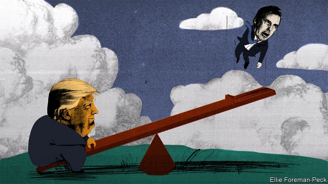

###### A specially strained relationship

# Britain humbled after Donald Trump pushes out its ambassador 

 

> print-edition iconPrint edition | Britain | Jul 13th 2019 

“THE CURRENT situation is making it impossible for me to carry out my role as I would like.” Thus did Sir Kim Darroch resign as Britain’s ambassador to Washington, the country’s top diplomatic post, on July 10th. His departure came days after the Mail on Sunday published a selection of his cables that were highly critical of President Donald Trump. In the end, Sir Kim was undone by a one-two from the West’s leading populist duo, Mr Trump himself and his apprentice, Boris Johnson, Britain’s probable next prime minister. The former froze him out of dealing with the American government, before the latter refused to back him. 

The furore will test the “special relationship”, on which Western defence is founded, as it has not been tested for many years. Few can remember a time when the ambassador of a close ally was so humiliated by an American president. It has also sparked a domestic political storm. Just when it should be preparing for a post-Brexit “Global Britain”, the Foreign Office finds itself fighting fires both at home and in the countries it most needs to cultivate. 

In truth Sir Kim’s cables, covering a period from 2017 to 2019, revealed little that had not been said frequently in the press. Still, they made juicy reading. The ambassador called Mr Trump’s administration “dysfunctional” and “diplomatically clumsy and inept”. Reports of “vicious infighting and chaos” inside the White House were judged to be “mostly true”. Mr Trump “radiates insecurity”. And Sir Kim warned that, although the president was dazzled on his state visit to Britain in June, America would continue to follow its own interest in post-Brexit trade talks: “This is still the land of America First.” 

Unsurprising as these views may be, their leaking is damaging, and has set off a hunt for the mole and the motive. In April a leak from Britain’s National Security Council over policy towards Huawei, a Chinese telecoms giant, led to the firing of the defence secretary, Gavin Williamson. Now another episode has strengthened the impression that something is rotten in the heart of the government. 

That the Darroch files emerged through a prominent Eurosceptic journalist, Isabel Oakeshott, has fed theories that this is all part of the battle over Brexit. Sir Kim was Britain’s permanent representative to the European Union and national security adviser before he went to Washington in 2016, and is seen as a Europhile. Suspicions range from Russian mischief-making to the even more unsettling idea that a British leaker hoped to ensure a more Brexit-friendly person is appointed ambassador after Theresa May steps down as prime minister later this month. 

If Mr Trump had his way, Britain would have long ago appointed Nigel Farage, the Brexit Party leader, as its man in Washington. After news of the leak broke on July 7th, the president made his views about Sir Kim plain. “The ambassador has not served the UK well, I can tell you that,” he said. “We will no longer deal with him,” he later tweeted. For good measure, the president rubbished Mrs May’s handling of Brexit (“What a mess she and her representatives have created”) and looked forward to her replacement. He described Sir Kim as “wacky” and “a pompous fool”. In fact the ambassador had been seen in Washington as a capable figure who was well liked by members of the Trump administration. 

Back home, Britain rallied behind its man, though the government distanced itself from his views. Mrs May insisted she had “full faith” in Sir Kim. In a televised debate on July 9th between the two rivals to succeed her, Jeremy Hunt, the foreign secretary, said that as prime minister he would keep Sir Kim in his job until he was due to retire at the end of the year. But Mr Johnson, supposedly the champion of taking back control, avoided any such commitment, instead saying meekly that the relationship with America was of “fantastic importance”. This was enough to persuade Sir Kim he could not stay. 

Mr Johnson “has basically thrown our top diplomat under the bus”, said Sir Alan Duncan, a Foreign Office minister. Sir John Major, a former prime minister, warned Mr Johnson that loyalty to civil servants was a “two-way street”. Meanwhile Sir Simon McDonald, the Foreign Office’s top civil servant, told a committee of MPs that more leaks might follow. “The basis on which we have worked all our careers suddenly feels challenged,” he said. 

The strain on Britain’s relationship with one superpower comes as its supposed “golden era” in relations with another, China, is looking tarnished. Tensions over pro-democracy demonstrations in Hong Kong are the latest in a series that includes policies towards Huawei and maritime rights in the South China Sea. 

Britain is also at loggerheads with Iran. On July 4th it seized a tanker off Gibraltar that it suspected of smuggling Iranian oil to Syria, provoking threats of retaliation. Sure enough, a week later three Iranian vessels tried to impede a British tanker as it sailed out of the Gulf, before the Royal Navy’s HMS Montrose drove them away. 

The contrast with France is striking. As Britain waits by the EU’s exit door and focuses on its leadership contest, President Emmanuel Macron has not been idle. He largely got his way in the recent share-out of top EU jobs. And on July 6th he agreed with Iran’s president, Hassan Rouhani, on conditions for talks to save the nuclear deal of 2015, the Joint Comprehensive Plan of Action (JCPOA). Britain’s Foreign Office merely says it is “co-ordinating with other JCPOA participants regarding the next steps under the terms of the deal”. 

The trade secretary, Liam Fox, is meant to be paving the way for a future deal with America, but in Washington this week he had a front-seat view of how fraught handling this administration might be. Rolling out the red carpet for Mr Trump in London last month did not change that (just as Sir Kim predicted). Nor would having a Brexiteer as the next ambassador. The EU, meanwhile, has been busy doing actual trade deals: its pact with Japan came into force in February and last month it reached agreements with Mercosur, a big Latin American trade club, and Vietnam. Global Britain has a lot of catching up to do. 

