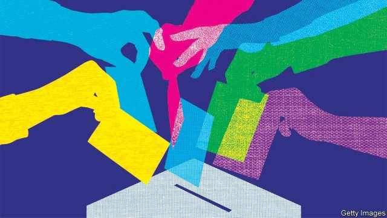
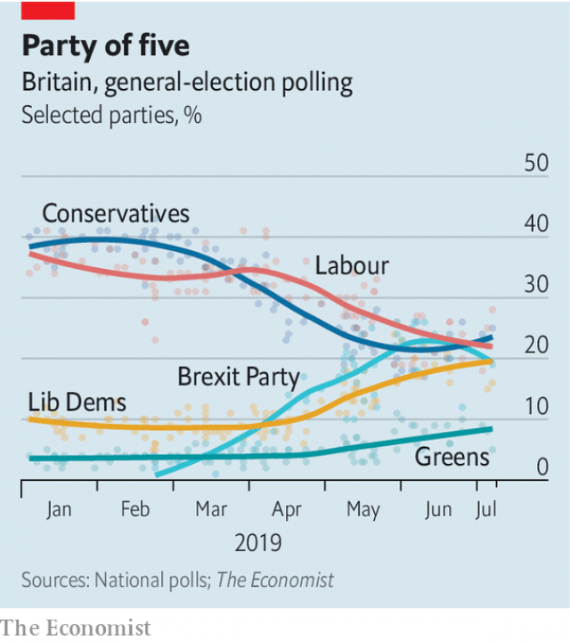

###### Polling in the deep

# Britain’s four-party politics looks like a lottery 

 

> print-edition iconPrint edition | Britain | Jul 13th 2019 

LABOUR AND the Conservatives have dominated British politics for a century. Combined, they have won over 60% of votes in every general election since 1922. But lately polls have suggested the duopoly is over. Four parties are polling at around 20%, as Labour and the Tories jostle with the Liberal Democrats and the new Brexit Party (see chart). A fifth lot, the Greens, are on nearly 10%. 

What sort of Parliament might emerge if an election were held? The next one is not due until 2022, but an incoming prime minister stuck with a deadlocked Commons will face pressure to go to the country. Under a proportional system, seats would be split four ways. But Britain’s first-past-the-post system awards seats only to the winner in each constituency, punishing parties that come a consistent second or third, however narrow the margin. So the next election could resemble a lottery. 

Forecasting the result means projecting national polls onto constituencies, adjusting for the profile of the people who live in them. This is tricky enough in a two-party race, in which votes lost by the Tories might be assumed to accrue mainly to Labour, and vice versa. In a four-way contest it is far harder. 

 

With four parties polling in the 20s, more constituencies will be won by tiny margins. In a two-way race, forecasters might get away with over- or underestimating a party’s performance by a few percentage points. In a multi-party race, that small error is likelier to be the difference between victory and defeat. Martin Baxter of Electoral Calculus, a forecasting website, says any projections will be highly sensitive to errors and movements in the polls. He estimates that, at the moment, a percentage-point increase in support for the Tories would yield a change of 20-25 seats. 

It is unclear whether the four-way split would survive an election campaign. Rob Ford of Manchester University points out that general elections have “feedback loops”: if voters think a party won’t win, they drop it. In the past, this has hit the Lib Dems. Yet with four parties neck and neck, any one of them is in danger of slipping out of contention in the minds of voters. Will Jennings of Southampton University doubts that anyone can confidently predict how an election would go at the moment: “People are just throwing out crazy numbers.” 

