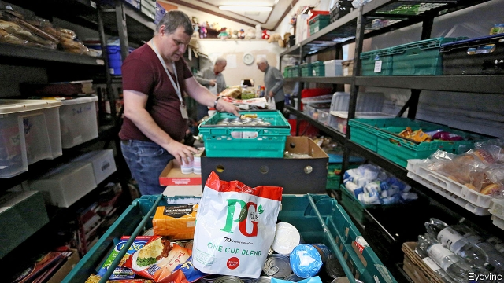
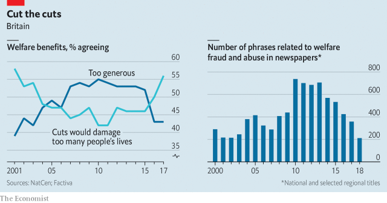

###### Moving out of Benefits Street

# British attitudes to welfare have undergone a quiet revolution 

 

> print-edition iconPrint edition | Britain | Jul 13th 2019 

“FAIRNESS”, DECLARED George Osborne, the then chancellor, in 2012, is “about being fair to the person who leaves home every morning to go out to work and sees their neighbour still asleep, living a life on benefits.” Newspapers printed story after story about welfare fraudsters pinching from the public purse, from the woman with two Samoyed dogs who collected thousands of pounds a month and claimed, “It’s not worth my while working,” to the man who collected disability benefit while competing in bodybuilding contests. In 2014 one in ten Britons tuned in to “Benefits Street”, a documentary which featured welfare recipients drinking and fighting on rubbish-strewn streets. 

Back then it felt impossible to be too mean to benefit claimants. They were a political piñata: whack them and votes fell out. When in 2013 the opposition Labour Party opposed a bill that would have resulted in three years of real-terms benefit cuts, the Conservatives responded with an advert that read: “Today Labour are voting to increase benefits by more than workers’ wages.” In the run-up to the general election in 2015, Mr Osborne promised £12bn ($18bn) of cuts to welfare. Voters rewarded his party with a majority. 

But the political piñata is no longer paying out. These days 56% of people think that cutting benefits “would damage too many people’s lives”—the highest figure since 2001 (see chart). Fears about benefit fiddling are at their lowest level in three decades. Concern over the extent of poverty, however, is rising, according to the latest edition of the British Social Attitudes Survey, published on July 11th. Voters no longer complain about “scroungers” during focus groups, say pollsters. TV programmes are more likely to focus on the botched roll-out of universal credit, a big welfare reform, than they are on the undeserving poor. Newspapers carry many fewer stories than they used to about skivers (see chart), instead running sympathetic profiles of people forced to use food banks. 

 

The shift has many causes. One is economic. The working-age employment rate has risen to an all-time high, so in Mr Osborne’s terms there are fewer people still snoozing as their neighbours begin their morning commute. Wages are also growing at their fastest rate since the financial crisis of 2008-09. When people feel reasonably flush they may feel more generous towards others. 

But a strong labour market does not always translate into support for welfare. The British economy boomed in 1997-2007, when Tony Blair’s Labour government was in charge, yet scepticism about welfare rose during Mr Blair’s second and third terms. What other factors are at play? 

Policy is one. The Tories, who came to power in 2010 on a promise to balance the fiscal books, have long been tough on benefits. In a conference speech in 1992 Peter Lilley, then the welfare secretary, adapted the libretto of a Gilbert and Sullivan musical: “I’ve got a little list / Of benefit offenders who I’ll soon be rooting out / And who never would be missed.” Yet even by Conservative standards, cuts to working-age welfare under Mr Osborne were severe. In the 2010-15 parliament about £30bn (equivalent to over 1% of GDP) was stripped away; single parents in work lost benefits worth 6% of their after-tax income. Reforms announced shortly after the general election in 2015 fell even harder on the poor. 

The highly visible effects of these policies, from a proliferation of food banks to a rise in rough sleeping, have convinced many people that Mr Osborne went too far. As on many subjects, public opinion on welfare tends to be “thermostatic”, says Ben Baumberg Geiger of the University of Kent. Once policies become harsher or softer than the level preferred by the public, voters send a signal and the government adjusts the policy “temperature” accordingly. Philip Hammond, who replaced Mr Osborne in 2016, has slightly increased the working-age welfare budget. 

Changes in other policy areas may help to explain why the public has gone softer on welfare. The growing concern in the 2000s with benefit fraud and abuse coincided with a big rise in immigration, especially after 2004, when residents of eight eastern European countries got the right to work in Britain. Voters feared the prospect of migrants coming to live off the taxpayer (many did indeed claim in-work benefits, though very few lived off the dole). A sense that Brexit will lead to lower immigration may have convinced people that there is no longer such a risk involved in having a generous welfare policy. Once the government is seen to be acting on a topic, public opinion moves on, says Andrew Cooper, a pollster at Populus. 

The change in mood is matched in the political debate. Not long ago, opposition parties boasted that they would be tougher on welfare than the incumbent. As recently as 2015 Labour—then under the caretaker leadership of Harriet Harman, a veteran of Mr Blair’s administrations—whipped its MPs to abstain on a vote on Mr Osborne’s benefit cuts, rather than vote against them. Ed Miliband, who preceded her as leader, promised to crack down on migrants receiving benefits. 

A bunch of left-wing backbenchers, including Jeremy Corbyn and John McDonnell, ignored Ms Harman’s orders, with Mr McDonnell pledging to “swim through vomit” to oppose the cuts. Mr Corbyn has since become Labour’s leader, and the party has moved in a different direction. It has mooted a universal basic income and hinted that it would scrap universal credit. Labour’s emollient approach means that the Tories no longer need to be macho about welfare. “Politicians now in Parliament can’t get up and speak the way they did a few years ago,” says Mr McDonnell, now the shadow chancellor. “In those days, we were still at ‘scrounger’ and all the rest.” 

One person, at least, has not changed his mind on benefits. When asked last October whether he regretted his actions in government, Mr Osborne admitted to policy failures regarding the EU, immigration and the banking industry. But he mounted a staunch defence of his welfare cuts. “If you are going to have to deal with the fact the country was spending too much, it would be a bit odd to leave out the very large chunk the government was spending on welfare,” said Mr Osborne. Voters, it seems, now disagree. 

