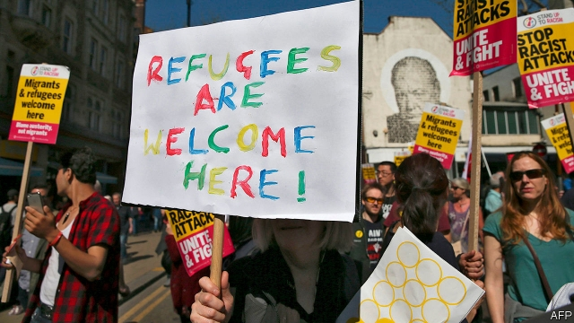

###### A crack in the wall

# Britons are warming to immigration. Will their next prime minister? 

 

> print-edition iconPrint edition | Britain | Jul 13th 2019 

IF BREXIT TAKES up the first volume of Theresa May’s political obituary, immigration ought to be the second. Throughout her six years as home secretary and her three as prime minister, which will end on July 24th, the issue obsessed her. She tightened visa requirements and insisted on counting students as long-term migrants. Her department sent vans to migration hotspots with hoardings that warned illegal migrants to “go home or face arrest”. “We are getting better at identifying and rejecting people we don’t want to come to Britain,” she boasted. 

Yet, even on her own terms, her policy failed. She and David Cameron repeatedly promised to reduce net inflows to no more than 100,000 people a year. When Mrs May took over the Home Office in 2010, that figure was 256,000. It dropped a little over the next two years, before rising again, partly because of the additional inflows when Britain lifted migration restrictions on Bulgaria and Romania in 2014. Since the Brexit vote, migration from the EU has fallen sharply, but inflows from the rest of the world have grown. The net figure now stands at 258,000. 

By the middle of his first term as prime minister, Mr Cameron would privately admit that his ministers no longer believed that the “tens of thousands” target was achievable, says James Kirkup of the Social Market Foundation, a think-tank. Mrs May was the exception. 

A report published on July 8th by British Future, another think-tank, argues that her successor must seize the opportunity of a “reset moment” on immigration. Polling shows that only 13% of Britons (and the same share of Tory voters) think the government has managed the system competently and fairly. So far, the leadership contenders’ noises on the subject suggest they have learned from Mrs May’s errors. Jeremy Hunt says he would drop her target. Boris Johnson, the favourite, would also probably ditch it, though he has not said so. 

As on other issues, Mr Johnson’s stance is tricky to pin down. He pledges to get tough on migrants “who abuse our hospitality” and do not speak English. Yet as mayor of London, he claimed (implausibly) to be the only politician willing to call himself “pro-immigration”. And he has mooted an amnesty for illegal migrants who have been living in Britain for years. 

A more liberal approach might not prove the vote-loser it was once thought. Before the Brexit referendum, voters sometimes told pollsters immigration was their primary political concern; now, it is ninth on the list. About half of Britons reckon immigration has generally been good for the country, compared with 19% in 2011. And they are more positive on the subject than are voters in Germany, France and America. “The heat has gone out of the debate,” says Robert McNeil of the Migration Observatory at Oxford University. 

This is far from an endorsement of open borders. About half still want net migration to fall, compared with 13% who are keen for it to rise. And the shift can partly be explained by a fall in net migration from its peak of 332,000 in 2015 and the expectation that it will drop again after Brexit. 

But the figures do suggest that Mrs May was wrong to assume public opinion on immigration was homogeneous or that it would retain its salience, says Sunder Katwala of British Future. He calls most people “balancers”, who see both the benefits and drawbacks of immigration and have differing views depending on the circumstances of each migrant. 

Polling for the report bears this out. Most voters are content with current—or, in a few cases, higher—inflows of highly skilled migrants, students and family members. But they are much less enthusiastic about low-skilled migrants, refugees and asylum-seekers. 

Most of those who have warmed to immigration attribute their change of heart to increased awareness of the contributions that migrants make. Newspapers are running fewer—and more positive—stories about migrants. And the scandal over the shoddy treatment of the Windrush generation of migrants, who came to Britain legally but struggled to prove it, demonstrated that being perceived as too harsh can be as politically toxic as appearing too lenient. Whether or not her successor salvages any of Mrs May’s Brexit policy, her tub-thumping speeches on immigration ought to be destined for the dustbin. 

