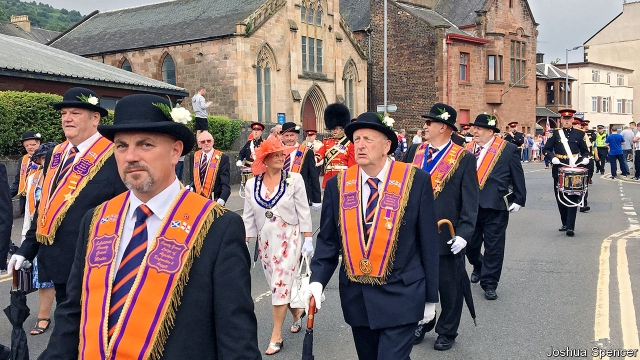

###### On the march

# Orange Order parades cause growing tension in Scotland 

 

> print-edition iconPrint edition | Britain | Jul 13th 2019 

A  TOY DRUM emblazoned with a Union Jack hangs around the neck of a young boy, who taps it excitedly while he waits. Pounding down the street, in a din of flutes and booming drums, are hundreds of marchers: some dressed in quasi-military uniforms, others in orange sashes, bowler hats and white gloves. Fluttering banners glorify the queen. Shopkeepers stand outside their premises to watch; there is no use working, though the more opportunistic sell union flags to spectators. 

Such marches are organised by the Orange Order, a fraternity formed in 1795 to promote Protestantism and loyalty to the Crown. Their noisy annual celebrations reach a crescendo in the weeks leading up to July 12th, the anniversary of the Battle of the Boyne of 1690, when William of Orange, a Dutch Protestant, defeated his rival for the English throne, the Catholic King James, in Ireland. Parading Orangemen are a familiar sight in Northern Ireland, where marches have long been a source of sectarian tension. But they are also active far from the Boyne, in Glasgow, where marching season is an increasingly tense affair. 

Scotland adopted Presbyterianism as its national creed after the Reformation, but many Irish Catholics later emigrated to Glasgow’s East End. The city’s footballing rivalry between Rangers (historically Protestant) and Celtic (mainly Catholic) contributes to the “inherited and institutionalised” division in Glasgow, says Duncan Morrow of Ulster University. Parades have long been a fixture. Orange Order marches, which attract up to 4,000 participants, made up 46% of those submitted to Glasgow council for permission last year, with 143 in all. Republicans held 16. 

In the past year these processions have become more politically charged. Four Orange marches in Glasgow were rerouted this summer after the police raised “significant concerns”. Ten times as many officers have been dispatched to police some parades as were sent last year. The police warned a council committee in June that “positions are becoming more polarised”. In the East End, “anxiety, anger, fear and a sense of injustice is high,” says Michael Rosie of the University of Edinburgh. 

The immediate cause of this tension was an attack on a Catholic priest during an Orange Order march last July. Canon Tom White was spat on and abused while standing on the steps of his church, St Alphonsus, as a parade thundered by. A man following the march (but who was not a member of the Orange Order) was jailed over the incident. 

The attack led to the founding of Call it Out, a group that has since then protested against Orange marches. Jeanette Findlay, one of its founders, accuses the Orange Order of anti-Catholic “racism” and argues that the authorities should stop its parades going past Catholic churches. Jim McHarg, Grand Master of Scotland’s Grand Orange Lodge, counters that the recent volatility has been caused by Call it Out travelling to Orange processions “to be offended”. 

Even before the attack at St Alphonsus, deeper political shifts had set the two sides at odds. In the independence referendum of 2014, the Orange Order campaigned to stay in the union. Sectarianism had been widely seen as a “non-issue”, but “raised its head” again after the vote, says Mr Morrow. Six out of ten Catholics backed independence; the same share of Protestants opposed it. Mr McHarg says the Order’s membership grew “astonishingly” afterwards (“We should have a referendum every year,” he quips). The capture of Glasgow’s council by the pro-independence Scottish National Party has added to the Order’s sense of victimisation. There is “fear and anxiety” among Catholics and “a sense of injustice on the Orange side”, says Mr Rosie. 

Leaders of both groups have made some efforts to dampen down tensions. The Catholic Archbishop of Edinburgh indicated that he had no problem with marches passing by Catholic churches. The Orange Order voluntarily rerouted this year’s Boyne parade in Glasgow away from St Alphonsus. It has also tried to improve its poor public image, with some difficulty. When in 2015 it held “Orangefest”, an event in Glasgow, a petition opposing it and decrying the Order’s “hate-filled” marches gathered 27,000 signatures. 

“Nobody knows about us,” complains Mr McHarg. In one sense he is right. At a recent march on Glasgow’s outskirts, Raza, a waiter watching from outside the Curry Lounge restaurant, reckons the procession is for “supporting national heroes”. Up the street, a barber presumes it is in honour of military veterans. Many young or recently arrived Scots do not feel fear so much as bemusement at the chaps in bowler hats. 

