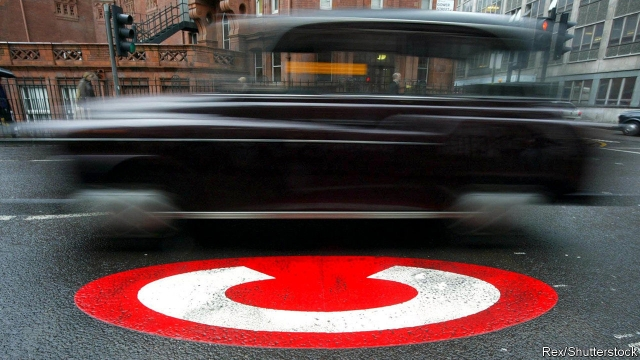

###### Cabs in court

# Uber drivers claim London’s congestion charge is racist 

 

> print-edition iconPrint edition | Britain | Jul 13th 2019 

EARLIER THIS year minicab drivers turned up to protest outside the offices of Transport for London (TFL). “Sadiq Khan, shame on you!” they chanted. “Not the drivers, not the poor, tax the operators more!” The cause of their ire? The mayor’s decision that minicab drivers, including those who use Uber, should join the general public in paying £11.50 ($14.30) a day to drive in the centre of the capital. “We hoped the public-pressure route would work,” explains Jason Moyer-Lee of the IWGB union, which organised the protest. But Mr Khan stood firm—so the union has decided to try the legal route. 

On July 10th the High Court began to hear its case that the introduction of the charge for minicab drivers is racially discriminatory and breaks the European Convention on Human Rights. As a public body, TFL must obey the Equality Act by avoiding indirect discrimination, which happens when a seemingly neutral rule has a disproportionate impact on a protected group. An example could be a rule making all employees work full-time, which would disproportionately affect women, who are more likely than men to be carers. 

Since the rules changed in April, the congestion-charge exemption has been available only to black cabs and to the 0.6% of private-hire vehicles that are accessible to wheelchairs. This is where the IWGB says the indirect discrimination comes in. Although Uber drivers and cabbies perform similar roles, shuttling Londoners about the city, they are very different people. According to a recent survey, only 8% of minicab drivers are white-British, compared with 80% of black-cab drivers. 

Black-cab drivers have little sympathy for their rivals. The number of private-hire drivers in the city has almost doubled since Uber arrived in 2012. “There’s too many of them on the road. Something needs to be done,” complains Miles, as he chomps on a sandwich outside a small green hut, known as a cabmen’s shelter, on the Embankment. The congestion charge was extended to cover minicabs to do just that. Research carried out on behalf of TFL predicts that it will cut private-hire traffic by 6%, but overall traffic by just 1%. 

Indirect discrimination is permissible if it is a “proportionate means” to achieve a “legitimate aim”. It is, for example, fair to make trainee firefighters pass a fitness test before they jump into burning buildings, even though such a test discriminates against old people. But the IWGB argues that there are other ways to achieve the legitimate aim of reducing traffic—such as raising the congestion charge for all drivers—and that a fall in the supply of minicabs may harm people with disabilities who do not need a wheelchair.  

TFL responds that the most price-sensitive traffic has already been priced out of the city, so a rise in the congestion charge for all would make little difference. Taxi drivers will hope it is a winning argument. In exchange for learning the Knowledge, a gruelling feat requiring them to remember 25,000 roads and 100,000 landmarks, they earn perks such as the right to pick people up off the street (whereas minicabs must be booked) and to drive in bus lanes. If minicab drivers have their way, the incentive to spend all those hours memorising road names will be a little less strong. 

