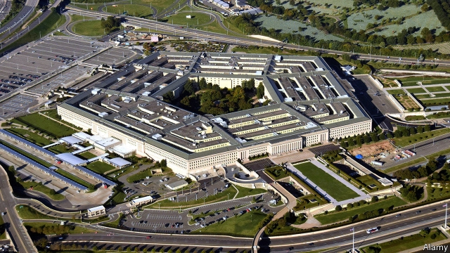

###### JEDI orders

# Amazon is eyeing billions in federal contracts 

 

> print-edition iconPrint edition | Business | Jul 13th 2019 

OVER THE past decade Amazon Web Services (AWS) lured untold numbers of consumers and corporations onto its billowing cloud. The division earned its giant e-commerce parent $7.3bn in operating profits last year. It could soon be earning more. Jeff Bezos, Amazon’s boss, is going after a potentially more lucrative customer: the government. Amazon has outspent all technology firms on lobbying in the first quarter, and is building a second headquarters in Virginia, near the Pentagon. 

No wonder. Next month the Defence Department may award a cloud-computing contract worth $10bn. The Joint Enterprise Defence Infrastructure (JEDI) initiative aims to create a unified “war-fighter cloud” to modernise the Pentagon’s existing networks and data centres. In April AWS and Microsoft edged out Oracle and IBM onto the final shortlist. 

JEDI is just the start. America’s federal agencies were slow to adopt cloud computing, notes Gary Labovich of Booz Allen Hamilton, a consultancy. The CIA led the way in 2013 by awarding a $600m cloud contract to Amazon (familiarising cautious officials with AWS). Today agencies are outsourcing with gusto. Bloomberg Government, a research outfit, reckons that annual spending on cloud computing by the federal bureaucracy will leap to $5.3bn this year, from $2.5bn in 2015. The feds will pay an extra $4.6bn for related digital services. 

Amazon may hit snags, however. For a start, the mood in Washington, DC, is turning against Big Tech. President Donald Trump has criticised Amazon and Mr Bezos over two dozen times on Twitter. Bernie Sanders, a leftie senator running for the Democratic presidential nomination, introduced a bill (dubbed “Stop BEZOS”) to levy hefty taxes on giant firms. Chuck Grassley, a Republican senator, has pressed the Pentagon to answer allegations that it its procurement process favours AWS. 

This points to a second niggle: Amazon’s rivals are crying foul. In a case before a federal court, Oracle is arguing that the JEDI procurement process was biased. The Washington Post reported that Deap Ubhi, a former Amazon executive named in the lawsuit, tweeted, “Once an Amazonian, always an Amazonian”, in praise of Mr Bezos, while allegedly involved in designing the JEDI process. The suit also questions meetings between senior officials including James Mattis, a former defence secretary, and Amazon bosses. AWS and the Pentagon deny any impropriety. 

The final complication is a potential backlash over Amazon’s cosiness with government. In May some shareholders at Amazon’s annual meeting called for it to stop selling facial-recognition software to governments. The resolutions failed but may resurface. (San Francisco has banned city departments from using such technology.) AWS has also come under fire for supporting Mr Trump’s immigration crackdown. 

Confronted last year with an employee backlash against its sale of artificial-intelligence software to America’s armed forces, Google backed off and withdrew from the JEDI tender. Amazon is standing firm. Last month Andy Jassy, who runs AWS, responded to employee concerns about the use of its facial-recognition tools in law enforcement by citing a core Amazon principle: “Have backbone; disagree and commit.” Spoken like a soldier. 

