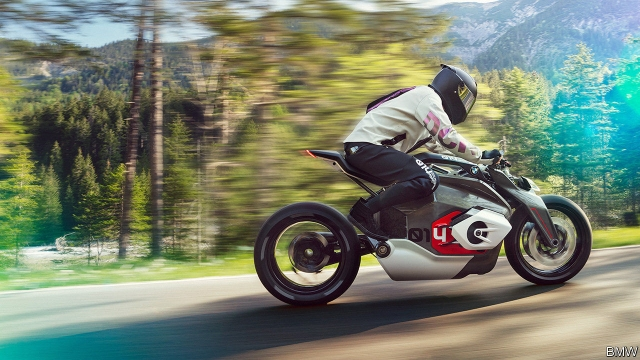
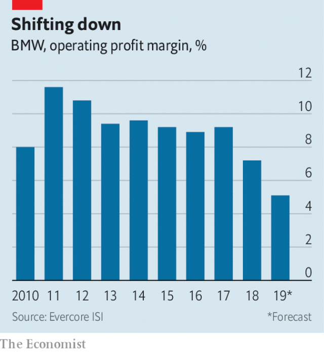

###### Tune-up time

# BMW tries to turn a corner—and loses its boss 

 

> print-edition iconPrint edition | Business | Jul 11th 2019 

IN THE GRAND finale of #NEXTgen, an event held last month at BMW’s headquarters in Munich to show off the German carmaker’s vision for the future of mobility, Harald Krüger, its boss, unveiled the Vision DC Roadster. The staid 53-year-old mounted the futuristic, angular motorbike as if he were ready to ride off into the sunset. Shortly afterwards he was on his way. On July 5th Mr Krüger said that he would stand down with less than a year of his five-year term remaining. 

Rumours had been rife that BMW’s supervisory board was about to announce that, unlike his predecessor, Norbert Reithofer, Mr Krüger would not get a second term. On his watch the company’s financial performance has sputtered. More troubling, it has lost the technological edge on which the pulling power of premium brands relies. His successor—widely tipped to be Oliver Zipse, BMW’s head of production—will need to soup up both. 

For years BMW’s excellent cars and outstanding profits were the envy of carmakers. Its luxury saloons remain desirable and returns have been decent. But despite record sales of around 2.5m vehicles last year, operating profits fell by 8% to €9.1bn ($10.7bn). Operating margins have halved since 2011, to under 6% (see chart). A profit warning in March has weighed on BMW’s share price, which is down by 45% since a peak in 2015, the year Mr Krüger took over. 

 

It would be unfair to pin all the blame on the outgoing boss. All carmakers must contend with slowing sales in China, trade tiffs and costly investments required to cope with tighter emissions rules and upheavals such as electric vehicles (EVs), self-driving cars, carsharing and other mobility services. Daimler, the maker of Mercedes and BMW’s arch-rival, has also seen its margins shrink and last month issued its third profit warning in a year. But Mr Krüger has been slow to adapt BMW to changing trends in technology and consumer taste. Blingier Mercedes have outshone conservative Beemers, and Daimler overtook BMW as the world’s biggest premium carmaker in 2017. Early to the spot the craze for SUVs, BMW has failed to exploit it; for every ten cars it makes, six are saloons, the market for which is shrinking fast. For all Mr Krüger’s talk of BMW as a “tech company” it has not produced a cutting-edge EV since the i3 and i8, two innovative vehicles introduced under Mr Reithofer. Daimler, Audi and Jaguar all have. 

At least BMW no longer appears to be asleep at the wheel. It wants to launch 25 new electric and hybrid vehicles by 2023, two years earlier than previously planned. On July 9th it presented a battery-powered version of its popular Mini hatchback. A tie-up with Daimler to pool investments in mobility services, and with Jaguar Land Rover to develop EVs, has met with the approval of analysts. Such manoeuvres, combined with a focus on more lucrative models, could help BMW to cut a cumulative €12bn in costs over the next four years and restore margins to a healthy 8-10%, insists Nicolas Peter, its chief financial officer. 

But rivals are not standing still. Many have more ambitious targets for EVs. BMW’s plans for a world of ride-sharing and self-driving cars—where the appeal of luxury motors is less obvious—do not differ radically from those of competitors. Re-engineering the “ultimate driving machine”, as BMW styles itself, for the new age will not be easy for whoever replaces Mr Krüger. 

