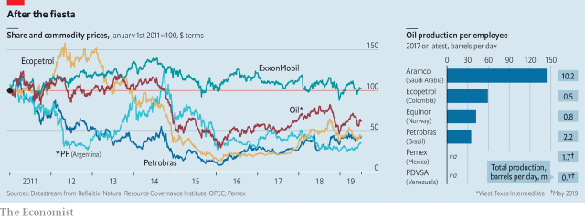

###### States of disarray

# Latin America’s state-run oil giants are struggling 

 

> print-edition iconPrint edition | Business | Jul 13th 2019 

OIL, IT IS often noted, can bring a country both wealth and woe. In Venezuela, by some measures home to the world’s largest proven oil reserves, it has mostly been the latter of late. Petróleos de Venezuela (PDVSA) saw production peak in 1998, when Hugo Chávez was elected president. In the years that followed the left-wing tribune and his authoritarian successor, Nicolás Maduro, purged PDVSA’s professional staff, strong-armed its international partners and raided its coffers. A sweeping American probe of bribery at the company has so far charged more than 20 people. Its current boss is a brigadier general with no oil experience. Since January, when America announced tough sanctions on PDVSA, production has plunged to the lowest levels per citizen since the 1920s. Meanwhile, millions of Venezuelans lack food and basic medicine. 

PDVSA is a caricature of mismanagement. But a survey of state-controlled energy giants in Latin America, which accounts for around 10% of global oil output and 20% of proven reserves, shows dysfunction is not confined to Venezuela. Five years after the oil price crashed, output remains depressed in much of the region, even as the industry as a whole faces unprecedented disruption. The shale boom helped the United States produce 15.3m barrels of oil a day last year, about one-sixth of global output. Concerns about carbon emissions and the rise of electric cars mean that worries about peak supply have been supplanted by fears of peak demand. 

This uncertainty has added new urgency to the old question of how to maximise the value of crude reserves. Instead of tackling this head on, Latin America’s national energy champions—or rather, their political taskmasters—are relitigating debates of yore. Subject firms to political pressures or keep them independent? Invite foreign investment or shun it? Maximise efficiency or create jobs? Subsidise petrol or let prices move with the market? Their responses have, for the most part, been discouraging. 

States control about 90% of the world’s oil and gas reserves. They do so in different ways, as Latin America illustrates. In Guyana, the region’s youngest petrostate, production is about to boom following a discovery in 2015 by ExxonMobil, but the country has yet to create its own oil company. Pemex, by contrast, was founded as a state-owned monopoly in Mexico in 1938. Other countries have both state companies and foreign ones, often in an uneasy partnership. Brazil’s state-run giant, Petrobras, listed shares in America in 2000. Its Argentine and Colombian counterparts also have private minority shareholders. In Ecuador the state controls more than 80% of oil output. Perupetro, Peru’s firm-cum-regulator, oversees private companies’ exploration and production. Venezuela, having opened up its oil sector in the 1990s, in 2006 declared that PDVSA would take majority control of oilfields managed by foreign firms. BP and Chevron were among those that agreed; ExxonMobil and ConocoPhillips packed their bags. 

Despite their different corporate forms, most of Latin America’s oil giants share three problems in common. The first is mismanagement of cash in good times. That included pouring too much money into government coffers and too little into investment for future growth. In 2013, when the oil price topped $100 a barrel, Pemex transferred about half of its revenue to Mexico’s government. Despite rising crude prices, Petrobras saw its share price decline, as it loaded up on debt and invested in too many marginal projects. As oil prices plummeted, Latin America’s oil companies racked up long-term liabilities of more than $400bn, or 8.5% of their countries’ combined GDP, according to data from the Natural Resource Governance Institute, a think-tank. Petrobras accounted for nearly half the total. 

Some politicians and executives also used the companies as personal piggy banks—the second common problem. Corruption scandals rocked Petrobras, Petroecuador and Pemex, as well as PDVSA. Petrobras took a particular nosedive when it emerged that construction firms paid Brazilian politicians billions of dollars in bribes in exchange for padded contracts to build refineries and other infrastructure. This, combined with the mountain of debt, led credit-rating agencies to downgrade Petrobras to junk in 2015. Between August 2014 and February 2016 the company’s market capitalisation shrivelled by $115bn, or 80%. Only some of that was down to the collapsing oil price; ExxonMobil’s stock dipped by 18% in the period (see chart). 

 

There are signs the sleaze is being cleaned up in Brazil and elsewhere. Several senior Petrobras executives, and scores of Brazilian politicians, have been prosecuted over the Petrolão (“Big Oily”) affair. On July 5th Mexican authorities said they had issued an arrest warrant for Emilio Lozoya, who led Pemex from 2012 to 2016 (and has fled the country). As Lenín Moreno, Ecuador’s president, mops up the mess at Petroecuador, American prosecutors continue to file charges alleging bribery at the company during the tenure of his predecessor, Rafael Correa. 

However, companies remain susceptible to political whims—the third and most vexing shared challenge. Start with Petrobras. The region’s biggest producer has made progress. Last year it agreed to pay minority shareholders $2.95bn in a class-action settlement in America. Pedro Parente, who became chief executive in 2016, cut costs, began selling less profitable assets, reformed pricing policy and set about boosting production from vast resources tucked under thousands of metres of salt beneath the seabed. 

Still, Petrobras remains vulnerable to political undulations. Last year the government reintroduced petrol subsidies to appease angry lorry drivers. Mr Parente resigned and Petrobras shares took a knock. Jair Bolsonaro, Brazil’s new president, appointed Roberto Castello Branco, a well-regarded economist who had served on the company’s board and looked set to continue Mr Parente’s market-friendly policies. 

But faced with the risk of another strike in April, Mr Bolsonaro asked him to scrap plans for a 5.7% increase in the price of diesel. Petrobras’s share price, which had risen sixfold since the trough in 2016, wobbled. The government rushed to calm the market, announcing the auction of several oil refineries and a price increase only slightly lower than planned. But investors are shaken. “You’re not going to sell a single screw of a refinery until the market has confidence that there won’t be government interference,” says one local oil veteran. 

The situation in Mexico, second to Brazil in regional oil production, looks worse. Pemex has been a symbol of sovereignty and national pride since Lázaro Cárdenas expropriated oilfields in 1938. With oil tethered to politics, strategy has been liable to swing from one presidency to the next. As Mexico realised the potential of the giant offshore Cantarell field in the 1970s, José López Portillo, the president, declared that all Mexico needed to do was “manage the abundance”. Instead the Cantarell boom bred complacency and investment declined. Last year the field produced 80,000 barrels per day, down from 2m in 2014. 

Complicating matters, for years Pemex has borrowed money to pay its taxes, accumulating government-guaranteed loans. This has turned it into a vehicle for public debt, leaving Mexico particularly vulnerable to its waning fortunes. Pemex has overtaken Petrobras as the world’s most indebted oil company, with long-term liabilities equivalent to 15% of Mexico’s GDP. On June 6th Fitch Ratings stripped it of its investment grade. 

Pemex is now led by a political ally of Andrés Manuel López Obrador, Mexico’s populist president, with no experience in oil or gas. It had sought foreign partners to jump-start production, but Mr López Obrador has frozen future auctions of exploration sites. Keen to reduce dependence on American fuel imports, he plans to build a refinery in his home state of Tabasco for $8bn (or more), which may aggravate Pemex’s woes, not alleviate them. Mr López Obrador’s finance minister has just resigned, apparently in part because he objected to the president’s strategy for Pemex (see article). Further plans for the company are expected this month. JPMorgan Chase, a bank, described an earlier rescue package as worse than underwhelming. Fitch thinks taxes would need to be halved for the company to retain enough cash either to invest in its business or pay down debt. The president’s goal of raising crude production by around 50% by 2024, from 1.7m today, looks fanciful. 

Latin America’s other state oil champions are minnows next to Petrobras and Pemex. But their experiences are nevertheless instructive. In Argentina, the oil industry has been scarred by the decision in 2012 by the then president, Cristina Fernández de Kirchner, to renationalise 51% of YPF, privatised 19 years earlier. Ms Fernández’s market-friendly successor, Mauricio Macri, has made it easier for foreign firms to invest in the country. 

As it competes with overseas rivals, and forms occasional partnerships with them, YPF is at last beginning to tap Argentina’s rich shale deposits in the Vaca Muerta formation in northern Patagonia. But in dollar terms, the company’s share price languishes 80% below its peak in 2005. Progress could be undone if Ms Fernández’s Peronist ally wins the presidency (the former president herself is currently campaigning as his running mate). 

In some ways the region’s brightest spot has been Colombia. Álvaro Uribe, president from 2002 to 2010, set about restructuring Ecopetrol. His changes included the creation of an independent regulator and the listing of 11% of Ecopetrol shares, which provided an infusion of capital that helped the company enlist better managers. In 2015 it recruited Felipe Bayón Pardo, a former senior executive at BP, a British oil giant, who became boss in 2017. After the downturn in oil prices at the end of 2014, Ecopetrol slashed spending. When prices ticked up, spending rose, though more slowly than in Mexico. But Ecopetrol’s reserves are dwindling. To boost them, it is teaming up with international oil majors and investing $500m in fracking. 

Success is not assured, in Colombia or elsewhere. The International Energy Agency, an intergovernmental forecaster, predicted that Brazilian output would boom last year—yet output dipped as new oilfields were slow to begin production and mature ones fell. 

Those concerned about climate change might argue that the region’s inefficient state-run firms would do well to return more money to shareholders and invest the rest in cleaner energy. Rivals in other parts of the world are taking tentative steps in that direction. Statoil, Norway’s titan, has reinvented itself as Equinor; its portfolio comprises both oil projects and wind farms. Even the world’s oil colossus, Saudi Aramco, is making a bet on petrochemicals and refining, demand for which should remain robust even if a global carbon price one day depressed that for crude. Latin American oilmen are too consumed by old challenges to deal with these new ones. 

