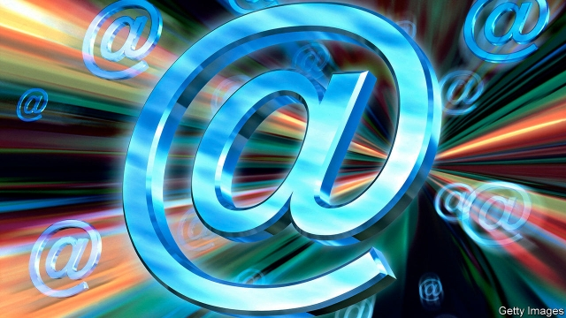

###### Faster than a speeding bullet

# Superhuman tries to reinvent email 

 

> print-edition iconPrint edition | Business | Jul 13th 2019 

EVEN FUTURE-OBSESSED Silicon Valley occasionally looks back in time. A case in point is Superhuman, a service that aims to reinvent something as antediluvian as email. It has created more buzz than anything for a while in the world’s tech capital, by marrying two of technologists’ biggest desires: for efficiency and status. 

Many a venture capitalist or entrepreneur in the Valley would sympathise with David Ulevitch of Andreessen Horowitz, a big venture-capital firm, who recently likened his overflowing inbox to the final level of Tetris, a classic video game. It is just as engrossing; tech types often spend four hours a day fielding emails. Superhuman (in which Mr Ulevitch’s fund has invested) tries to speed emailing up—no command is meant to take longer than one-tenth of a second to execute—while making it less taxing. Keyboard shortcuts, conversion of messages to tasks, instant unsubscribing from newsletters and other tricks, plus nudges to get people to use them, can cut emailing time by half, boosters claim. The firm regularly quizzes users and adds features requested by the most committed among them. 

But its greatest superpower may be to make adopters feel special. This is partly by design. “We aspire to treat you like you’re our only user,” explains Rahul Vohra, the firm’s chief executive. Forget “onboarding” (startup speak for setting up your account) with a few taps on an app. Superhuman has you sit through video-conference tutorials. This limits uptake—but increases exclusivity, further augmented by requiring an invitation to join. The service has welcomed 15,000 users, each paying $30 a month for the privilege. The waiting list exceeds 200,000 names. 

Superhuman is not invincible. Last week it faced the first backlash when it emerged that senders can track when and even where emails have been opened. The problem has since been fixed but others may prove harder to solve. One is that once taught Superhuman tricks, users could easily replicate them in Gmail and other free services. A bigger one is that by focusing on power users it may become a niche offering. This would limit the scope for fulfilling Silicon Valley’s number-one desire—for growth. 

Mr Vohra argues that serving one group of customers well is the first step. With confidence typical of a startup founder he believes growth opportunities will present themselves later. Recipients could, for instance, have the service charge some senders for postage. 

Superhuman can probably afford to bide its time. With a steady revenue from subscriptions and, for the time being, no cash-hungry customer-acquisition costs to speak of, it has a good shot at making money soon. If it manages to grow and make money at once, that would, in a world of perennially lossmaking startups, be a superhuman feat indeed. 

