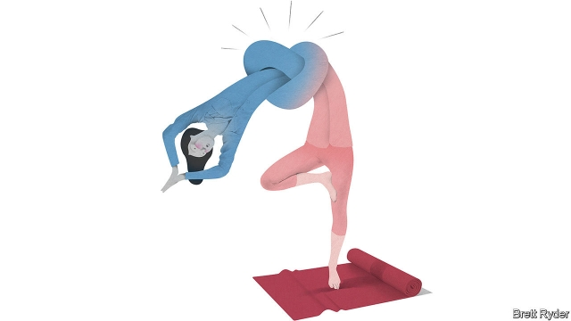

###### Schumpeter

# The business of the body 

 

> print-edition iconPrint edition | Business | Jul 13th 2019 

IN A. DICKSON WRIGHT’S “Quacks Through the Ages”, a study published in 1957, the “outstanding quack of all times” was James Graham, an 18th-century Scottish doctor who conceived mystical cures for all sorts of ailments using fiery electric lamps, magnets and perfumes of the Orient. The centrepiece of his Temple of Health in London was a celestial bed that he claimed could combat sterility and produce perfect babies by pouring out waves of magnetism. High society flocked to his events, which had an air of eroticism and culminated in the scantily clad appearance of the Goddess of Health—none other than the future Lady Hamilton. He may have been an impostor, but Graham deserves special reverence at The Economist. His magnetic love bed lay adjacent to the site of our current headquarters overlooking the Thames. 

Once again miracle cures are all the rage, not just in London but all around the world. Electric currents are out of fashion, replaced by yoga boot camps, meditation and veganism. To immerse himself, Schumpeter hauled his flabby body to Taryn Toomey’s The Class in New York, which invites its sometimes A-list, mostly female clientele to “witness their resistance to discomfort” by leaping around on a mat to thumping music. He threw his shoulders, sweat, spit and howls of agony and ecstasy about with the best of them, and felt quite brilliant afterwards. Ms Toomey’s mix of Dyonisian priestess and soothing guru helped. So, no doubt, did the underfloor crystals. 

Welcome to the cult of wellness, a phenomenon of mind-and-body worship that is moving beyond the boutique to shake up industries from health, food and beauty to insurance and property. PwC, a consultancy, estimates that what it calls the market for “wellcare”, incorporating preventive health, nutrition, fitness and beauty, was worth $810bn last year. 

Is it just modern-day quackery, a hankering for any life-prolonging quicksilver, however unscientific and unorthodox? There have been alleged frauds—consider Theranos, a Silicon Valley firm founded by the silver-tongued Elizabeth Holmes, which raised more than $1bn to promote a blood-testing device which was later found to produce flawed results (a court case begins next year). 

Some in the industry say they blend science with age-old healing methods. Take Gwyneth Paltrow, a Hollywood star, with her “psychic vampire repellents” and “Goop-approved lubes”. 

Big business is lunging into action. In the pharmaceuticals industry, GSK is merging its consumer-health businesses with that of Pfizer, a big rival, to create a $12.7bn powerhouse to take advantage of the trend for over-the-counter self-care (think headache tablets), as opposed to prescription drugs. Nestlé and Danone, European food giants, are increasingly mindful of selling healthier fare. Brazil’s direct-sales cosmetics firm, Natura, has just agreed to acquire Avon Products, its 133-year-old London-based rival, to strengthen its grip on the door-to-door beauty business. CVS, an American pharmacy chain, hopes to install 1,500 “HealthHUBs” by the end of 2021, including “care concierges”, dieticians and yoga rooms, to monitor people’s wellness and save on the hospital bills for its newly acquired insurance company, Aetna. Life insurers such as 156-year-old John Hancock in America are tying their policies to the use of fitness-tracking devices. In Asia life-insurance companies are offering policyholders health-care tips. 

Asset markets are perking up, too. Todd Caruso of CBRE, a property firm, says large gyms are replacing department stores as the anchor tenants in shopping malls. By far the most sizzling initial public offering (IPO) of the year has been that of Beyond Meat, which makes healthy plant-based burgers; its shares have soared sixfold since May 1st. Peloton, which sells exercise bikes to the well-heeled, last month filed confidential documents for an IPO. 

Smart money, then, appears to be flowing with the endorphins. But there are other reasons to take the latest trend seriously. In health, prevention is better than cure. Yet for most of the 20th century, sickness was prioritised over wellness. Private health was mostly a business-to-business enterprise, involving hospitals, insurers, drug firms and employers. Patients needed lots of, well, patience. Adverts for fatty foods were interspersed with those for fat-busting medicines, fuelling a sickness culture. Surgeons were pillars of society, herbalists the loony fringe. The health-care provider, not the customer, was always right. 

Today, the customers are taking back control. This may be because they are sick of the over-stretched health-care system, cannot afford it, can use the internet to self-diagnose and are more aware of the dangers of lifestyle diseases, such as obesity and stress. It may also be because they are more body-obsessed, on account of Instagramming, even while doing the Downward Dog. 

Business trends are encouraging the shift. The lines between industries such as Big Pharma and Big Food are blurring—witness the growth of nutraceuticals and cosmeceuticals. Globalisation is fusing cultures. Mindfulness comes from Buddhism. The 3,000-year-old Indian tradition of Ayurvedic balance between mind, body and spirit is popular among Delhi’s yuppies. Turmeric lattes are sipped by Brooklyn hipsters. And through it all runs technology: fitness, stress-relief and health apps are now central to the growth of wearable devices such as smart watches. 

The bigger the business of mind and body becomes, the more likely it will be regulated and quality-controlled. That is a good thing. But watch out for impostors. A recent study suggests there is no evidence vitamins or minerals slow cognitive decline or dementia—despite what is often claimed on the tin. Health apps have the potential to misuse data, exacerbate eating disorders and keep people permanently on a treadmill. As society ages, the promise of eternal youth becomes all the more seductive. When you are invited to a Temple of Health, think twice before entering. 

