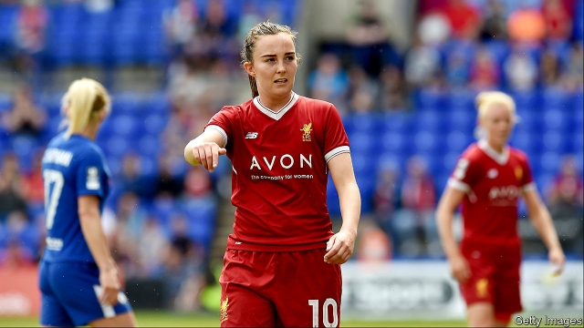

###### Net gains

# Women’s football is becoming big business 

 

> print-edition iconPrint edition | Business | Jul 13th 2019 

“IS THIS HOW we should show up before you come to our games?” read the frustrated slogan of the French national team, posing nude during the women’s football World Cup in 2011. At this year’s tournament in France figures smashed records without such desperate measures. FIFA, the game’s governing body, estimates that it drew a total of 1bn viewers, up from 750m four years ago in Canada. The semi-final featuring England was the most watched television programme of the year so far in Britain. Some 14m Americans saw their team beat the Dutch 2-0 to win their fourth title on July 7th, more than tuned in to most basketball and baseball league finals. 

Sponsors have taken note. Visa, a payment-card network with a taste for supporting high-profile sports events, spent as much promoting it as it did on the men’s competition. Earlier this year Barclays, a bank, became the first ever title sponsor of the English Women’s Super League (WSL) in a deal said to be worth over £10m ($12.6m). On July 5th Alipay, China’s electronic-payments giant, announced a 1bn yuan ($145m) ten-year deal with the Chinese women’s football team. 

The women’s game is luring brands which have previously been shut out of the sport because of the way sponsorships of women’s teams were bundled with those of men’s sides. Avon, a beauty and cosmetics company, became the first to sponsor a women’s professional football club, signing an exclusive deal with Liverpool FC Women in 2017. In April Boots, a pharmacy chain, struck partnerships with the national teams of England, Scotland, Wales and Northern Ireland, as well as the Irish Republic. Arkema, a chemicals firm, recently bought the naming rights to the top French women’s league in a deal worth €1m ($1.1m) a year over three years—peanuts compared with the €15m a year the men’s league receives from its main sponsor, but a start. 

Sixty percent of women’s football teams in the biggest leagues now sport front-of-shirt patrons different to those for the men’s team at the same club, according to Deloitte. The consultancy reckons this could approach 100% by the next World Cup in 2023. The number of European national associations with dedicated women’s football sponsors rose from nine in 2013 to 17 in 2017.  

Kelly Simmons, director of the professional women’s game at England’s football association, says that these multi-million-pound deals have been transformative. The big bucks, though, will come with broadcasting rights. Men’s English Premier League games bring in more than £3bn a year from broadcasters. France’s top female league sold five-year rights to Canal+, a pay-TV firm, for €6m—a trifle but six times more than two years ago. TF1, the most popular French TV station, raised ad prices twice in a week for France matches, earning an estimated €9m as the home team reached the knockout stages. In Britain women’s-football rights were handed over to BT, a telecoms company, and the BBC, the public broadcaster, at virtually no cost. Expect negotiations for new contracts, set to begin now that the tournament is over, to be much more of a contest.  

