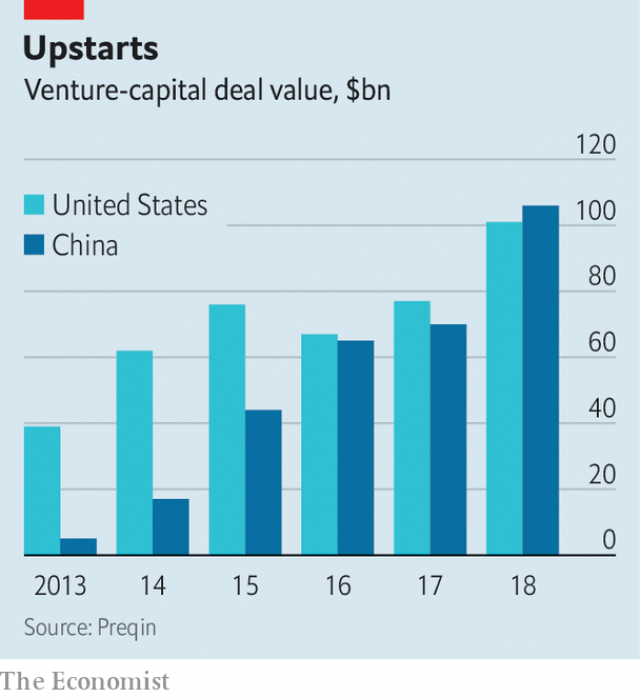

###### Home grown

# China’s Silicon Valley is transforming China, but not yet the world 

 

> print-edition iconPrint edition | China | Jul 13th 2019 

AS A TEENAGER, Wang Hanyang was fascinated by the electronics markets of Zhongguancun. He wandered the aisles of hard drives and graphics cards like a kid in a zoo, asking questions and learning. By 2009, government attempts to foster a tech hub in Mr Wang’s patch of Beijing had yielded little else to inspire a 14-year-old’s imagination. There were a few successful Chinese tech firms mimicking their American counterparts in search and social media, along with other startups. But in general Zhongguancun, a byword for cheap knock-offs, was still a disappointment. 

No longer. Today Mr Wang, 25, is at the helm of his second startup, Generalized Aviation, which creates software for drones. Trendy coffee chains and boutique supermarkets dot the streets. Zhongguancun has spread out from the electronics markets into a sweeping quadrant of northwestern Beijing that takes in its two leading universities, Peking and Tsinghua. Zhongguancun is now a concept as much as a place, China’s “Silicon Valley”. 

It is also China’s best hope for the domestic innovation that might insulate the country from a world perturbed by its rise. The government calls this “self-dependent innovation”, an idea that the trade war with America has given urgency. In January, during a visit to the new Binhai-Zhongguancun Science and Technology Park (conceptually part of Zhongguancun, but geographically distinct), Xi Jinping, China’s leader, emphasised the need for Zhongguancun to generate “high-quality” economic development. As Mr Wang puts it, the country must accelerate a shift from assembling tech products to creating them. Surrounded by the world’s largest, fastest-growing market for such goods, Zhongguancun is creating new apps, services and devices more speedily and cleverly than ever before. 

The ingredients for success are in place, though it is hardly assured. The amount of money pouring into Chinese technology companies has grown rapidly over the past ten years (see chart), with the total annual levels of venture-capital investment now reaching parity with America. Armed with capital, a new company can stake out office space easily and quickly, and tap into annually refreshed stocks of technically minded graduates from the most prestigious universities in Beijing. 

 

China has long since moved beyond producing merely Chinese versions of Silicon Valley companies. WeChat, an all-encompassing chat and payment app introduced in 2011 by Tencent, an internet giant in the southern city of Shenzhen, has inspired copycattery from Facebook. The newest firms in Zhongguancun employ business models that do not exist yet in America. One company lets doctors in small family practices order up complex lab tests for their patients on their phone. Another sells robotic arms to knife factories, which use them to sharpen the blades automatically. The international popularity of TikTok, a video-sharing app made by Bytedance, a Beijing company, shows that even in areas where Silicon Valley dominates globally, like social media, Zhongguancun can compete. 

Its young companies start not in garages, but in cramped offices, tucked away in the low-rise towers that host what is left of the electronics market, the heart of old Zhongguancun. Mr Wang points out the dingy nook in which DiDi, China’s ride-hailing giant, got its start. A larger office next door is for rent. Some 66 square metres are available, and the landlord is explicitly looking for tenants who “love Apple products”. As they grow, startups migrate north, to larger office blocks. Tencent, Baidu, Lenovo and Sina all have sprawling campuses in the more distant reaches of the city. 

New companies all rely on one of the most important geographical features of Zhongguancun: its proximity to the best schools in Beijing. The area is home not just to universities like Tsinghua and Peking, but also to highly regarded primary and secondary schools. The headquarters of one of China’s most important private education companies, New Oriental, which offers coaching for English-language exams, sits across the road from the electronics markets. Elite Chinese students come here before heading off to America for university. 

Often they come back and start a company, as Mr Wang did after he dropped out of the University of Waterloo in Canada. The schools of Zhongguancun predate its tech boom, and are foundational to it. As tech companies grow larger, the universities supply young talent while the promise of good schooling helps lure older recruits with families. The concentration of bright minds, in turn, attracts more brain power. “Beijing has a lot of terrible things like the air or the traffic, but the best thing is that you can talk to the smartest people in China within an hour,” says Mr Wang. 

Most of those smart people are not working on fundamental technologies, says Zhou Wei, the boss of China Creation Ventures (CCV), an investment firm based in Beijing’s Wangjing district. Hawkish officials in America may be kept up at night worrying about China’s advancement in semiconductors and artificial intelligence. But Zhongguancun’s real strength is in developing new applications and services for the Chinese market, to be provided through smartphones. Chinese consumers are even more primed for such services than their counterparts in the West. In America or Europe, digital services must compete with existing infrastructure. Chinese digital services are often the first of their kind. 

They are also heavily in demand. Mr Zhou points to one of CCV’s investments, YunHu Health, as an example. The firm offers medical tests for patients at primary-care clinics, eliminating the need to wait in long queues at oversubscribed hospitals. Instead, samples are whisked away to local labs on a moped, with results sent back to the patient and their doctor in a day or two. Just two years old, the company already serves some 100,000 clinics throughout the country. 

The application of technology to situations where demand outstrips supply is a guiding investment thesis for Mr Zhou. He has invested in software to help process medical imagery, reducing waiting times at hospitals, and in an interactive educational app that (purportedly) eliminates the need for a human teacher. DingDong Class charges the equivalent of $1 per hour for its automated English lessons, which use recorded videos of human teachers tailored to individual students. (Mr Zhou contrasts DingDong’s method of teaching English favourably with his own learning process: watching every episode of “Friends”, a situational comedy, at least ten times.) 

The Chinese government has adopted a laissez-faire approach to such companies. “If there is no regulation, they let you run,” says Mr Zhou. This does mean that new services risk leaving some people behind. “China is moving so fast that companies don’t pay much attention to less technical people,” Mr Zhou says. It is tricky now, in Beijing, to track down a taxi cab without using the DiDi app on your phone. To pay for a macchiato without using WeChat is to face a barista’s exasperation with paper currency, or, at trendier coffee shops in Beijing and Shanghai, outright rejection. 

Where CCV is focusing on technological fixes to gaps in the Chinese markets for education and health, Shunwei, another venture-capital firm, is focused in doing the same for China’s manufacturing industry. One of its investments, Rokae, runs its research and development centre out of a warehouse in Zhongguancun. The ground floor is packed with white robot arms with a variety of appendages attached to their wrists. One arm is set up to sharpen knives, plucking raw blades from a box and grinding them to an edge on a stone. Rokae says it has sold hundreds of robots to a large knife factory in Guangdong province, where the arms have directly replaced human workers. Rokae is also teaching its arms to manufacture bras, and says it is working with Adidas to test whether the arms are able to sew the three white stripes of the German firm’s logo onto garments. Because Rokae can produce robot arms more cheaply than Western competitors, it can appeal to businesses that might not otherwise have had enough capital to invest in automation. 

Shunwei also aims to address Zhongguancun’s greatest weakness—a reliance on imported components and technology. The firm has investments in Chinese companies that make chips which manage charging devices wirelessly, or that fuse camera data into three-dimensional scans. It is also investing in companies that design new materials—antibiotic ones for fabrics and mattresses, ceramics for phones. Today, most Chinese companies import these sorts of products from America, Europe, Japan or South Korea. If Zhongguancun is to blossom as a global, not just a regional, tech hub, and if it is to insulate China against protectionism, it will need to nurture its own suppliers. 

The local government is doing its bit. Haidian district, where Zhongguancun is located, recently opened a business park dedicated to fostering Chinese chip companies. The idea behind Zhongguancun IC Park (the IC stands for integrated circuit), according to Wu Chunyan, one of the park’s sales team, is that it will smooth the way for new chip companies, and not just through subsidised rents. It offers software for designing circuits, and handles licensing negotiations on behalf of its young tenants with other chip architecture firms such as Arm. Bitmain, a Chinese company which makes chips for mining Bitcoin, and GigaDevice, which makes memory chips, have already committed to moving in. Even though the campus seems quiet and somewhat empty, the canteen is bustling. 

The latest crop of startups have set their sights on foreign markets. Rokae is planning to sell its robot arms to Europe. Mr Wang wants Generalized Aviation to flourish globally. They see the trade war not as a threat, but as an opportunity—to fill the gaps in Chinese supply chains and then compete in the West. But to become a world-shaping force like Silicon Valley, Zhongguancun will have to overcome Western concerns about the potential misuses of Chinese technology. So far, very few Chinese tech companies have managed to go global, Huawei and Bytedance being the most prominent. And Huawei, in particular, is under threat due to security fears raised by Western governments. 

In the meantime, even Mr Wang cannot keep up with the pace of change in Zhongguancun. As he rides an escalator up into the last remnants of the electronics market, he sees that an entire floor has been emptied. He exclaims: “Oh no, they closed this one down?” The spaces which inspired him to go into the tech business are fading into history. “I feel a bit upset, but it’s ok,” he says. “Everything goes forward. We live life forwards, not in the past.” 

