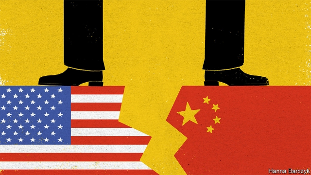

###### Chaguan

# Few things worry China’s elite more than getting their kids into Harvard 

 

> print-edition iconPrint edition | China | Jul 13th 2019 

DIZZIED BY TRUMPIAN flip-flops and clashing policy announcements, China’s ruling classes no longer know quite what to expect from America—with one exception. Chinese elites appear sure that President Donald Trump’s America is willing to hurt their children, as part of a racist scheme to keep China down. 

Outsiders might think it odd to spend time fretting about the roughly 360,000 Chinese youngsters studying in America, and whether they face tougher visa rules or unfair scrutiny from FBI agents hunting spies on college campuses. After all, tariffs worth billions of dollars are at stake in the trade war. Depending on what Mr Trump’s dealmaking gut tells him, America may or may not be bent on crushing Huawei, the telecommunications giant key to China’s hopes of becoming a technological superpower. 

Yet when Chinese officials meet Westerners, America’s treatment of Chinese students and scholars comes up time and again. For many, the issue is personal: in China as elsewhere, few things matter more to the elite than getting their offspring into Stanford. Chaguan spent July 8th and 9th at the World Peace Forum, a conference attended by Chinese leaders and foreign grandees, hosted by Tsinghua University in Beijing. In public debates and in private corridor conversations, Americans were repeatedly scolded by Chinese government ministers, professors and retired generals, and even ambassadors from Western allies. The charge is that, in the name of national security, America is treating Chinese students and scholars as a new “Yellow Peril”, in a witch-hunt worthy of Senator Joseph McCarthy. 

In part, this is a useful propaganda line. Chinese state media have been cranking out America-bashing commentaries ever since trade talks broke down in May. It is especially potent to point out ways in which rich-but-flawed, crime-ridden America is not safe for Chinese youngsters. A hit television drama this summer, “Over The Sea I Come To You”, depicts Chinese parents who accompany children studying in a rather bleak America. In one episode a Chinese father saves his son from a school shooting, heroically dodging a bullet then punching the gunman to the ground before an American SWAT team eventually arrives. 

Such horrors aside, it turns out to be just as potent to argue that Chinese students are being singled out for discrimination by American authorities, as part of a vindictive campaign by an ageing superpower to hold China back. The vice foreign minister, Le Yucheng, gave a speech at the peace forum arguing that America’s many problems, from the bitter legacy of wars in Afghanistan and Iraq, to yawning inequality and crumbling infrastructure, should not be blamed on China’s rise. After the speech, the first question to the minister came from a professor, lamenting visa delays for “our students” who hold offers from American universities, as well as cases in which Chinese scholars had seen ten-year American visas cancelled. Mr Le was sympathetic. China sends teenagers to study in America without worrying if they will be brainwashed, and then they are treated as spies, the minister tut-tutted. Chinese scholars have been harassed in airports and hotels by American intelligence, and, he asserted, cancer researchers have lost jobs at American institutions because of their Chinese ethnicity. How can America be so lacking in confidence? These actions are based on “blood lineage and race”, Mr Le charged. Chinese people find this “hard to understand”. 

In vain American participants at the forum noted that Western scholars in China have endured harsh visa restrictions for years. Chinese universities face ever-tougher state surveillance. It is not unreasonable to charge Communist Party bosses with hypocrisy for clamping down on academic debate at home, while the past four Chinese leaders all sent a child to study in America (President Xi Jinping’s daughter was at Harvard). 

Still, it is a wrinkle of the human condition that hypocrisy and sincere indignation can co-exist in the same breast. Since the first Chinese students attended Yale and other universities in the 19th century, an American education has stood for critical thinking, an escape from rote learning and freedoms that are both invigorating and alarming. The desire to give Chinese youngsters a horizon-broadening education unites flintily ideological officials and aspirational middle-class Chinese who care nothing for politics. 

The key to their angst—and to this tense moment in Chinese-American relations—lies in a particular sense that just as China is poised to join the world on an equal footing, giving its young chances of which their elders could only dream, a selfish, resentful America is slamming shut its doors. 

America’s government has done little to explain its side. Visa policies are always rather secretive. There seems little doubt that America’s rules have become tougher for Chinese applicants, notably in science subjects, with more students languishing in “additional administrative processing” for so long that some must abandon their studies. FBI chiefs have repeatedly briefed Congress about how China uses scholars to steal secrets. It would not hurt the FBI director to invite Chinese students to a speech to explain how much espionage actually goes on in America, state that the vast majority of Chinese are not under suspicion, then take lots of questions. Chinese censors might keep news of such a speech from parents and youngsters back home. (No speakers at the peace forum either knew or were willing to acknowledge that Mr Trump recently praised Chinese students as “tremendous assets”.) 

America has a story worth telling. It is one about open societies, and how openness to people and ideas, though it can be seen as a vulnerability, represents their greatest strength. That America is losing a propaganda war, unbeknown to most Americans, is an extraordinary failure. Some day, China’s brightest youngsters may no longer want to come. 

