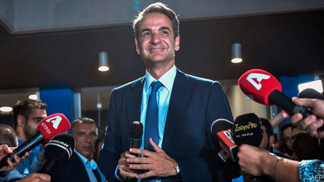

###### Farewell Syriza

# Greece’s new prime minister promises less drama 

 

> print-edition iconPrint edition | Europe | Jul 13th 2019 

CENTRAL ATHENS was uncannily quiet for an election night. Where were the firecrackers and the cars filled with party workers waving Greek flags that would normally race around Syntagma Square blaring out patriotic songs? After Kyriakos Mitsotakis, leader of the centre-right New Democracy (ND), claimed victory at around 10.30pm on July 7th, a small crowd outside the party’s headquarters applauded and shouted, “Prime minister, prime minister!” A beaming Mr Mitsotakis made a brief speech thanking his supporters and went home to his family. 

It may be no bad thing if the drama has gone out of Greek politics, at least for a while. Under Alexis Tsipras, the charismatic outgoing prime minister, and his left-wing Syriza government, it was a roller-coaster ride: from brinkmanship with EU partners in the summer of 2015 over whether Greece should leave the euro, to last year’s €112bn ($132bn) debt-relief package from its European creditors. The economy is looking up. Tourist numbers will probably match last year’s record of more than 30m arrivals. Owners of family businesses are more cheerful. Stelios Alexakis, a hotelier on the island of Crete, says: “We still keep cash under the floorboards just in case, but I have a business plan again.” 

Mr Mitsotakis, a former McKinsey consultant, wants to accelerate reforms that would make Greece more competitive and encourage foreign investment. With 158 seats in the 300-member parliament his government is stable enough to make progress. The new prime minister says he will push through big laws on taxation and cutting bureaucracy by August. Tax on corporate profits will be cut from 28% to 20% by January 1st 2021. 

Yet some worry that when Mr Mitsotakis’s political honeymoon is over, old rivalries and clientelism in ND will resurface and undermine his efforts to reform. Others see him as just the latest manifestation of the old establishment that got Greece into trouble in the first place. He is the son of a previous prime minister; his older sister served as mayor of Athens; and the mayor-elect of Athens is her son. 

Yields on Greek sovereign bonds plunged to a record low the day after the election. But Greece’s official creditors were less enthusiastic than hedge-fund managers about the change of government. Hours after Mr Mitsotakis was sworn in, Klaus Regling, the head of the euro zone’s bail-out fund, warned sternly that Greece’s commitment to run high budget surpluses until 2022 was a “cornerstone” of the debt-relief package. Eurocrats fear that Mr Mitsotakis wants to knock as much as a percentage point off the promised surplus of 3.5% of GDP, in order to promote faster growth, though he has pledged not to take any such action without consulting the country’s bail-out creditors. 

Mr Mitsotakis’s 51-member government is a mixture of seasoned conservative politicians like Christos Staikouras, the new finance minister, and bright but untested technocrats serving as deputy ministers. “It’s a hopeful sign that he’s found so many international experts in their respective fields who are keen to make a difference,” said Antonis Kamaras, a political commentator and expert on Greece’s diaspora. The government includes only five women, however; the most senior is Niki Kerameus, 38, a Harvard-trained lawyer charged with clearing up the muddle in the education system left by Syriza’s policy of disregarding academic excellence. 

Mr Tsipras declared the day after the election that Syriza would not “disappear”. He stressed that under his leadership his party grew from a splinter group with just 3% of the vote to become the mainstream party of the left. Syriza won 31.5% of the vote this time (compared with 39.9% for ND), only some four points down from its winning percentage at the previous general election in September 2015. 

True to its communist background, Syriza will focus on self-castigation over the next few months, say analysts, before holding a party congress. That may be the moment for Mr Tsipras to transform Syriza into a left-of-centre party that could command broader support. In the meantime, he promises that his party intends to practise “dynamic” opposition—which is left-wing code for street protests, strikes and sit-ins. Mr Mitsotakis has been warned. ◼ 

