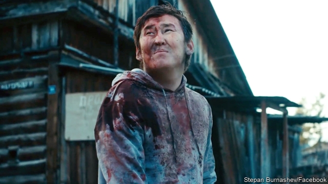

###### Arctic zombie apocalypse

# The pitfalls of making movies in Siberia 

 

> print-edition iconPrint edition | Europe | Jul 13th 2019 

CINEMA CAME to Samorsun, a small village in Russia’s far-eastern republic of Sakha, by way of VHS in the late Soviet era. There, a young Stepan Burnashev devoured pirated Hollywood films. At the time, movies in the local Yakut language barely existed. Mr Burnashev, like many of his peers, admired one: “Setteekh Sir” (Cursed Land), a 1996 horror flick about spirits that torment a young family in a Yakut village. 

One evening in June Mr Burnashev called “action” on a Setteekh Sir sequel. These days the film industry is booming in Sakha, which is five times the size of France but has only 1m people. Half of all Russian movies made outside Moscow and St Petersburg are from there. At cinemas in the capital, Yakutsk, local productions often outgross Hollywood blockbusters. In recent years, Yakut directors have been featured at festivals from Berlin to Seoul. 

This is all the more remarkable given the challenges filmmakers face. First, budgets. Mr Burnashev’s previous film, about a zombie apocalypse triggered by a virus released from melting permafrost, had a budget of just 3.4m roubles ($53,000). Then there are the elements. “The hardest thing to negotiate is nature,” says Anastasia Pitel, an assistant director on Mr Burnashev’s film. Winter temperatures can dip below –50ºC. Camera batteries run out rapidly. In the summer, swarms of mosquitoes emerge from the swampy earth. “When one buzzes in front of the lens, it looks like a horse is galloping across the frame,” Ms Pitel says. Operators must spray rings of bug repellent around their cameras. 

Yakut identity holds clues to the films’ success. Many are shot in the Yakut language, a Turkic tongue with little resemblance to Russian. Scripts draw heavily on Yakut folklore, a tradition rich with fantasy, mysticism and otherworldly realms. Beat that, Hollywood. 

