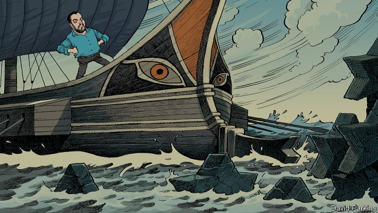

###### Il Capitano

# Will Matteo Salvini wreck the euro? 

 

> print-edition iconPrint edition | Europe | Jul 13th 2019 

“HE’S ALMOST here...he’s arrived! He’s arrived!” bawls the mayoral candidate, as a sea of blue and white flags declaring Prima L’Italia, Italy First, wave in the summer evening air of the ancient Umbrian hill city of Orvieto. And as the cheers and the shouts of “Mat-te-o! Mat-te-o!” swirl around the medieval buildings, the man the crowd is really here to see walks onto the stage: Matteo Salvini in chinos and an open-neck shirt, sleeves rolled up, slightly tubby, as ordinary-looking as any of the adoring fans jammed into the little square. 

They call him Il Capitano. No Italian can fail to hear an echo of Mussolini’s nickname, Il Duce. Critics see neo-fascist overtones everywhere—from the fact that Mr Salvini recently published a book using a publishing house with links to a far-right outfit, CasaPound, to the observation that he has been seen in a jacket made by a designer the CasaPounders favour. His personality cult, driven by dozens of daily tweets and Facebook posts, expertly crafted to show him as a man of the people, on the side of the little guy against the elite, comes in for similar suspicion. 

But you don’t have to believe that Mr Salvini is a neo-fascist, or could succeed as one in a place as pluralistic as Italy, to be alarmed by his rise. Nominally, his party, the right-wing Northern League, is the junior partner in an unlikely and unstable coalition government with the anti-establishment Five Star Movement (M5S). In reality, Mr Salvini has been the most powerful man in Italy since shortly after he became a deputy prime minister in June last year. His relentless rise in the opinion polls, and the League’s stunning victory at the European Parliament elections in May, mean that he, more than anyone, makes the political weather. It is quite a feat for a man and a party that six years ago won just 4% of the vote. The League took 17% in last year’s general election, 34% in May, and is polling even higher now. 

The problem is that Mr Salvini has not risen to pre-eminence by solving or showing how he might solve any of Italy’s obvious malaises. Its economy is stagnant. Between 2008 and 2018 Italy’s GDP fell by 3% in total, compared with a 13% rise in Germany, a 10% rise in France and a 4% rise in Spain, the three other big euro-zone economies. It has stubbornly high unemployment, at around 10%. He has won support, rather, by the well-tested populists’ method of finding others to blame. And that carries big risks, for Italy and for Europe. 

There are two favourite enemies: migrants and Brussels. As he revs up the crowd in Orvieto (the local candidate he was there to back last month went on to win the mayoralty easily in what has traditionally been Italy’s central left-dominated “red belt”), Mr Salvini takes swipes at both. He tells listeners that he respects the right of people to believe in other gods, “Just so long as that God does not come and tell me that women are worth less than men and that they must go around in a burqa.” Vast applause ensues. “More carabinieri! Fewer irregular aliens!” he cries. Loud cheers. 

Since taking the additional post of interior minister in the coalition government, Mr Salvini has used his powers to clobber migrants. As one of his first actions, he closed Italian ports to NGO boats carrying people rescued from the sea, and has now passed a new law making those who try to land them vulnerable to huge penalties. (Carola Rackete, the 31-year-old German captain of one such vessel, is currently facing charges after docking in Lampedusa.) The coastguard does land small numbers of rescued migrants, but these days patrols a much smaller area of sea than before. Mr Salvini has slashed funding for reception centres, and tightened the criteria for migrants being granted protected status. The flood of arrivals, at 181,000 in 2016, has become a trickle, just over 3,000 so far this year. Mr Salvini has scooped up the credit for this, even though the decline is mostly the result of tough actions by the previous government. 

 

Migrant-bashing carries few costs for Mr Salvini, except in the court of liberal opinion, for which he cares little. His fellow European leaders mostly turn a blind eye. They do not want to help Italy cope with its migrants, or take many more themselves. Emmanuel Macron, France’s president, openly detests Mr Salvini (and complains that populism is spreading across Europe “like leprosy”), but has pointedly refused to take the rescue ships that Mr Salvini turned away. Mr Salvini’s skilful stoking of anti-migrant feeling has made him the most popular politician in the country. But since so few migrants are now arriving, this has its limits. 

The other enemy Mr Salvini rages against is more likely to fight back. But threatening a showdown still pays electoral dividends. “We will put up a fight in Europe, because if you don’t even put up a fight, like the governments in the past, who went to Brussels cap in hand and their trousers round their ankles, it’s clear you can’t win,” Mr Salvini told selfie-snapping supporters in Orvieto. 

This has the markets and other European governments spooked. Mr Salvini’s confrontation with Brussels waxes and wanes, but never goes away; and until he abandons it, the threat to the euro zone itself is real, and potentially deadly. In the past Mr Salvini has spoken of a desire to take Italy out of the euro, and perhaps even the EU itself, which he has called a “gulag”. That is not his current policy, doubtless because there is no majority support for either. But he clearly chafes at their restrictions, and no one knows when he might decide to try to break free of them, by ignoring the rules despite the risk of a bond crisis, or even by going back to his earlier position and leaving altogether. 

The drama has been going on for a year now. When the populist coalition came into office in June 2018 its costly economic promises posed immediate problems. M5S, led by Luigi Di Maio, had pledged a guaranteed income for the hard-up; the League a low, flat rate of income and corporation tax. Both had vowed to reverse unpopular reforms that had raised the state pension age. Together they showed little regard for the EU’s fiscal rules. These require that Italy’s vast public-debt burden—over 130% of GDP, second only to Greece in Europe—fall towards 60% at a prescribed pace. 

Twice now Brussels has threatened to penalise Italy for its excessive debt, and twice the government has meekly toned down its deficit plans. In autumn last year ten-year government-borrowing spreads over German bunds approached 3.4 percentage points, leading the coalition to curb its deficit plans for 2019 from 2.4% to a cunningly precise 2.04%. In June Brussels made threatening noises again as it became clear that Italy’s debt ratio had risen in 2018, rather than fallen. On July 1st the coalition promised a round of savings and spending cuts, worth €7.6bn (0.4% of GDP). This week euro-zone finance ministers declared themselves satisfied by the concessions. Spreads are narrower: as of July 10th they stood at two percentage points. 

But a bigger confrontation is looming. The government has begun its “citizens’ income” scheme for the poorest households. Nodding slightly at the notion of a flat tax, it has lowered tax rates for some self-employed people. But these watered-down versions of electoral promises have underwhelmed supporters. Both coalition partners face pressure to do more next year; especially M5S, whose popularity has collapsed. Even without extra commitments, Brussels expects Italy’s budget deficit in 2020 to break through not just the 2% ceiling that is there to get the debt under control, but the larger 3% one that all countries are meant to stick to. If no compromise is reached, Italy could eventually be fined as much as 0.2% of GDP (€3.5bn). That is unlikely: no country has ever been punished in this way. But the threat of it would alarm markets. 

Other sources of anxiety are growing. Although Mr Salvini and other ministers have since the election said they have no plans to leave the euro, occasional noise from others adds confusion. On May 28th the parliament passed a non-binding motion asking the government to consider issuing “mini-BoTs”, low-value bills designed to help the state pay commercial suppliers. The clause on mini-BOTs had reportedly been inserted into the motion at the last minute, catching many lawmakers unawares. Claudio Borghi, a Euro-sceptic League economist and close adviser to Mr Salvini who heads parliament’s finance committee, has previously argued that mini-BoTs could be “spent anywhere to buy anything”, raising suspicion that they would act as a parallel currency in preparation for leaving the euro. As investors became uneasy, Giovanni Tria, the finance minister, was forced to respond, attempting to rule out the idea. But Mr Salvini has said he still considers it an option. 

Mr Tria and Giuseppe Conte, the technocratic prime minister, would surely resign and bring down the government rather than permit mini-BoTs. But an election (which he might well choose to trigger anyway) could bring Mr Salvini to power as prime minister of a right-wing coalition with the far-right Brothers of Italy. But either way, an accidental bond crisis triggered by the issue remains possible. 

The coalition’s truce with the commission on the public debt is anyway likely to prove fleeting. The next flashpoint is close: the government must thrash out next year’s budget by October or thereabouts. If Mr Salvini and Mr Di Maio keep their promises and enact lavish spending rises and tax cuts, investors and ratings agencies may again panic. If instead they cave in and choose to comply with the EU’s rules, as they finally did last year, they will either need to back down from their plans, or find a way to plug a hole in the public finances of tens of billions of euros. Either of those options will be politically very tricky. 

The commission already expects Italy to run a budget deficit of 3.5% of GDP next year, at odds with the government’s projection of 2.1%. The difference comes down to whether or not a value-added-tax increase, which has already been legislated for, comes into effect. The commission points out that such stopgap clauses have consistently been repealed in recent years. Both Messrs Salvini and Di Maio, aware of its unpopularity, have already promised to avert the increase. That means somehow finding an additional €23bn. No one knows where that money would come from. Mr Di Maio has already ruled out cuts to welfare spending. And on top of the expected big deficit, Mr Salvini wants to cut taxes further in pursuit of his promised flat tax of 15% for companies and individuals. 

 

Mr Salvini’s call for more fiscal flexibility is not by any means absurd: many economists reckon the EU’s rules are too tight. The problem is that Mr Salvini has antagonised the commission and northern member states, which are wary of being on the hook for other countries’ profligacy. So Mr Salvini is not likely to get much slack from European leaders. Though the European Parliament elections in May were a triumph for him domestically, at the European level they were a disaster. He had staked out a claim to lead a pan-European alliance of nationalists that would change the face of European politics, the nationalist cause failed to make headway beyond Italy. Mr Salvini’s reckless rhetoric has made it less likely, not more, that Germany and the “New Hanseatic League” of fiscally orthodox northern European countries will indulge him. 

Mr Salvini has done nothing to help his cause in Europe by courting Vladimir Putin. He has been spotted wearing a Putin T-shirt, is a frequent visitor to Moscow and has allowed the Veneto region, run by the League, to recognise Crimea, a chunk of Ukraine that Russia has illegally annexed. This infuriates the eastern Europeans who might otherwise be his allies. The suspicions of a sinister Moscow-Rome axis have been stirred by tapes, published this week and confirming earlier reports, that appear to show a former close aide to Mr Salvini meeting unidentified Russians in Moscow to discuss the secret funding of the League with money derived from a dodgy oil deal. Mr Salvini says he has never taken “a rouble, a euro, a dollar or a litre of vodka”, and there is no evidence that any money was ever actually paid to anyone. 

Even if a crisis is again averted this autumn, a deeper fear about Mr Salvini remains. It is not so much what he has done, as what he has failed and will fail to do. Matteo Renzi, prime minister from 2014 to 2016 and a genuine reformer, is scathing. “He seems macho, but what has he ever done that is brave?” he asks. “He is not a leader, he is an algorithm.” Certainly the first year of Mr Salvini’s pre-eminence has seen nothing that suggests that the all-populist government has any interesting plans for doing anything about Italy’s chronically low growth. Fighting with Brussels and turning away boatloads of migrants are good ways to fire up supporters, but such gestures do not create jobs. 

 

Italy’s problems remain what they always were: a labyrinth of regulations that discourage companies from growing, and labour laws that entrench the power of unions in larger companies, doing more to protect those already in work than open up chances for those outside it. Francesco Grillo of Vision, a think-tank in Rome, notes that Italy spends more than four times as much on pensions as on education. And yet one of the early acts of the new coalition was to undo modest pension reforms that would have made the system more affordable. If you join the workforce at 18 and work continuously, you can now retire at 60. 

The new government has done virtually nothing that would help with any of this. The League has, to be fair, pushed for new procedures that could speed up the approval of infrastructure projects. The proposed sblocca cantieri (“unblocking works”) bill, however, has so far been opposed by the M5S. One of the M5S’s main appeals to voters has, after all, been the promise to crack down on corruption, and short-circuiting the approvals process risks undermining that fight. 

Added to that, the government policies that have been enacted have been shoddily executed. The size of the “citizen’s income” that the state will hand out was set arbitrarily, says Tito Boeri, formerly the head of the national social-security administration. It is too generous to single people, particularly in the south. Payments taper off as soon as a recipient earns more, which risks discouraging the unemployed from taking up work. 

 

The government has also done little or nothing to tackle vested interests. Important reforms such as broadening the tax base, eliminating tax loopholes and overhauling the judicial system have fallen by the wayside. This lack of focus on economic growth and lingering doubts over the commitment to the euro might be why Italy’s bond spreads are higher now than before the elections in 2018. 

The next few months will reveal if the coalition prizes its credibility with investors. Financial markets have been relatively calm this year, with investors pricing in compromise, not confrontation, with Brussels. But spreads could quickly widen if the coalition does not restrain its budget plans. The banking system too is vulnerable: holdings of Italian sovereign debt account for a tenth of Italian lenders’ assets, well above the euro-area average. Part of that portfolio would be repriced as bond prices fall, eroding banks’ ability to withstand losses. A hit to the economy would close the “doom loop”, where weak sovereigns and banks drag each other down. 

Past experience, in 1992 and in 2011, shows that governments tend to buckle under pressure from the markets. So far this coalition has been no different. And the elements of a compromise do exist. Mr Salvini could further moderate his programme of tax cuts. A small increase in VAT might help plug the gap, and have the virtue of signalling a commitment to fiscal discipline. Meanwhile Brussels may be content to accept a slightly higher deficit, provided it does not breach the 3% threshold. 

But Mr Salvini may decide otherwise. He may stick to his guns; or he may surrender. He may force an early election; he may not. The troubling fact for Europe is that no one knows what this meteor that has flashed across Italy’s skies will do next. ◼ 

