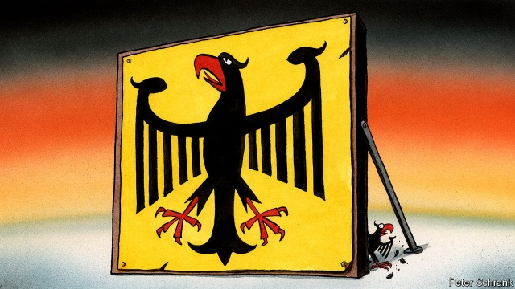

###### Charlemagne

# Wurst among equals 

 

> print-edition iconPrint edition | Europe | Jul 13th 2019 

ONE CAN almost hear Wagner’s “Ride of the Valkyries” in Brussels these days. Big Mercedes cars with German plates swoosh up and down its streets. Bigwigs from Berlin bestride the bureaucracy. The full might of the German political and diplomatic network in Brussels is working overtime to secure the presidency of the European Commission, the EU’s executive, for Ursula von der Leyen, who faces a confirmation vote by the European Parliament on July 16th or 17th. The multilingual German defence minister is, after all, one of its daughters: she grew up nearby while her father ran the competition directorate. 

It is often claimed that Germany really runs the EU. Angela Merkel has been the bloc’s dominant figure for years. The presidents of the European Court of Auditors, the European Stability Mechanism and the leaders of several of the European Parliament’s groups, including the largest, are Germans. The secretaries-general of the parliament and the commission are, too. The latter, Martin Selmayr, is credited with securing German backing for Jean-Claude Juncker, the outgoing commission president. 

Germany’s critics hold its pre-eminence responsible for all manner of evils. The Trump administration spies Germany’s hand in the European Central Bank’s (ECB) loose monetary policy, which it says hurts American exporters. Southerners resent Germany for austerity policies imposed in the crisis years. British politicians fear German power: in Westminster on July 4th Bill Cash, a Brexiteer, described the prospect of a German president of the commission as “a grave concern” and proof that Britain should escape “Germany’s increasing dominance”. European governments shape their strategies around this assumption. British ministers once claimed that German car exporters would press the rest of the EU into doing a favourable Brexit deal. Emmanuel Macron tried to advance his plans for closer EU integration by wooing the German establishment. It is telling, however, that neither gambit succeeded—because Germany does not in fact have Europe stitched up. 

Take Brussels. More French, Spanish, Italian and Belgian citizens work in both the commission and the parliament than do Germans, who also hold fewer of the commission’s most powerful “director general” roles than do Italians. The Germans in Brussels are a mixed bunch and do not take orders from Berlin. They tend to be more Francophile and federalist than politicians back home. Mr Selmayr in particular is regarded with suspicion in Berlin, where officials fret about his influence over Mrs von der Leyen’s team. It was Mr Macron who first proposed her and German social democrats and greens who are leading the opposition in the European Parliament to her candidacy. 

Germany does not always get its way on policy. The ECB’s loose monetary stance appals many German savers. Fiscal rules designed to soothe German concerns are routinely strained by euro states like Italy and now France. On other matters, from refugee quotas to emissions targets and from takeover rulings to energy policy, the commission has defied Berlin’s preferences. An example is the package of incoming candidates for the EU’s top jobs: Mrs von der Leyen’s federalist instincts put her closer to Mr Macron than to Mrs Merkel in some respects, and Christine Lagarde, a Frenchwoman, will take the helm of the ECB. Charles Michel and Josep Borrell, the incoming European Council president and EU foreign policy supremo, are both closer to Paris than Berlin. 

Why, then, is Germany less mighty than it looks? First, its size can be a weakness. Hans Kundnani of Chatham House, a think-tank, describes the country as a “semi-hegemon”: too small to dominate Europe (proportionally it is about as big in population terms as California in America) but big enough that others feel daunted and seek to contain it. Central Europeans banded together during the migration crisis, for example, to block what they saw as a heavy-handed German preference for open borders. So neuralgic is France about Mr Selmayr’s perceived influence that Mr Macron wants the secretary general moved (perhaps to the ECB) and replaced by a Frenchman. 

Second, Germany’s establishment is different. America has a powerful executive, Britain has a high degree of centralisation and France has both, but in Germany power is diffuse and plural. Opinion is more diverse than the notion of a monolithic German interest and outlook allows. Plenty of prominent figures in German politics and academia share French and southern European criticisms of her government’s stances. Among them are the Greens, who have come first in some recent polls. 

So multilayered and multifaceted are German politics and public life that the country can be in fact frustratingly introverted. Even at the peak of her powers, Mrs Merkel was more a crisis manager than a visionary leader. On European debates about the euro, technology, defence and foreign policy, Germany does not so much block or impose but is rather semi-engaged, caught up instead with its own, often petty domestic squabbles. In 2011 Radek Sikorski, then Poland’s foreign minister, admitted that he now feared German inaction more than German action—a remarkable confession given his country’s past. 

A Germany insufficiently engaged with European matters can hardly create the “German Europe” that its critics fear. And that will not change if Mrs von der Leyen leads the next commission (it might even produce a slightly more French Europe). But as a face familiar to German voters and with influence in Berlin, where change is in any case in the air as the Merkel era draws to a close, a President von der Leyen might at least help confront that disengagement among her sleepy compatriots by better explaining the EU and pressing the need for more reform and integration on them. She might thus produce not a more German Europe but a more European Germany. ◼ 

