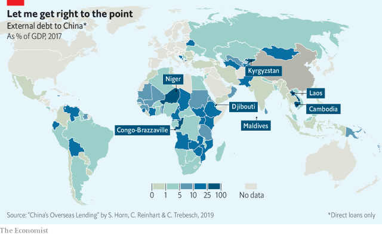

###### Hey, big lender

# A new study tracks the surge in Chinese loans to poor countries 

> print-edition iconPrint edition | Finance and economics | Jul 13th 2019 

 

LOAN TALKS with Belarus; funding for bridges in Liberia; a possible gas project in Timor-Leste; accusations of exploitation in Tanzania; a corporate dispute in India; pledges to support the Rwandan private sector. And that was just the past few weeks. Such is the frenetic pace of China’s overseas lending that its outstanding loans have risen from almost nothing in 2000 to more than $700bn today. It is the world’s largest official creditor, more than twice as big as the World Bank and IMF combined. Yet tracking the money is hard because of limited transparency in its disclosures. 

A new study by Sebastian Horn and Christoph Trebesch of the Kiel Institute for the World Economy and Carmen Reinhart of Harvard University offers the most comprehensive picture yet of China’s official credit flows (including state-owned banks). It adds to concern about whether China has sowed the seeds for debt problems abroad. They find that nearly half of China’s lending to developing countries is “hidden”, in that neither the World Bank nor the IMF has data on it. 

The problem is most severe for the most vulnerable borrowers: the authors conclude that in its reporting to the Bank for International Settlements, an organisation of central banks, China has disclosed no loans to Iran, Venezuela or Zimbabwe, despite giving them plenty in the past 15 years. They speculate that China avoids cross-border claims by disbursing loans directly to Chinese contractors, so that recipient governments will not misuse funds. 

According to the authors, the 50 biggest recipients now have debts with China worth about 17% of their GDP on average (see map), up from 1% in 2005. Strikingly, many were granted debt relief by wealthy creditors in the early 2000s after a wave of defaults. But thanks to China’s largesse they are now on track to reach the same level of debt that they had before the crisis. 

Whereas the norm for other official creditors is to lend at concessional terms, about 60% of Chinese loans are extended at higher interest rates and shorter maturities. They often have commodity revenues as collateral. China has started to talk about making its loans more sustainable, but there is little evidence of that so far. 

Though China is often depicted as an unforgiving lender, the study finds that it has engaged in at least 140 restructurings and write-offs of external debt since 2000. Moreover, the boom could soon tail off. Chinese economic growth and capital outflows are closely correlated. As China slows its lending floodwaters might recede. 

